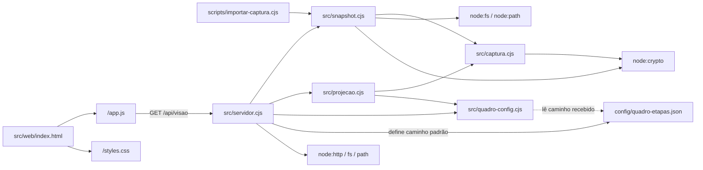
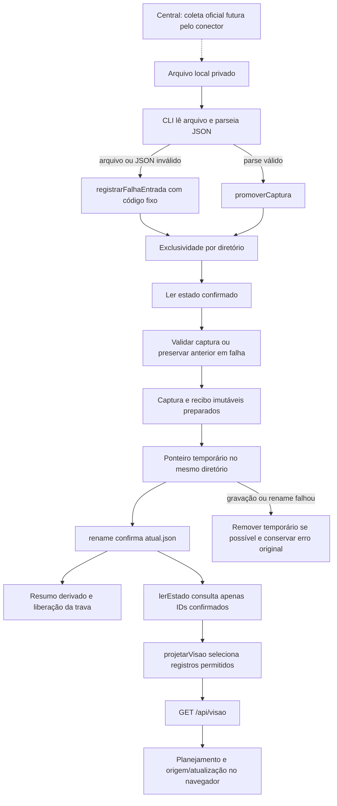
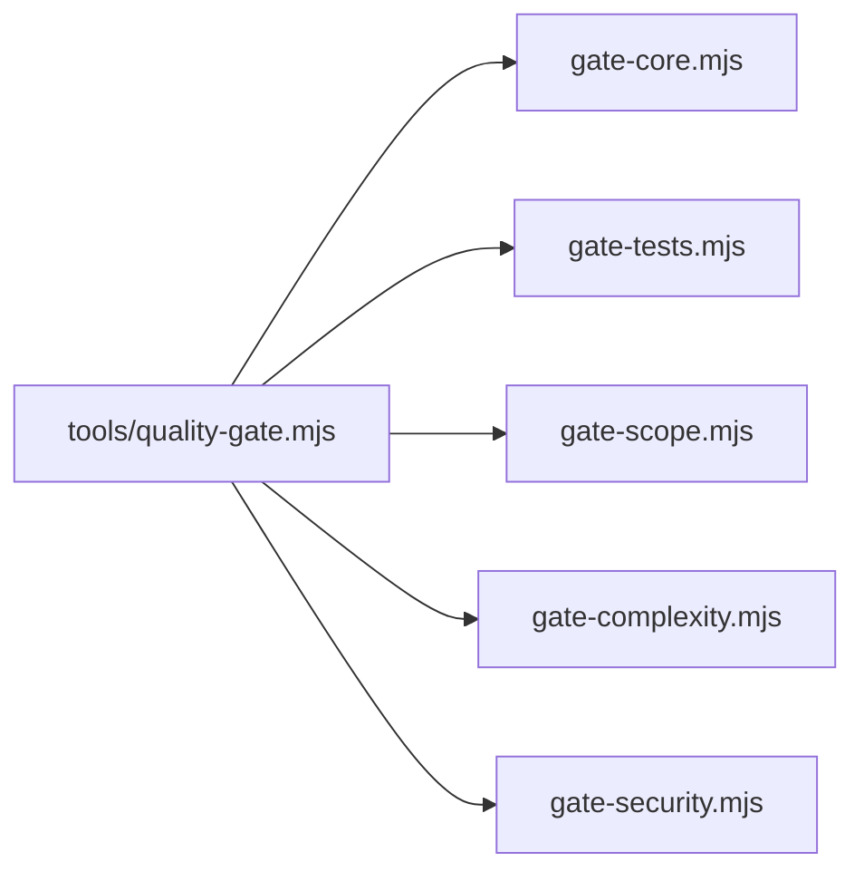

# Arquitetura

Como um álbum de fotografias da operação, o CRM recebe um arquivo preparado pela Central, guarda a observação aceita e apresenta um índice local da NTV. Consultar o álbum não comanda a produção.

Estado em 04/10/2026: T001–T022/fundação, US1 e US2 implementadas localmente. Sete suítes passaram com 75 PASS, 0 FAIL, 0 SKIP, incluindo 14 casos de interface; gate local exit 0 e cobertura 96,19%, conforme a [validação](../specs/001-consulta-local-producao/validacao.md). As correções do PR #6 foram integradas em `19e222a` e a 0.4.9 foi aceita no PR #7, merge `7e17e85`. Novo aceite remoto da US2 e demonstração com captura operacional aguardam. Nenhuma leitura Google ocorreu no runtime desta entrega. A [spec](../specs/001-consulta-local-producao/spec.md) continua sendo a meta completa.

## Módulos e imports reais

| Módulo | Responsabilidade atual | Documento |
| --- | --- | --- |
| captura | Seis abas/66 mínimos, identidades, dimensões, tempos e hash; sem rede | [Validação](modules/captura.md) |
| snapshot | Leitura privada, exclusividade de importação, arquivos imutáveis, confirmação e falhas | [Persistência](modules/snapshot.md) |
| importar-captura | Entrada CLI local, mensagens/saída e recibo de falha de leitura | [Importador](modules/importador.md) |
| quadro-config | Validador genérico; JSON versionado atual tem nove etapas e duas listas vazias; distribuição dos cartões ainda futura | [Configuração](modules/quadro-config.md) |
| projecao | Seleção NTV e campos permitidos, semanas/dias/formatos e quatro estados de frescor | [Projeção](modules/projecao.md) |
| servidor | HTTP local com quatro rotas fixas, controle de Host/Origin e respostas resumidas | [Servidor](modules/servidor.md) |
| web | Planejamento/calendário/lista/filtros, diálogo básico, selo comum e origem/releitura em Planilha | [Interface](modules/web.md) |

Aplicação em CommonJS e JavaScript/HTML/CSS nativos, sem framework, banco ou `package.json` de aplicação. Node 24.19.0 e Playwright já existentes; nenhuma dependência nova instalada. Configuração versionada não contém dados de linhas.

`.specify/feature.json` é ponteiro local não versionado. Checkout remoto identifica a feature pela branch `001-consulta-local-producao` e sua pasta de specs; o ponteiro não é pré-requisito do importador/servidor.

## Entrada, persistência e confirmação

`atual.json` contém `{capturaId, ultimaTentativaId, historicoIds}`. Capturas e recibos são preparados com abertura exclusiva e fsync antes do rename. Falha na gravação/rename do ponteiro tenta remover somente seu temporário, preservando o erro original se a limpeza também falhar. Resumo `ultima-tentativa.json` é derivado; falha dele não muda o estado confirmado. Arquivo órfão de interrupção não comprova aceitação nem entra no Histórico.

| Caminho dentro do diretório privado | Autoridade / regra |
| --- | --- |
| `.importacao.lock` | PID/instante da única importação em andamento; segunda instância recusada |
| `capturas/<capturaId>.json` | Envelope/células validados, imutáveis |
| `tentativas/<tentativaId>.json` | Recibo preparado; confirmado apenas quando ID está no ponteiro |
| `atual.json` | Única confirmação de captura vigente e Histórico |
| `ultima-tentativa.json` | Cache derivado, sem autoridade concorrente |

Mesmo ID e serialização já aceitos devolvem `sem_alteracao`, sem novo recibo/frescor/rollback. Conteúdo diferente no mesmo ID é conflito. Falha confirmável preserva captura e acrescenta recibo saneado; impossibilidade de registrar gera erro explícito. Interrupção pode deixar trava: não há expiração/remoção automática; conferir proprietário/processo/estado antes de recuperação manual. Os detalhes de falha, órfãos e concorrência estão no [módulo snapshot](modules/snapshot.md).

A liberação tenta close e unlink separadamente. Avisos transitórios de liberação acompanham o resultado/erro original, sem alterar o recibo confirmado; o CLI os imprime em stderr e preserva o exit do resultado. A projeção `(estadoLocal, nowIso, mapaQuadro)` usa `nowIso` e `captura.completedAt` para frescor em São Paulo. A classificação dos cartões pelo mapa permanece em US4.

## Fluxo HTTP e fronteiras

O ponto de entrada faz bind somente em `127.0.0.1:4318` por padrão. `criarServidor` devolve servidor não iniciado e admite diretórios/configuração confiáveis para testes em TEMP. O mapa é validado antes de criar o handler. Em cada consulta, o estado privado é relido/validado e só a projeção sai.

| Rota / condição | Método e resposta |
| --- | --- |
| / | GET/HEAD, HTML fixo |
| /app.js | GET/HEAD, JS fixo |
| /styles.css | GET/HEAD, CSS fixo |
| /api/visao | GET/HEAD, JSON selecionado; sem captura é 200 com ausência estruturada |
| Outro método com origem válida | 405 e Allow GET, HEAD |
| Outra rota, privado ou traversal | 404; query não escolhe diretórios |
| Host/Origin recusados | 403, antes de método/rota |
| Estado confirmado ilegível | 503 resumido, sem alteração da captura |

Host é exatamente `127.0.0.1:<porta real>`; `localhost` não passa. Origin ausente é permitido; presente deve ser a própria origem HTTP. Sem CORS externo. CSP restringe scripts/estilos/conexões a self e proíbe imagens/objetos/incorporação. Respostas têm no-store/nosniff; HEAD não inclui corpo.

O servidor não expõe `data/`, configuração bruta, envelope/metadados de coleta, células extras ou qualquer arquivo arbitrário. Texto é renderizado por `textContent`; supressão conservadora protege formatos conhecidos de conteúdo sensível sem confundir HTTPS com caminho Windows. Nenhuma URL registrada é carregada automaticamente.

## Configuração e execução

| Entrada real | Consumidor / limite |
| --- | --- |
| `--data-dir <diretorio>` | CLI/servidor; diretório privado padrão data/; testes sempre TEMP |
| `--port <inteiro>` | Servidor; 4318 padrão, 0 para porta efêmera de teste |
| `quadroConfigPath` / `webDir` | Argumentos internos confiáveis de criarServidor, sem controle HTTP |
| `CRM_NODE_PATH` | PowerShell seleciona Node existente; aplicação não lê variável |
| `PATH` | Diretório do Node 24.19.0 à frente para subprocessos do gate; ver quickstart |
| `CRM_PLAYWRIGHT_MODULE` | Teste de interface resolve Playwright existente; sem ela tenta playwright |
| `CI=true` | 14 testes de interface fazem SKIP explícito; pendência M8 de aplicabilidade, sem substituir aceite local |

Comandos reais e demo sintética isolada estão no [quickstart](../specs/001-consulta-local-producao/quickstart.md). Não existe iniciador PowerShell neste recorte. A primeira captura oficial é futura e deve preservar os campos/identidades do [contrato](../specs/001-consulta-local-producao/contracts/captura-e-consulta.md); os hashes coerentes do JSON não comprovam coleta real.

## O que já aparece e o que falta

Planejamento apresenta calendário/lista/filtros, imagem B, “N sem data” global, objetivo indefinido e diálogo básico do dia inteiro. Peça remarcada segue sua data civil no mês e continua agrupada pela semana registrada. Seis status literais recebem rótulos legíveis só na UI; desconhecidos e API mantêm o original. Mês usa somente inicial maiúscula; calendário inclui apenas semanas com dia do mês e sidebar desktop acompanha a altura da página. Desktop usa calendário; 390 px começa em lista e menu recolhido. [Screenshots](design/screenshots/LEIA-ME.md) são da aplicação com dados fictícios.

US2/T019–T022 entrega `sem_captura`, `falha_atualizacao`, `atualizada_hoje` e `anterior_hoje`, com textos/cores contratuais e clique do selo até Planilha em todas as telas. Sem captura, eventual primeira falha conserva **Sem dados**. Com captura, a última tentativa falha tem precedência sobre frescor e acrescenta aviso curto de preservação da anterior. Datas/horas vêm de `completedAt` em `America/Sao_Paulo`, sem usar datas das linhas ou renovar instante por consulta.

Planilha mostra fonte, fim da captura, cobertura semanal e motivos resumidos distintos dos avisos, com `role=status`; tabelas/Histórico permanecem em US5. **Atualizar dados** desabilita apenas o próprio botão durante `GET /api/visao` com cache no-store. Sucesso atualiza a visão mantendo a tela; erro HTTP, inclusive 503, apresenta mensagem local e conserva visão/selo/dados já carregados, liberando o botão para tentar novamente. Sem visão anterior, aparece **Consulta indisponível**. GET/no-op conservam falha ativa; só nova captura completa aceita a encerra.

Detalhes/relações/acordeões são US3/T023–T026; classificação/quadro são US4/T027–T030; seis tabelas/Histórico são US5/T031–T034. Produção conserva a mensagem de próxima entrega. Iniciador, escala e aceite completo são posteriores; 19 tarefas T023–T041 permanecem pendentes.

## Ferramentas de qualidade, evidência e dívidas

O gate e seus imports foram conferidos no código de `tools/`; ESLint/lock estão isolados. `quality-gate.config.json` conserva Node 24.19.0, runner node --test e modo full. Gate local US2 exit 0: testes PASS (75), cobertura PASS (96,19%, queda 0) e complexidade PASS com aviso CLI argumentos 12; Semgrep SKIP por ausência no Windows; audit N/A sem dependências de aplicação. A UI fica fora do LCOV, dívida M8 de cobertura/aplicabilidade; os 14 testes locais de interface continuam obrigatórios para o aceite no computador. Não foi alterada baseline, configuração ou ferramenta.

CI/review do node-kit 0.4.8 foi aceito no [PR #5](https://github.com/Browsher/crm-social/pull/5#issuecomment-5976475669), head bc0b02b, merge 4f20f20 e [execução 37176292254](https://github.com/Browsher/crm-social/actions/runs/37176292254). Repo público, main protegida por quality-gate. As correções do [PR #6](https://github.com/Browsher/crm-social/pull/6) tiveram CI/review verdes e foram integradas em `19e222a`; o aceite da 0.4.9 está registrado abaixo. Novo aceite remoto da US2 continua pendente. Os 14 casos de UI fazem pulo explícito no CI, enquanto dados/I/O/CLI/projeção/HTTP são obrigatórios; aplicabilidade dos pulos e UI fora do LCOV são a pendência M8, sem aceite remoto da interface.

| Dívida / pegadinha | Fonte e impacto |
| --- | --- |
| null vira célula vazia na entidade | src/captura.cjs:81; envelope original preservado, mas projeção perde essa distinção |
| Avisos usam índice filtrado (M3) | src/projecao.cjs:33–62; número pode diferir da linha física de origem; correção adiada para US3/US5 |
| Classificação pelo mapa pendente | src/projecao.cjs:95; mapa recebido, distribuição dos cartões reservada a US4 |
| I/O síncrono e validação por consulta | src/snapshot.cjs:20 e src/servidor.cjs:25; escala final ainda não exercitada em T037 |
| Trava sobrevivente à interrupção | src/snapshot.cjs:72; exige reconciliação manual; aviso de liberação preserva resultado/erro |
| Teste de rename não prova queda de energia | Fluxo de persistência e validacao.md; registrar somente garantia testada |
| Aviso de complexidade do CLI | scripts/importar-captura.cjs:5, valor 12; manutenção sem retirar validações |
| Fonte/hashes no envelope não são prova de coleta | src/captura.cjs:27–118; Central e captura real ainda devem ser conferidas |
| Review consumiu 23 turnos no PR #1 | Limite 60 turnos/20 min na 0.4.9; custo/tempo e teto numérico de arquivos ainda a acompanhar |
| gerar-testes e retenção remota | Não exercitados no Actions; testes locais do kit não substituem prova remota |
| Aplicabilidade dos 14 pulos de UI e UI fora do LCOV | tests/interface.test.cjs; pendência M8; CI/cobertura não substituem os testes locais da interface |

As dívidas Minor não foram corrigidas nesta rodada. Não há leitura de data/ para implementar/documentar, escrita operacional, geração, publicação, deploy ou instalação de agentes por consequência da consulta.

A 0.4.9 está instalada: review com 60 turnos e timeout de 20 minutos; geração de testes mantém 20 turnos. O autor aprovou o aumento porque a execução 37196385840 do PR #6 usou 42 turnos e excedeu 40. A versão foi aceita no [PR #7](https://github.com/Browsher/crm-social/pull/7#issuecomment-5979972293), head `ef9ac93`, merge `7e17e85`: [quality-gate](https://github.com/Browsher/crm-social/actions/runs/37202478722/job/111436807063) e [review](https://github.com/Browsher/crm-social/actions/runs/37202478729/job/111436806960) terminaram SUCCESS. O novo aceite remoto da US2 permanece pendente.
