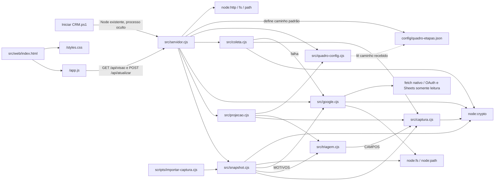
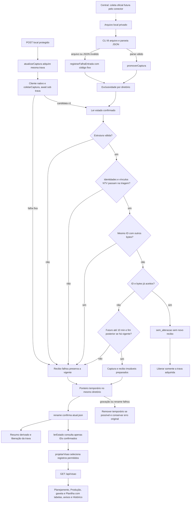
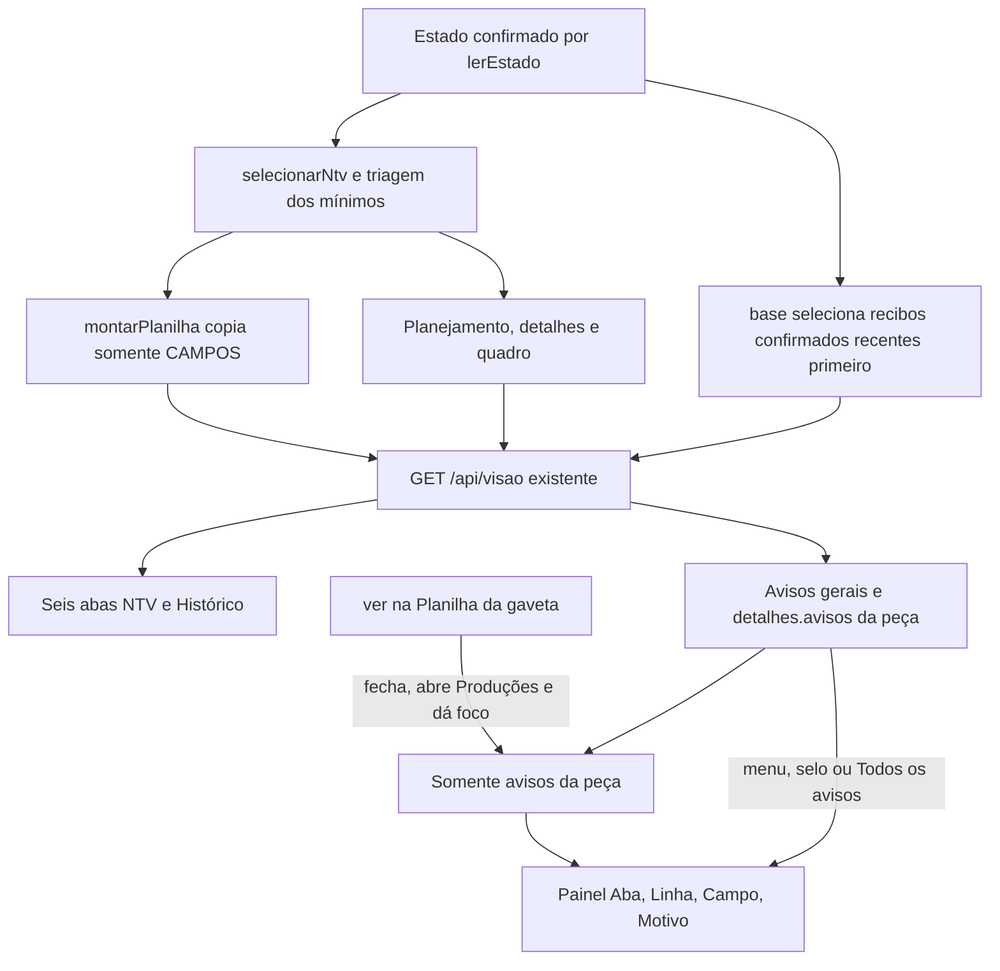
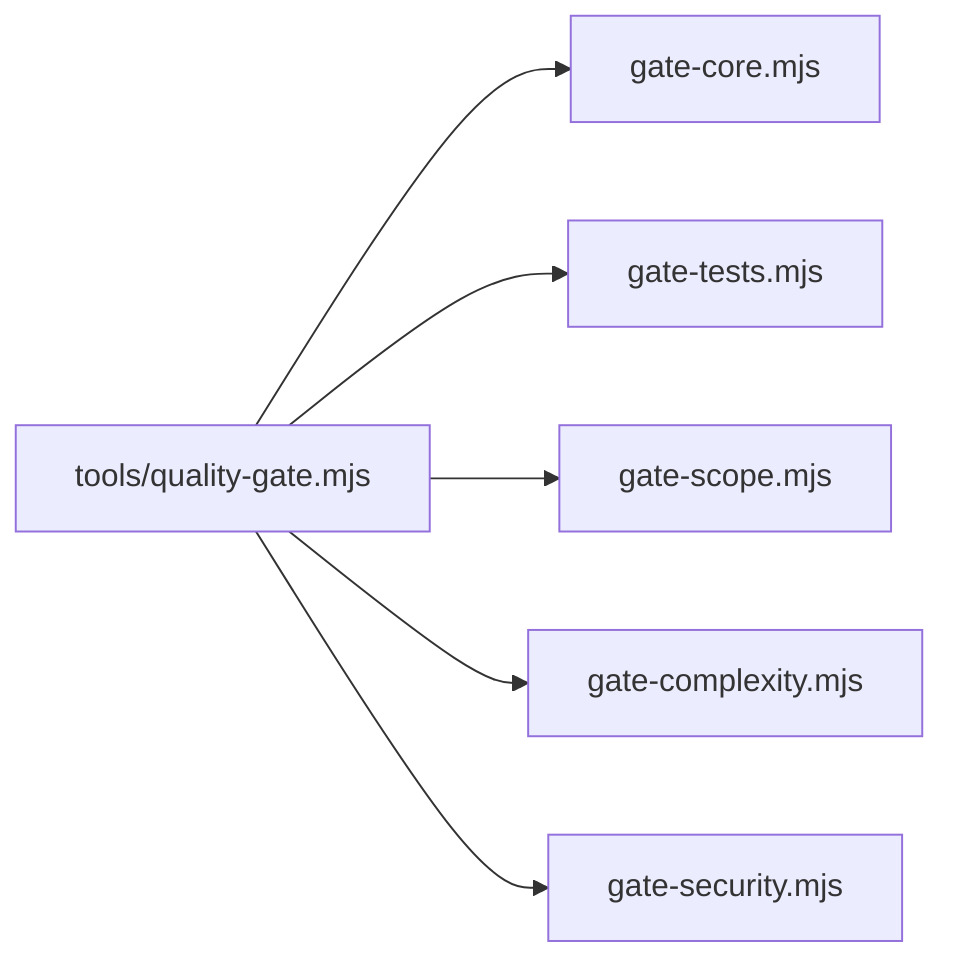

# Arquitetura

Como um álbum de fotografias da operação, o CRM recebe um arquivo preparado pela Central, guarda a observação aceita e apresenta um índice local da NTV. Consultar o álbum não comanda a produção.

001 entregue e demonstrada: [validação da 001](../specs/001-consulta-local-producao/validacao.md). 002 concluída com T021 demonstrada; testes permanecem com cliente falso: [validação da 002](../specs/002-consulta-planilhas/validacao.md).

## Módulos e imports reais

| Módulo | Responsabilidade atual | Documento |
| --- | --- | --- |
| captura | Seis abas/66 mínimos, identidades, dimensões, tempos e hash; sem rede | [Validação](modules/captura.md) |
| triagem | Seleção NTV/66 mínimos, redação conservadora e validação de identidades antes da promoção; sem I/O ou mapa do quadro | [Triagem](modules/triagem.md) |
| snapshot | Leitura privada, exclusividade de importação, arquivos imutáveis, confirmação e falhas | [Persistência](modules/snapshot.md) |
| importar-captura | Entrada CLI local, mensagens/saída e recibo de falha de leitura | [Importador](modules/importador.md) |
| quadro-config | Validador genérico; JSON versionado tem nove etapas e duas listas vazias; projeção aplica classificação e contador por semana | [Configuração](modules/quadro-config.md) |
| projecao | Usa seleção/triagem compartilhada e reúne semanas/dias/formatos, frescor, detalhes/quadro e cópias dos mínimos para seis tabelas | [Projeção](modules/projecao.md) |
| google | Configuração externa, JWT RS256, token em memória e GET tipada | [Google](modules/google.md) |
| coleta | Duas leituras de seis grades, datas, hashes e metadados | [Coleta](modules/coleta.md) |
| servidor | HTTP local com cinco rotas fixas, controle de Host/Origin e respostas resumidas | [Servidor](modules/servidor.md) |
| iniciador | Windows PowerShell 5.1, escolha do Node, porta, processo oculto, confirmação de início e logs privados | [Iniciador](modules/iniciador.md) |
| web | Planejamento/calendário/lista/filtros, Produção por semana, gaveta compacta, selo/releitura e Planilha com seis abas, Histórico e avisos detalhados | [Interface](modules/web.md) |

Aplicação em CommonJS e JavaScript/HTML/CSS nativos, sem framework, banco ou `package.json` de aplicação. Node 24.19.0 e Playwright já existentes; nenhuma dependência nova instalada. Configuração versionada não contém dados de linhas.

`.specify/feature.json` é ponteiro local não versionado. Checkout remoto identifica a feature pela branch `001-consulta-local-producao` e sua pasta de specs; o ponteiro não é pré-requisito do importador/servidor.

## Entrada, persistência e confirmação

`atual.json` contém `{capturaId, ultimaTentativaId, historicoIds}`. Capturas e recibos são preparados com abertura exclusiva e fsync antes do rename. Falha na gravação/rename do ponteiro tenta remover somente seu temporário, preservando o erro original se a limpeza também falhar. Resumo `ultima-tentativa.json` é derivado; falha dele não muda o estado confirmado. Arquivo órfão de interrupção não comprova aceitação nem entra no Histórico.

| Caminho dentro do diretório privado | Autoridade / regra |
| --- | --- |
| `.importacao.lock` | PID/instante da única importação em andamento; segunda instância recusada |
| `capturas/<capturaId>.json` | Envelope/células validados, imutáveis |
| `tentativas/<tentativaId>.json` | Recibo preparado; confirmado apenas quando ID está no ponteiro |
| `atual.json` | Única confirmação de captura vigente e Histórico |
| `ultima-tentativa.json` | Cache derivado, sem autoridade concorrente |

Após validar estrutura e identidades NTV da candidata, mesmo ID e serialização já aceitos devolvem `sem_alteracao`, sem novo recibo/frescor/rollback. Conteúdo diferente no mesmo ID é conflito. Falha confirmável preserva captura e acrescenta recibo saneado; impossibilidade de registrar gera erro explícito. Interrupção pode deixar trava: não há expiração/remoção automática; conferir proprietário/processo/estado antes de recuperação manual. Os detalhes de falha, órfãos e concorrência estão no [módulo snapshot](modules/snapshot.md).

`lerRecibo` confere cada recibo confirmado antes da projeção: objeto, IDs compatíveis, tipos, resultado e data ISO real com fuso explícito; `completa` exige captura identificada. Recibo corrompido recusa a leitura, e `criarServidor` responde 503 genérico sem escrever ou reparar arquivos. Após `validarCaptura(raw)`, `promoverComTrava` chama `validarIdentidadesNtv` de [triagem](modules/triagem.md), antes de no-op, gravação da candidata ou troca de captura vigente. Campo NTV terminado em `_id` que seria redigido recusa a candidata; falha confirmável registra somente aba/linha/campo e motivo estático, preservando a última captura. A projeção reutiliza a mesma seleção e continua recusando bytes antigos/corrompidos sem fundir identidades em marcadores; HTTP retorna 503 sem escrita. Snapshot não importa mapa ou regras do quadro. `detalhar` avisa versão ausente; `pendenciasMidia` não afirma ausência de mídia vigente sem versão positiva da produção.

A validação temporal ocorre sob trava, depois de estrutura/conflito/no-op e antes de gravar a candidata: fim até 10 minutos no futuro é permitido, inclusive o limite; excedente é inválida, e ID novo com fim igual ou anterior ao vigente é desatualizada. Ambas confirmam motivo fixo no recibo e mantêm a vigente. GET/releitura/reinício validam estrutura sem reaplicar essa política relativa à importação.

A liberação tenta close e unlink separadamente. Avisos transitórios de liberação acompanham o resultado/erro original, sem alterar o recibo confirmado; o CLI os imprime em stderr e preserva o exit do resultado. A projeção `(estadoLocal, nowIso, mapaQuadro)` usa `nowIso` e `captura.completedAt` para frescor em São Paulo. US4 aplica mapa validado: publicação > liberação > revisão > etapa, status informativo e fallback Outras por semana.

## Fluxo HTTP e fronteiras

O ponto de entrada faz bind somente em `127.0.0.1:4318` por padrão. `criarServidor` devolve servidor não iniciado e admite diretórios/configuração confiáveis para testes em TEMP. O mapa é validado antes de criar o handler. Em cada consulta, o estado privado é relido/validado e só a projeção sai.

| Rota / condição | Método e resposta |
| --- | --- |
| / | GET/HEAD, HTML fixo |
| /app.js | GET/HEAD, JS fixo |
| /styles.css | GET/HEAD, CSS fixo |
| /api/visao | GET/HEAD, JSON selecionado; sem captura é 200 com ausência estruturada |
| /api/atualizar | POST local JSON {}, origem obrigatória e ≤1KiB; leitura/promoção |
| Outro método com origem válida | 405; Allow POST no atualizador, GET/HEAD nas outras rotas |
| Outra rota, privado ou traversal | 404; query não escolhe diretórios |
| Host/Origin recusados | 403, antes de método/rota |
| Estado confirmado ilegível | 503 resumido, sem alteração da captura |

Host é exatamente `127.0.0.1:<porta real>`; `localhost` não passa. Origin ausente é permitido somente na consulta; POST exige a própria origem HTTP. Sem CORS externo. CSP restringe scripts/estilos/conexões a self e proíbe imagens/objetos/incorporação. Respostas têm no-store/nosniff; HEAD não inclui corpo.

O servidor não expõe `data/`, configuração bruta, envelope/metadados de coleta, células extras ou qualquer arquivo arbitrário. Texto é renderizado por `textContent`; supressão conservadora protege formatos conhecidos de conteúdo sensível sem confundir HTTPS com caminho Windows. Antes do HTTP, a projeção analisa `Arquivos.url` e `Produções.url_video_final` com `new URL`: usuário ou senha causam **[conteúdo suprimido]** e aviso fixo localizado, sem expor o valor. String não vazia recusada pelo construtor também é suprimida, com motivo fixo **URL inválida suprimida**; vazio/somente espaços é preservado sem esse aviso. Original permanece só na captura privada. Nenhuma URL registrada é carregada automaticamente; a UI também não ecoa URL recusada como texto bruto.

Por decisão do autor, a triagem em texto livre e recibo substitui somente pedaço HTTP(S) separado por espaços em branco que `new URL` reconhece com usuário/senha, preservando o restante da frase, separadores e pontuação de contorno. Não promete detectar outros esquemas, URL relativa, espaços em userinfo ou forma fora desse pedaço; o guarda dos campos de URL dedicados permanece. JSON é dado: somente tokens de string alterados são reserializados, com demais bytes, números, ordem, espaços e escapes legítimos intactos, sem execução ou expansão da whitelist. A validade original de origens_json fica em WeakMap privado para não confundir supressão com JSON inválido. Avisos globais de registros relacionados passam a integrar o contador de cada peça, sem duplicar o conjunto global. Na tela, arquivo ligado sem URL segura mostra **link não permitido** e Texto registrado identifica Página/Cena por número e versão, conservando IDs na API.

## Configuração e execução

| Entrada real | Consumidor / limite |
| --- | --- |
| `--data-dir <diretorio>` | CLI/servidor; diretório privado padrão data/; testes sempre TEMP |
| `--port <inteiro>` | Servidor; 4318 padrão, 0 para porta efêmera de teste |
| `quadroConfigPath` / `webDir` | Argumentos internos confiáveis de criarServidor, sem controle HTTP |
| `-DataDir` / `-Port` / `-NodePath` | Iniciador; diretório privado, porta 0–65535 e runtime explícito; defaults data/ e 4318 |
| `CRM_NODE_PATH` | Iniciador usa se -NodePath estiver vazio; fallback node.exe no PATH; módulos Node não leem essa variável |
| `CRM_GOOGLE_CREDENTIALS_FILE` | Cliente Google no POST; caminho absoluto privado fora do projeto |
| `CRM_SPREADSHEET_ID` | Cliente Google no POST; ID privado, sem controle HTTP ou browser |
| `PATH` | Diretório do Node 24.19.0 à frente para subprocessos do gate; ver quickstart |
| `CRM_PLAYWRIGHT_MODULE` | Teste de interface resolve Playwright existente; sem ela tenta playwright |
| `CI=true` / plataforma Linux | Interface faz SKIP com CI=true; iniciador faz SKIP fora de win32. M8: UI fora do LCOV e fronteira UI/PowerShell no Linux, sem substituir aceite Windows |

Comandos reais e demo sintética isolada estão no [quickstart](../specs/001-consulta-local-producao/quickstart.md). O [iniciador](modules/iniciador.md) confirma a linha de início do Node em até dez segundos, retorna PID/URL/logDir/orientação de encerramento e mantém logs em `<DataDir>/runtime/`. Em erro encerra somente o filho criado por sua chamada; nunca o ocupante da porta. A 001 foi demonstrada com captura oficial; a leitura direta da 002 foi demonstrada na T021 e preserva os campos/identidades do [contrato](../specs/001-consulta-local-producao/contracts/captura-e-consulta.md); hashes coerentes de fixture não comprovam coleta real.

## O que já aparece e o que falta

Planejamento apresenta calendário/lista/filtros, imagem B, “N sem data” global, objetivo indefinido e gaveta do dia inteiro em acordeões. Peça remarcada segue sua data civil no mês e continua agrupada pela semana registrada. Seis status literais recebem rótulos legíveis só na UI; desconhecidos e API mantêm o original. Mês usa somente inicial maiúscula; calendário inclui apenas semanas com dia do mês e sidebar desktop acompanha a altura da página. Desktop usa calendário; 390 px começa em lista e menu recolhido. [Screenshots](design/screenshots/LEIA-ME.md) são da aplicação com dados fictícios.

US2/T019–T022 entrega `sem_captura`, `falha_atualizacao`, `atualizada_hoje` e `anterior_hoje`, com textos/cores contratuais e clique do selo até Planilha em todas as telas. Sem captura, eventual primeira falha conserva **Sem dados**. Com captura, a última tentativa falha tem precedência sobre frescor e acrescenta aviso curto de preservação da anterior. Datas/horas vêm de `completedAt` em `America/Sao_Paulo`, sem usar datas das linhas ou renovar instante por consulta.

Planilha mostra fonte, fim da captura e cobertura semanal. Origem resume somente a falha ativa e **N avisos de dados** como link; os motivos ficam em uma única tabela Aba/Linha/Campo/Motivo, sem lista repetida no cabeçalho. Há seis abas de dados e Histórico final. **Atualizar dados** desabilita o botão durante POST /api/atualizar e o GET posterior; role=status informa atualização/sucesso/falha e aviso fixo da trava, quando houver. Sucesso atualiza a visão mantendo a tela e uma aba disponível; erro HTTP, inclusive 503, apresenta mensagem local e conserva visão/selo/dados já carregados, liberando o botão para tentar novamente. Sem visão anterior, aparece **Consulta indisponível**. GET/no-op conservam falha ativa; só nova captura completa aceita a encerra.

US3/T023–T026 entrega todas as peças do dia, independentemente do filtro do resumo, na [gaveta compacta aprovada](design/mockups/gaveta-v2.html): primeira seção aberta, demais resumidas, faixa de quatro dados preenchidos, publicação registrada em uma linha e unidades compactas por versão. Etapas conhecidas têm rótulos legíveis só na apresentação. Resumo distingue revisão aberta, a confirmar e ausência; a revisão visual mostra decisão/versão/motivo e correção/tratamento sem IDs técnicos, conservados na API. Adicionais ficam em +N revisão aberta/revisões abertas, e resolvidas/antigas dentro de Histórico recolhido. Texto registrado e versões anteriores também abrem por clique. Cena conserva três slots de mídia e um aviso humano agregado das imagens/vídeo ausentes; validações de índice/tempo/versão são independentes. Documentos Plano/Redação/Visual aparecem uma vez por semana representada, no fim do dia, com — na ausência. A projeção reutiliza sua resolução na mesma consulta: aviso semanal aparece uma vez no conjunto global e continua localizado em cada peça afetada.

A API conserva detalhes e avisos com aba/linha física/campo; a gaveta mostra quantidade e link para os avisos da peça na Planilha. Publicação preenchida inconsistente conserva o registro e o aviso, sem confirmação remota. Links só HTTPS nos hosts Drive/Docs exatos e sem credenciais; não há carregamento automático de mídia. O diálogo tem 520 px no desktop, fecha com Esc e devolve foco; no celular ocupa a tela inteira. US4/T027–T030 entrega quadro por semana/tema, oito colunas e Outras por rótulos distintos; responsável/correção separados e primeira pendência/+N visíveis. Mídia fica oculta somente nos cartões de Planejamento/Redação/Visual; detalhes continuam na API/gaveta. Clique abre dia inteiro ou Sem data da semana, sem arrastar/editar. Grid tem quatro colunas em 1440 px, duas até 1100 px e uma até 720 px. US5/T031–T034 implementa seis tabelas/Histórico. Iniciador, escala sintética e regressões de T035–T038 foram verificados localmente; captura real, gate após demonstração e onboarding final (T039–T041) concluídos. Evidências e limites ficam somente na validação.

## Planilha: mínimos, avisos e Histórico

Como folhas de consulta do mesmo álbum, as seis tabelas mostram a captura NTV
completa; o atalho da gaveta localiza os avisos relacionados à peça.

`montarPlanilha` em [src/projecao.cjs](../src/projecao.cjs) copia cabeçalhos e objetos de linha já
triados antes dos enriquecimentos, evitando `quadro`, `detalhes`, envelope e extras.
Contagens são das linhas NTV, não da alocação no Google. Normalização null→string
vazia permanece nos mínimos, exceto `etapa_producao`; o original fica privado.
Histórico mostra todas as tentativas confirmadas, sem órfãos nem novo recibo por
no-op. As tabelas e o Histórico não criam rotas ou escritores adicionais; a triagem compartilhada está descrita acima.

`renderPlanilha` em [src/web/app.js](../src/web/app.js) conserva a aba disponível; setas, Home e End
mudam seleção e foco, e tabelas largas têm região própria de rolagem. Sem captura,
somente Histórico e orientação à Central. O link da gaveta abre Produções e dá
rolagem/foco ao painel da peça, sem recortar as seis tabelas; menu/selo/Todos os
avisos restauram os avisos gerais. Painel fica oculto em Histórico ou sem avisos.

`celulaPlanilha` no mesmo [app.js](../src/web/app.js) troca somente URL dedicada recusada por
**link não permitido**, mantendo o marcador exato de supressão. A API pode conservar
URL já triada fora da allowlist visual; textos livres legítimos mantêm suas URLs
como texto segundo o contrato. Células não criam links ou navegação automática.

## Ferramentas de qualidade, evidência e dívidas

O gate e seus imports estão em `tools/`; ESLint/lock são isolados da aplicação. `quality-gate.config.json` define Node 24.19.0, runner node --test e modo full. A UI fica fora do LCOV (pendência M8) e seus testes continuam obrigatórios no computador. Os resultados do gate estão somente na [validação](../specs/001-consulta-local-producao/validacao.md).

CI ativo com quality-gate obrigatório e review por comentário; histórico e estado corrente na [validação](../specs/001-consulta-local-producao/validacao.md). Dados, I/O, CLI, projeção e HTTP são obrigatórios no Linux; UI/PowerShell têm pulos explícitos e não comprovam aceite remoto dessas camadas. CLI está coberta; M8 refere-se à UI fora do LCOV e à fronteira UI/PowerShell no Linux.

| Dívida / pegadinha | Fonte e impacto |
| --- | --- |
| null vira célula vazia na entidade e na tabela projetada | função registros em src/captura.cjs; envelope preservado; projeção recupera null de etapa_producao antes da triagem; demais mínimos da US5 conservam a normalização, sem prometer reprodução literal da matriz |
| Mapa restrito aos rótulos aprovados | config/quadro-etapas.json; nove etapas e liberação/revisão vazias; testes/demonstrações usam mapa sintético em TEMP |
| I/O síncrono e validação por consulta | lerEstado em src/snapshot.cjs e handler de criarServidor em src/servidor.cjs; cenário sintético de escala verificado, limites na validação |
| Trava sobrevivente à interrupção | exclusiva em src/snapshot.cjs; exige reconciliação manual; aviso de liberação preserva resultado/erro |
| Teste de rename não prova queda de energia | Fluxo de persistência e validacao.md; registrar somente garantia testada |
| Avisos de complexidade | Funções do CLI, snapshot, projeção e web; medições atuais somente na validação, manutenção sem retirar validações |
| Manutenção da montagem do acordeão | acordeaoPeca em src/web/app.js; reúne seções com helpers compactos; preservar testes em futuras extrações, métricas na validação |
| Fonte/hashes no envelope não são prova de coleta | validarCaptura em src/captura.cjs; demonstrações da Central/002 conferidas nas respectivas validações; futuras capturas continuam exigindo evidência própria |
| Custo e limite do review | Limite 60 turnos/20 min na 0.4.9; custo/tempo e teto numérico de arquivos ainda a acompanhar |
| gerar-testes e retenção remota | Não exercitados no Actions; testes locais do kit não substituem prova remota |
| UI fora do LCOV e pulos UI/PowerShell no Linux | tests/interface.test.cjs e tests/iniciador.test.cjs; M8; CI/cobertura não substituem execução Windows local |

A projeção preserva a linha física dos avisos desde a matriz privada, por ID e WeakMap; não usa índice filtrado como localização. As demais dívidas acima continuam explícitas. Não há leitura de data/ para implementar/documentar, escrita operacional, geração, publicação, deploy ou instalação de agentes por consequência da consulta.

Estado e provas da 002 na [validação](../specs/002-consulta-planilhas/validacao.md). JWT/fetch sem dependência, timeout/sem redirects e quatro categorias de falha; [contrato](../specs/002-consulta-planilhas/contracts/leitura-planilha.md). Limite lexical de chave/junction e dupla leitura sem transação documentados nos módulos.
