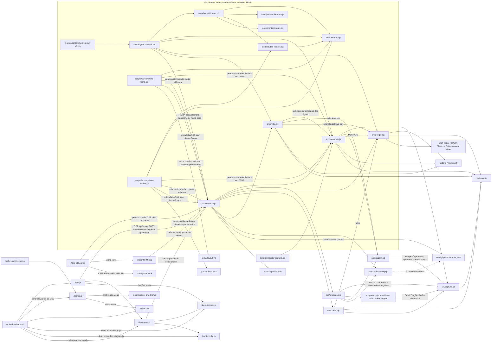
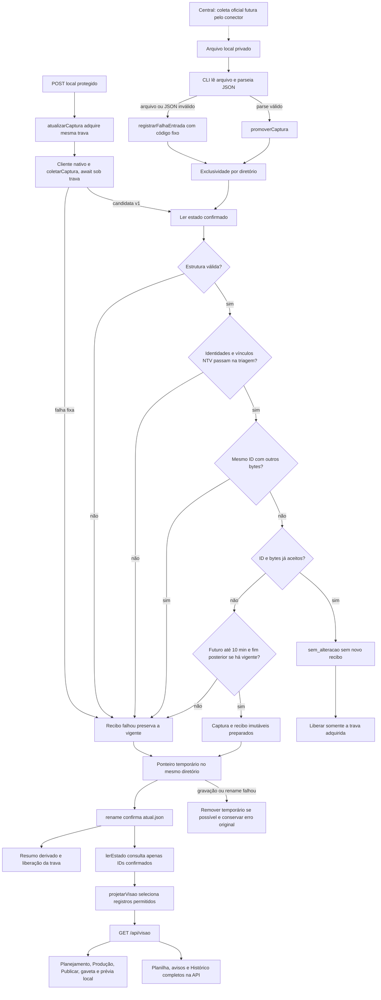
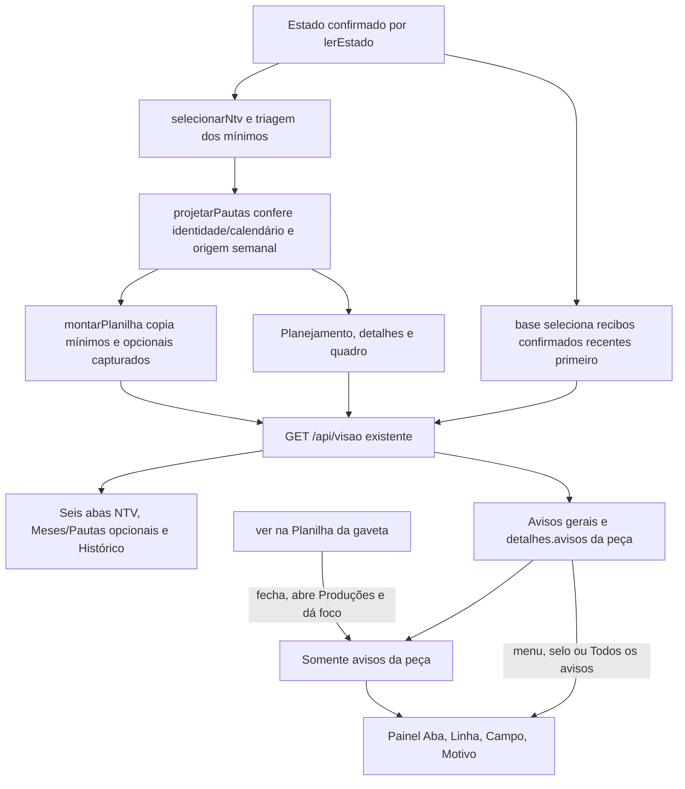
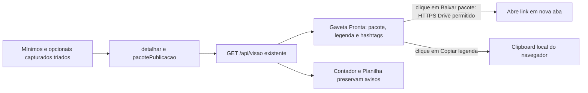
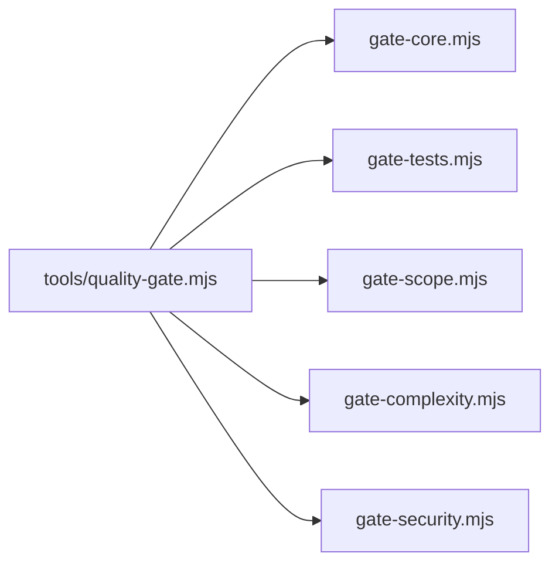

# Arquitetura

Como um álbum de fotografias da operação, o CRM recebe um arquivo preparado pela Central, guarda a observação aceita e apresenta um índice local da NTV. Consultar o álbum não comanda a produção.

001 entregue e demonstrada: [validação da 001](../specs/001-consulta-local-producao/validacao.md). 002 concluída com T021 demonstrada; testes permanecem com cliente falso: [validação da 002](../specs/002-consulta-planilhas/validacao.md). A 003 acrescenta Meses opcional, está concluída e foi demonstrada pelo CRM com uma linha fictícia marcada como teste na aba criada pelo autor; [validação da 003](../specs/003-planejamento-mensal/validacao.md). Código integrado pelo PR #15. A 004 está implementada/testada localmente com Pautas opcional e origem semanal; [PR #20](https://github.com/Browsher/crm-social/pull/20) acompanha entrega e integração, com merge condicionado ao gate/review do head vigente; resultados por head na validação. [Validação da 004](../specs/004-pautas-planejamento/validacao.md).

## Módulos, imports e relações de execução

A 006 Parte A foi integrada PR #24/main a5be355. B implementada, testada e revisada; 32/32 tarefas executadas, PR #25 MERGED e integrada em c4660d7 após aprovação expressa do autor. Gate local bc74d6e e CI do head aprovado a5c964c verde; I1 investigado sem regressão reproduzida, I2 histórico corrigido. Checks e revisão do head aprovado a5c964c conferidos no PR #25. API/captura/coleta/cache/tecnologia/mapas permanecem; [validação e fontes](../specs/006-layout-v3/validacao.md).

Manutenção visual `028778a`: avatar e SVG decorativo em instagram/styles; rótulo de pauta e rolagem semanal móvel em app. Sem mudança de imports, API, captura ou cache. Implementada/testada localmente, não integrada; checks/review do head final ficam no PR. [Validação](reports/006-ajustes-visuais-validacao.md).

**Histórico da entrega 005:** **005 — Prévias de imagens**, implementado/testado localmente em 08/10/2026, no [PR #23](https://github.com/Browsher/crm-social/pull/23), com merge/exclusão da branch autorizados após gate/review aprovados no head final. Acrescenta mídia sob demanda pelo servidor, cache privado e galeria/ampliação na gaveta. O autor aprovou as 21 tarefas após a parada inicial; 21/21 concluídas. T002 confirmada pelo autor em 08/10/2026: pasta Produções compartilhada com a conta de serviço como Leitor, sem teste de acesso real pelo agente. [Validação por fonte e checks/review da entrega](../specs/005-previas-imagens/validacao.md). Versões de páginas e cenas integrada pelo [PR #22](https://github.com/Browsher/crm-social/pull/22), merge `b90980a`, após gate/review; Pronta já integrada pelo PR #21. O registro da 004 na introdução preserva sua rodada histórica.

| Módulo | Responsabilidade atual | Documento |
| --- | --- | --- |
| captura | Allowlist camposCapturados compartilhada por triagem/Planilha; seis abas obrigatórias/66 mínimos; Meses/quatro mínimos e Pautas/doze mínimos opcionais independentes; estrutura, dimensões, tempos e hash; sem rede | [Validação](modules/captura.md) |
| triagem | Seleção NTV dos mínimos e opcionais capturados, avisos por linha física, redação conservadora e validação de identidades antes da promoção; sem I/O ou mapa do quadro | [Triagem](modules/triagem.md) |
| snapshot | Leitura privada, exclusividade de importação, arquivos imutáveis, confirmação e falhas | [Persistência](modules/snapshot.md) |
| importar-captura | Entrada CLI local, mensagens/saída e recibo de falha de leitura | [Importador](modules/importador.md) |
| quadro-config | Validador genérico; JSON versionado tem nove etapas, liberacaoPronta com liberado e revisaoEmAndamento vazia; projeção aplica classificação e contador por semana | [Configuração](modules/quadro-config.md) |
| projecao | Usa seleção/triagem compartilhada e resolve pautas antes de reunir semanas/dias/formatos, frescor, detalhes/pacote de publicação/quadro e cópias dos mínimos/opcionais capturados para seis tabelas e Meses/Pautas opcionais | [Projeção](modules/projecao.md) |
| pautas | Confere pautas NTV triadas, calendário/duplicatas e resolve o ponteiro semanal por ID/marca/início, sem I/O | [Pautas](modules/pautas.md) |
| google | Configuração externa, JWT RS256 com scope por finalidade, tokens separados em RAM; Sheets tipado e Drive binário limitado | [Google](modules/google.md) |
| midia | Resolve arquivo no snapshot NTV vigente, confere bytes/hash, cache privado e fingerprint final; cliente Drive lazy | [Mídia](modules/midia.md) |
| coleta | Duas leituras de seis grades e Meses/Pautas quando existem, datas, inteiros textuais declarados, hashes e metadados | [Coleta](modules/coleta.md) |
| servidor | HTTP local com rotas existentes, sete estáticos explícitos e rota dinâmica restrita de mídia; Host/Origin, Sec-Fetch-Site na mídia e respostas resumidas | [Servidor](modules/servidor.md) |
| iniciador | Entrada Abrir CRM.cmd por duplo clique, reconhecimento de instância existente por GET local; Windows PowerShell 5.1, escolha do Node, porta, processo oculto, confirmação de início e logs privados | [Iniciador](modules/iniciador.md) |
| layout-model | Dez funções puras de estado/travamento/progresso/seleção e slots de imagens/datas/ordem/fila/publicadas, sem I/O ou mutação | [Modelo visual](modules/layout-model.md) |
| instagram | Dialog local compartilhado, perfil, slots, navegação/foco e atualização, sem contato com Instagram | [Prévia](modules/instagram.md) |
| perfil-config | Objeto global público sintético, carregado antes da prévia | [Configuração visual](modules/perfil-config.md) |
| web | Semana/Mês/objetivo/projetos, Publicar, topo único e gaveta; dados técnicos completos somente na API | [Interface](modules/web.md) |

Aplicação em CommonJS e JavaScript/HTML/CSS nativos, sem framework, banco ou `package.json` de aplicação. Node 24.19.0 e Playwright já existentes; nenhuma dependência nova instalada. Configuração versionada não contém dados de linhas.

`Abrir CRM.cmd` chama o PowerShell pelo caminho explícito do Windows e confere a porta 4318 antes de escolher Node. Se ocupada, `HttpClient` do .NET faz GET em loopback com timeout de dois segundos, sem proxy nem redirecionamento; HTTP 200 com objeto JSON e `schemaVersion` numérico 1 abre a URL fixa, sem chamar o iniciador. É reconhecimento mínimo da resposta, não autenticação do processo. Resposta incompatível/erro, inclusive HTTP 503 do próprio CRM, preserva o ocupante e falha com mensagem fixa/espera por tecla. Sucesso fecha sem `pause`. O GET lê somente a captura local; não altera o fluxo de coleta ou a persistência. `Iniciar CRM.ps1` continua recusando porta ocupada quando chamado diretamente. [Testes e limites](modules/iniciador.md#entrada-por-duplo-clique).

Tema claro/escuro implementado e testado localmente em 06/10/2026; integrado pelo [PR #18](https://github.com/Browsher/crm-social/pull/18). `theme.js` é carregado de forma síncrona no head antes do CSS; usa `prefers-color-scheme` e a escolha válida `crm-theme`, com leitura/escrita protegidas por try/catch. Sem armazenamento disponível, a escolha manual dura na página aberta. O atributo `data-theme` seleciona somente variáveis visuais de `styles.css`; não modifica captura, recibo, filtros, API ou estado editorial. [Testes e limites](modules/web.md#tema-claro-e-escuro) e [galeria sintética](design/screenshots/LEIA-ME.md#tema-claro-e-escuro).

O [gerador de screenshots](../scripts/screenshots-tema.cjs) é ferramenta de evidência sintética, externa à operação: usa `tests/fixtures.cjs`, promove somente em TEMP e cria sua própria instância do servidor. Nunca usa o CRM do autor ou Google. Em 07/10, [três testes do script real](../tests/screenshots-tema.test.cjs) passaram localmente: dois VM recusam limpeza fora de TEMP/prefixo permitido; um CLI gera 16 PNG em cópia TEMP e preserva diretório alheio. No CI, os dois VM executam e o CLI de navegador mantém SKIP pela M8. Esta rodada não mudou código de produção, PNG, configuração de CI/gate ou baseline; a integração posterior foi concluída pelo PR #18.

O [gerador da 004](../scripts/screenshots-pautas.cjs) usa `tests/pautas-fixtures.cjs` e os helpers de `tests/fixtures.cjs`, além de snapshot/servidor. Produz 20 imagens de cinco cenários em 1440/390 e claro/escuro, com relógio fixo sintético, estado em TEMP e porta efêmera; bloqueia acesso externo e confere erros do navegador. A limpeza fecha navegador/servidor e confere diretório TEMP/prefixo antes de remover somente a pasta criada. Quatro testes próprios verificam guardas, falha do navegador e CLI em cópia TEMP. [Galeria](design/screenshots/LEIA-ME.md#004--pautas-no-planejamento) e [validação da 004](../specs/004-pautas-planejamento/validacao.md); nenhum dado operacional ou instância do autor é usado.

`.specify/feature.json` é ponteiro local não versionado. Checkout remoto identifica a feature pela branch e sua pasta de specs (por exemplo, `004-pautas-planejamento`); o ponteiro não é pré-requisito do importador/servidor. Não há mapa Graphify neste checkout; o diagrama acima registra os imports pertinentes.

## Entrada, persistência e confirmação

`atual.json` contém `{capturaId, ultimaTentativaId, historicoIds}`. Capturas e recibos são preparados com abertura exclusiva e fsync antes do rename. Falha na gravação/rename do ponteiro tenta remover somente seu temporário, preservando o erro original se a limpeza também falhar. Resumo `ultima-tentativa.json` é derivado; falha dele não muda o estado confirmado. Arquivo órfão de interrupção não comprova aceitação nem entra no Histórico.

| Caminho dentro do diretório privado | Autoridade / regra |
| --- | --- |
| `.importacao.lock` | PID/instante da única importação em andamento; segunda instância recusada |
| `capturas/<capturaId>.json` | Envelope/células validados, imutáveis |
| `tentativas/<tentativaId>.json` | Recibo preparado; confirmado apenas quando ID está no ponteiro |
| `atual.json` | Única confirmação de captura vigente e Histórico |
| `ultima-tentativa.json` | Cache derivado, sem autoridade concorrente |

Após validar estrutura e identidades NTV da candidata, mesmo ID e serialização já aceitos devolvem `sem_alteracao`, sem novo recibo/frescor/rollback. Conteúdo diferente no mesmo ID é conflito. Falha confirmável preserva captura e acrescenta recibo saneado; impossibilidade de registrar gera erro explícito. Interrupção pode deixar trava: não há expiração/remoção automática; conferir proprietário/processo/estado antes de recuperação manual. Os detalhes de falha, órfãos e concorrência estão no [módulo snapshot](modules/snapshot.md).

`lerRecibo` confere cada recibo confirmado antes da projeção: objeto, IDs compatíveis, tipos, resultado e data ISO real com fuso explícito; `completa` exige captura identificada. Recibo corrompido recusa a leitura, e `criarServidor` responde 503 genérico sem escrever ou reparar arquivos. Após `validarCaptura(raw)`, `promoverComTrava` chama `validarIdentidadesNtv` de [triagem](modules/triagem.md), antes de no-op, gravação da candidata ou troca de captura vigente. Campo NTV terminado em `_id` que seria redigido recusa a candidata; falha confirmável registra somente aba/linha/campo e motivo estático, preservando a última captura. A projeção reutiliza a mesma seleção e continua recusando bytes antigos/corrompidos sem fundir identidades em marcadores; HTTP retorna 503 sem escrita. Snapshot não importa mapa ou regras do quadro. `detalhar` avisa versão ausente; `pendenciasMidia` usa unidades vigentes válidas independentemente da versão da produção, exigindo versão positiva da produção somente no fallback sem unidades vigentes.

A validação temporal ocorre sob trava, depois de estrutura/conflito/no-op e antes de gravar a candidata: fim até 10 minutos no futuro é permitido, inclusive o limite; excedente é inválida, e ID novo com fim igual ou anterior ao vigente é desatualizada. Ambas confirmam motivo fixo no recibo e mantêm a vigente. GET/releitura/reinício validam estrutura sem reaplicar essa política relativa à importação.

A liberação tenta close e unlink separadamente. Avisos transitórios de liberação acompanham o resultado/erro original, sem alterar o recibo confirmado; o CLI os imprime em stderr e preserva o exit do resultado. A projeção `(estadoLocal, nowIso, mapaQuadro)` usa `nowIso` e `captura.completedAt` para frescor em São Paulo. US4 aplica mapa validado: publicação > liberação > revisão > etapa, status informativo e fallback Outras por semana.

## Fluxo HTTP e fronteiras

O ponto de entrada faz bind somente em `127.0.0.1:4318` por padrão. `criarServidor` devolve servidor não iniciado e admite diretórios/configuração confiáveis para testes em TEMP. O mapa é validado antes de criar o handler. GET /api/visao relê/valida o estado privado e entrega somente a projeção; GET /api/midia resolve o registro vigente e pode ler o Drive pelo servidor, mantendo a captura/recibos inalterados.

| Rota / condição | Método e resposta |
| --- | --- |
| / | GET/HEAD, HTML fixo |
| /app.js | GET/HEAD, JS fixo |
| /theme.js | GET/HEAD, JS fixo; aplica preferência visual antes do CSS |
| /layout-model.js | GET/HEAD, JS fixo; derivados de apresentação |
| /perfil-config.js | GET/HEAD, JS fixo; nome e sigla sintéticos públicos |
| /instagram.js | GET/HEAD, JS fixo; prévia local |
| /styles.css | GET/HEAD, CSS fixo |
| /api/visao | GET/HEAD, JSON selecionado; sem captura é 200 com ausência estruturada |
| /api/midia/ID-interno | GET exclusivo; bytes PNG/JPEG/WEBP pelo serviço privado; HEAD/outros 405 sem serviço |
| /api/atualizar | POST local JSON {}, origem obrigatória e ≤1KiB; leitura/promoção |
| Outro método com origem válida | 405; Allow POST no atualizador, GET na mídia, GET/HEAD nas outras rotas |
| Outra rota, privado ou traversal | 404; query não escolhe diretórios |
| Host/Origin recusados | 403, antes de método/rota |
| Estado confirmado ilegível | 503 resumido, sem alteração da captura |

Host é exatamente `127.0.0.1:<porta real>`; `localhost` não passa. Origin ausente é permitido na consulta; POST exige a própria origem HTTP. Na mídia, Sec-Fetch-Site cross-site/same-site é recusado antes de método/resolução/cache/rede. Sem CORS externo. A 005 muda somente CSP img-src de none para self; scripts/estilos/conexões continuam self, com objetos/incorporação bloqueados. Respostas têm no-store/nosniff; mídia também tem CORP same-origin em sucesso/falhas. HEAD não inclui corpo.

O servidor não expõe `data/`, configuração bruta, envelope/metadados de coleta, células extras ou qualquer arquivo arbitrário. Texto é renderizado por `textContent`; supressão conservadora protege formatos conhecidos de conteúdo sensível sem confundir HTTPS com caminho Windows. Antes do HTTP, a projeção analisa `Arquivos.url` e `Produções.url_video_final` com `new URL`: usuário ou senha causam **[conteúdo suprimido]** e aviso fixo localizado, sem expor o valor. String não vazia recusada pelo construtor também é suprimida, com motivo fixo **URL inválida suprimida**; vazio/somente espaços é preservado sem esse aviso. Original permanece só na captura privada. Nenhuma URL registrada é carregada automaticamente; a UI também não ecoa URL recusada como texto bruto.

Por decisão do autor, a triagem em texto livre e recibo substitui somente pedaço HTTP(S) separado por espaços em branco que `new URL` reconhece com usuário/senha, preservando o restante da frase, separadores e pontuação de contorno. Não promete detectar outros esquemas, URL relativa, espaços em userinfo ou forma fora desse pedaço; o guarda dos campos de URL dedicados permanece. JSON é dado: somente tokens de string alterados são reserializados, com demais bytes, números, ordem, espaços e escapes legítimos intactos, sem execução ou expansão da whitelist. A validade original de origens_json fica em WeakMap privado para não confundir supressão com JSON inválido. Avisos globais de registros relacionados passam a integrar o contador de cada peça, sem duplicar o conjunto global. Na tela, arquivo ligado sem URL segura mostra **link não permitido** e Texto registrado identifica Página/Cena por número e versão, conservando IDs na API.

## Configuração e execução

| Entrada real | Consumidor / limite |
| --- | --- |
| `--data-dir <diretorio>` | CLI/servidor; diretório privado padrão data/; testes sempre TEMP |
| `--port <inteiro>` | Servidor; 4318 padrão, 0 para porta efêmera de teste |
| `quadroConfigPath` / `webDir` | Argumentos internos confiáveis de criarServidor, sem controle HTTP |
| `-DataDir` / `-Port` / `-NodePath` | Iniciador; diretório privado, porta 0–65535 e runtime explícito; defaults data/ e 4318 |
| `CRM_NODE_PATH` | Iniciador usa se -NodePath estiver vazio; fallback node.exe no PATH; módulos Node não leem essa variável |
| `CRM_GOOGLE_CREDENTIALS_FILE` | Sheets no POST e Drive no primeiro cache miss de mídia; caminho absoluto privado fora do projeto |
| `CRM_SPREADSHEET_ID` | Somente Sheets no POST; ID privado, sem controle HTTP ou browser; Drive não exige essa variável |
| `PATH` | Diretório do Node 24.19.0 à frente para subprocessos do gate; ver quickstart |
| `CRM_PLAYWRIGHT_MODULE` | Teste de interface resolve Playwright existente; sem ela tenta playwright |
| `CI=true` / plataforma Linux | Interface faz SKIP com CI=true; iniciador faz SKIP fora de win32. M8: UI fora do LCOV e fronteira UI/PowerShell no Linux, sem substituir aceite Windows |

Comandos reais e demo sintética isolada estão no [quickstart](../specs/001-consulta-local-producao/quickstart.md). O [iniciador](modules/iniciador.md) confirma a linha de início do Node em até dez segundos, retorna PID/URL/logDir/orientação de encerramento e mantém logs em `<DataDir>/runtime/`. Em erro encerra somente o filho criado por sua chamada; nunca o ocupante da porta. A 001 foi demonstrada com captura oficial; a leitura direta da 002 foi demonstrada na T021 e preserva os campos/identidades do [contrato](../specs/001-consulta-local-producao/contracts/captura-e-consulta.md); hashes coerentes de fixture não comprovam coleta real.

## O que já aparece e o que falta

A Parte A substituiu calendário/lista de entrada e quadro técnico por Semana/Mês e projetos. B removeu a Planilha visual e o destino do selo, acrescentou fila Publicar e prévia compartilhada por Produção/Publicar/gaveta. O Mês usa rótulos curtos junto ao ponto, com Imagem → Oferta somente nessa apresentação. A revisão visual posterior conserva Atualizar/selo/feedback somente no topo da página, que fica inerte durante showModal. A prévia usa moldura preta .phone, siglaMarca/nomePerfil sintéticos configurados, Fechar acima e navegação sobreposta à arte; Imagem única 1/1 oculta setas/pontos. Releitura recebida atualiza a mesma peça ou fecha se removida, sem tornar o botão do fundo acionável pelo usuário. O selo conserva data/hora/falha da captura, inclusive falha inicial; a API preserva o destino legado planilha, ignorado pelo cliente. Dados a confirmar, único status global e no resumo de peça com aviso, mantém a incerteza visível na página, sem entrar no modal; fonte/cobertura/avisos técnicos completos continuam nos dados por decisão explícita do autor, com trade-off documentado no Constitution Check da 006. O restante desta seção conserva a implementação histórica 001–005; o módulo web descreve a interface vigente.

Planejamento apresenta calendário/lista/filtros, imagem B, “N sem data” global, objetivo/pautas do mês exibido em Meses opcional, estados indefinido/A confirmar e gaveta do dia inteiro em acordeões. Peça remarcada segue sua data civil no mês e continua agrupada pela semana registrada. Seis status literais recebem rótulos legíveis só na UI; desconhecidos e API mantêm o original. Mês usa somente inicial maiúscula; calendário inclui apenas semanas com dia do mês e sidebar desktop acompanha a altura da página. Desktop usa calendário; 390 px começa em lista e menu recolhido. [Screenshots](design/screenshots/LEIA-ME.md) são da aplicação com dados fictícios.

**Histórico 001–005:** US2/T019–T022 entrega `sem_captura`, `falha_atualizacao`, `atualizada_hoje` e `anterior_hoje`, com textos/cores contratuais e clique do selo até Planilha em todas as telas. Sem captura, eventual primeira falha conserva **Sem dados**. Com captura, a última tentativa falha tem precedência sobre frescor e acrescenta aviso curto de preservação da anterior. Datas/horas vêm de `completedAt` em `America/Sao_Paulo`, sem usar datas das linhas ou renovar instante por consulta.

**Histórico 001–005 da interface, antes da remoção na 006 B:** Planilha mostra fonte, fim da captura e cobertura semanal. Origem resume somente a falha ativa e **N avisos de dados** como link; os motivos ficam em uma única tabela Aba/Linha/Campo/Motivo, sem lista repetida no cabeçalho. Há seis abas obrigatórias, Meses/Pautas opcionais nessa ordem depois de Revisoes e Histórico final. As opcionais acompanham teclado/rolagem, com retorno à primeira aba disponível se a selecionada desaparecer; falhas usam mensagem legível no Histórico. **Atualizar dados** desabilita o botão durante POST /api/atualizar e o GET posterior; role=status informa atualização/sucesso/falha e aviso fixo da trava, quando houver. Sucesso atualiza a visão mantendo a tela e uma aba disponível; erro HTTP, inclusive 503, apresenta mensagem local e conserva visão/selo/dados já carregados, liberando o botão para tentar novamente. Sem visão anterior, aparece **Consulta indisponível**. GET/no-op conservam falha ativa; só nova captura completa aceita a encerra.

US3/T023–T026 entrega todas as peças do dia, independentemente do filtro do resumo, na [gaveta compacta aprovada](design/mockups/gaveta-v2.html): primeira seção aberta, demais resumidas, faixa de quatro dados preenchidos, publicação registrada em uma linha e unidades compactas por versão. Etapas conhecidas têm rótulos legíveis só na apresentação. Resumo distingue revisão aberta, a confirmar e ausência; a revisão visual mostra decisão/versão/motivo e correção/tratamento sem IDs técnicos, conservados na API. Adicionais ficam em +N revisão aberta/revisões abertas, e resolvidas/antigas dentro de Histórico recolhido. Texto registrado e versões anteriores também abrem por clique. Cena conserva três slots de mídia e um aviso humano agregado das imagens/vídeo ausentes; validações de índice/tempo/versão são independentes. Documentos Plano/Redação/Visual aparecem uma vez por semana representada, no fim do dia, com — na ausência. A projeção reutiliza sua resolução na mesma consulta: aviso semanal aparece uma vez no conjunto global e continua localizado em cada peça afetada.

**Histórico 001–005 da interface:** a API conserva detalhes e avisos com aba/linha física/campo; a gaveta então mostrava quantidade e link para os avisos da peça na Planilha. Na 006 B, dados da API permanecem, destino visual foi removido e há sinal mínimo Dados a confirmar. Publicação preenchida inconsistente conserva o registro e o aviso, sem confirmação remota. Links só HTTPS nos hosts Drive/Docs exatos e sem credenciais; na 005, abrir a peça inicia suas imagens por rota local, mantendo quadro e peças fechadas sem busca. O diálogo tem 520 px no desktop, fecha com Esc e devolve foco; no celular ocupa a tela inteira. A ampliação usa segundo dialog e o primeiro Escape fecha somente a imagem. US4/T027–T030 entrega quadro por semana/tema, oito colunas e Outras por rótulos distintos; responsável/correção separados e primeira pendência/+N visíveis. Mídia fica oculta nos cartões de Planejamento/Redação/Visual. Pronta troca toda pendência do cartão por Pronta para publicar e recolhe páginas/cenas, sem avisos de mídia nas unidades; detalhes e avisos continuam na API e na Planilha. Clique abre dia inteiro ou Sem data da semana, sem arrastar/editar. Grid tem quatro colunas em 1440 px, duas até 1100 px e uma até 720 px. US5/T031–T034 implementa seis tabelas/Histórico. Iniciador, escala sintética e regressões de T035–T038 foram verificados localmente; captura real, gate após demonstração e onboarding final (T039–T041) concluídos. Evidências e limites ficam somente na validação.

## Planilha: mínimos, avisos e Histórico — projeção preservada; interface histórica

Na apresentação histórica 001–005, como folhas de consulta do mesmo álbum, as seis tabelas mostravam a captura NTV
completa; o atalho da gaveta localizava os avisos relacionados à peça. A projeção permanece na API; esses destinos visuais foram removidos na 006 B. O diagrama abaixo conserva o fluxo histórico da interface.

`camposCapturados` em [src/captura.cjs](../src/captura.cjs) compartilha a allowlist de mínimos e opcionais entre triagem e Planilha: Semanas.pauta_id, Produções.pacote_versao/hashtags e Arquivos.extensao só existem na consulta se seus cabeçalhos foram capturados. Demais extras continuam privados. A allowlist vale também para capturas antigas que já contêm esses cabeçalhos: seus valores entram na seleção triada e na Planilha, sem regravar o envelope, alterar bytes/hashes ou converter tipos históricos. `montarPlanilha` em [src/projecao.cjs](../src/projecao.cjs) copia cabeçalhos e objetos de linha já
triados, depois da resolução de pautas e antes de planejar/detalhar o quadro, evitando
`pautaOrigem`, `quadro`, `detalhes`, envelope e extras nas tabelas.
Contagens são das linhas NTV, não da alocação no Google. Normalização null→string
vazia permanece nos mínimos, exceto `etapa_producao`; o original fica privado.
Histórico mostra todas as tentativas confirmadas, sem órfãos nem novo recibo por
no-op. As tabelas e o Histórico não criam rotas ou escritores adicionais; a triagem compartilhada está descrita acima.

Na interface histórica 001–005, `renderPlanilha` em [src/web/app.js](../src/web/app.js) conservava a aba disponível; setas, Home e End
mudavam seleção e foco, e tabelas largas tinham região própria de rolagem. Sem captura,
apareciam somente Histórico e orientação à Central. O link da gaveta abria Produções e dava
rolagem/foco ao painel da peça, sem recortar as seis tabelas; menu/selo/Todos os
avisos restauravam os avisos gerais. O painel ficava oculto em Histórico ou sem avisos. Esses renderizadores/atalhos não existem na 006 B.

Na interface histórica 001–005, `celulaPlanilha` no mesmo [app.js](../src/web/app.js) trocava somente URL dedicada recusada por
**link não permitido**, mantendo o marcador exato de supressão. A API pode conservar
URL já triada fora da allowlist visual; textos livres legítimos mantêm suas URLs
como texto segundo o contrato. Células não criavam links ou navegação automática.

## Páginas e cenas: vigência e mídia explícita

Como um texto que conserva sua fotografia, cada unidade resolve os arquivos pelos ponteiros exatos em `src/projecao.cjs`. `arquivoLigado` exige produção e, se preenchida no arquivo, unidade coincidente; versão da mídia pode diferir do texto. Vínculo quebrado ou escopo incompatível retorna null com aviso, sem substituição. Versão inválida do arquivo conserva sua validação numérica independente.

`versoesUnidades` calcula a maior versão inteira positiva por índice inteiro positivo para cada produção e tipo de unidade. `unidades` marca todos os empates nessa maior versão como vigentes; IDs continuam exclusivos por registro e seu formato não é interpretado. Índice/versão inválidos permanecem com aviso e não são vigentes. Sem flag de retirada, um índice cujo único registro ainda capturado é v1 continua vigente, mesmo com outros índices em v3. `Produções.versao` não participa desse cálculo. Revisões mantêm sua comparação com a versão da produção e seus vínculos: produção v8/página v3 conserva revisão v3 em anteriores e revisão v8 dessa página em ambíguas, sem pendência vigente no quadro. Pacote mantém a versão exata capturada em `pacote_versao`.

**Apresentação histórica 001–005:** Em `src/web/app.js`, `secaoUnidades` agrupa por `[vigente,versao]`, mostrando grupos atuais antes dos históricos recolhidos, inclusive quando uma mesma versão contém unidades atuais e antigas. `adicionarVersaoImagem`, chamado por `unidadeDetalhe`, mostra **imagem vN** quando a versão do arquivo ligado é inteira positiva; vazia/inválida mostra **imagem: versão a confirmar**, sem converter o original. A regra de Pronta continua recolhendo a seção inteira e mantendo seus avisos na API/Planilha. [Projeção](modules/projecao.md#detalhes-versões-e-relações), [interface](modules/web.md#versões-das-unidades) e [evidência local](reports/versoes-unidades-validacao.md). Os imports do mapa acima permanecem os mesmos; não há mapa Graphify neste checkout.

## Pronta: pacote e ações locais da gaveta — histórico 001–005

Como consultar uma pasta já preparada, `pacotePublicacao` em `src/projecao.cjs` procura um único Arquivos com produção exata, tipo `pacote`, extensão `zip` e versão igual a `Produções.pacote_versao`, inteiro positivo seguro. Não depende de `Produções.versao`, não escolhe maior versão ou empate; seleção não confirma bytes ou acesso. A coleta direta normaliza o inteiro textual canônico seguro antes dos hashes, sem migrar capturas históricas.

**Apresentação histórica 001–005:** `prontaParaPublicar` em `src/web/app.js` aplica ao botão somente HTTPS em `drive.google.com`, sem usuário/senha ou porta diferente da padrão; ausência/ambiguidade/URL recusada apresenta Pacote indisponível. Legenda/hashtags são texto seguro; a ausência da coluna hashtags e a célula vazia mostram a mesma mensagem Hashtags não informadas. A cópia junta presentes com duas quebras de linha, desabilita sem texto e oferece cópia manual na falha. `detalhesUnidades` recolhe páginas/cenas e omite seus avisos de mídia nessa coluna mesmo expandidas. `pendenciaQuadro` mostra Pronta para publicar no cartão. API e Planilha mantêm detalhes/avisos; nenhuma ação editorial ou rota é acrescentada.

`tests/pronta-interface.test.cjs` usa `tests/pronta-fixtures.cjs`, snapshot e servidor isolados em TEMP/porta efêmera. O clipboard dos testes é simulado em memória, com requisições externas bloqueadas; `CRM_SCREENSHOTS_PRONTA=1` gera somente os oito `pronta-*.png`. [Reprodução e galeria](design/screenshots/LEIA-ME.md#pronta-para-publicar), [validação/limites](reports/pronta-publicar-validacao.md). Os imports de produção permanecem os mesmos; `camposCapturados` é reutilizado pelos consumidores de captura existentes, sem mapa Graphify no checkout.

## Pautas: identidade, calendário e origem

`src/pautas.cjs` importa `CAMPOS_PAUTAS` e `instanteUtc` de captura e é chamado pela projeção com linhas NTV já triadas. A raiz `pautas` existe somente quando a aba foi capturada, com cópias de pautas cuja identidade/calendário são válidos e unívocos. Duplicatas de ID textual não vazio ou marca/início civil válido em qualquer linha NTV invalidam os destinos envolvidos, inclusive quando a linha é inválida em outro campo; ID inválido repetido recebe apenas o aviso de identidade inválida, sem aviso adicional de identidade repetida, e início vazio/não textual/impossível não recebe aviso adicional de duplicidade; outras marcas não participam desse índice nem criam avisos. Mês, ordinal inteiro 1–4 e segunda-feira correspondente são conferidos sem inferir uma quinta pauta. Texto/modelo/origem/status desconhecidos geram aviso e permanecem dados da fonte; não mudam a produção.

Semanas recebe `pauta_id` e `pautaOrigem` somente quando o cabeçalho opcional foi capturado. A origem exige ID exato, mesma marca e mesmo início, sem dedução por data/tema/ordem; vazio não avisa e preenchido não resolvido fica null com aviso localizado. Na apresentação histórica 001–005, Planilha conservava todas as linhas NTV triadas de Pautas, inclusive inválidas/duplicadas; esses dados continuam na API da 006. Os dois opcionais são independentes e não alteram bytes/hashes de capturas históricas. [Contrato da 004](../specs/004-pautas-planejamento/contracts/pautas.md).

A UI escolhe pautas válidas pelo mês exibido, mantém objetivo de Meses e cria destino de foco para a segunda-feira mesmo sem peças; mês sem pautas válidas usa todo o fallback textual da 003. Semana e gaveta apresentam somente `pautaOrigem` confirmada. Implementação/testes locais e screenshots sintéticos estão na [validação da 004](../specs/004-pautas-planejamento/validacao.md); entrega no [PR #20](https://github.com/Browsher/crm-social/pull/20), com merge condicionado ao gate/review do head vigente; resultados por head na validação citada. Sem novos endpoints, env, dependências ou escrita operacional.

## Ferramentas de qualidade, evidência e dívidas

O gate e seus imports estão em `tools/`; ESLint/lock são isolados da aplicação. `quality-gate.config.json` define Node 24.19.0, runner node --test e modo full. A UI fica fora do LCOV (pendência M8) e seus testes continuam obrigatórios no computador. Os resultados históricos ficam na [validação da 001](../specs/001-consulta-local-producao/validacao.md); a árvore da 004 tem [validação própria](../specs/004-pautas-planejamento/validacao.md) e [relatório local dos ajustes](reports/004-ajustes-local-gate.json).

CI ativo com quality-gate obrigatório e review por comentário; histórico e estado corrente na [validação](../specs/001-consulta-local-producao/validacao.md). Dados, I/O, CLI, projeção e HTTP são obrigatórios no Linux; UI/PowerShell têm pulos explícitos e não comprovam aceite remoto dessas camadas. CLI está coberta; M8 refere-se à UI fora do LCOV e à fronteira UI/PowerShell no Linux.

| Dívida / pegadinha | Fonte e impacto |
| --- | --- |
| null vira célula vazia na entidade e na tabela projetada | função registros em src/captura.cjs; envelope preservado; projeção recupera null de etapa_producao antes da triagem; demais mínimos da US5 conservam a normalização, sem prometer reprodução literal da matriz |
| Mapa restrito aos rótulos aprovados | config/quadro-etapas.json; nove etapas, somente liberado em liberacaoPronta e revisaoEmAndamento vazia; outros rótulos de testes/demonstrações usam mapa sintético em TEMP |
| I/O síncrono e validação por consulta | lerEstado em src/snapshot.cjs e handler de criarServidor em src/servidor.cjs; cada prévia chama lerEstado antes e depois dos bytes em src/midia.cjs, com duas leituras síncronas integrais da captura, inclusive em cache hit. Cenário sintético de escala verificado não mede acesso operacional ao Drive; limites na validação |
| Cache de mídia sem política de retenção | src/midia.cjs mantém entradas antigas quando a referência muda; sem eviction, quota ou expiração. Diretório herda a ACL de data/, sem chmod/ACL própria; permissões locais dependem do ambiente do autor |
| Trava sobrevivente à interrupção | exclusiva em src/snapshot.cjs; exige reconciliação manual; aviso de liberação preserva resultado/erro |
| Teste de rename não prova queda de energia | Fluxo de persistência e validacao.md; registrar somente garantia testada |
| Avisos de complexidade | Funções do CLI, snapshot, projeção e web; medições atuais somente na validação, manutenção sem retirar validações |
| Manutenção da montagem do acordeão | acordeaoPeca em src/web/app.js; reúne seções com helpers compactos; preservar testes em futuras extrações, métricas na validação |
| Fonte/hashes no envelope não são prova de coleta | validarCaptura em src/captura.cjs; demonstrações da Central/002 conferidas nas respectivas validações; futuras capturas continuam exigindo evidência própria |
| Custo e limite do review | Limite 60 turnos/20 min na 0.4.9; custo/tempo e teto numérico de arquivos ainda a acompanhar |
| gerar-testes e retenção remota | Não exercitados no Actions; testes locais do kit não substituem prova remota |
| UI fora do LCOV e pulos UI/PowerShell no Linux | tests/interface.test.cjs e tests/iniciador.test.cjs; M8; CI/cobertura não substituem execução Windows local |

A projeção preserva a linha física dos avisos desde a matriz privada, por ID e WeakMap; Meses usa WeakMap registrado pelo parser e `linhaMensal`, sem chave única pela primeira coluna ou índice filtrado como localização. As demais dívidas acima continuam explícitas. Não há leitura de data/ para implementar/documentar, escrita operacional, geração, publicação, deploy ou instalação de agentes por consequência da consulta.

Na leitura de cache de mídia, `lerLimitado` compara o arquivo regular e os campos `dev`/`ino` bigint do descritor aberto com o `lstat` anterior. Troca de arquivo entre a verificação do caminho e a abertura vira miss/refetch, com fechamento do descritor em `finally`; os bytes continuam sujeitos a assinatura/tamanho/SHA. Sem SHA, essa identidade não prova imutabilidade do conteúdo. [Contrato e limites](../specs/005-previas-imagens/contracts/midia.md), [regressão e validação](../specs/005-previas-imagens/validacao.md).

Estado e provas da 002 na [validação](../specs/002-consulta-planilhas/validacao.md). A [003](../specs/003-planejamento-mensal/contracts/meses.md) estende o envelope v1: Meses ausente não acrescenta mapa/array; quando presente participa dos dois hashes com pares ordenados por nome. Não há migração dos bytes/hashes antigos, rota/env nova ou alteração de guardas do POST/GET. Estado/testes e pendências reais na [validação da 003](../specs/003-planejamento-mensal/validacao.md). JWT/fetch sem dependência, timeout/sem redirects e quatro categorias de falha; [contrato](../specs/002-consulta-planilhas/contracts/leitura-planilha.md). Limite lexical de chave/junction e dupla leitura sem transação documentados nos módulos.
