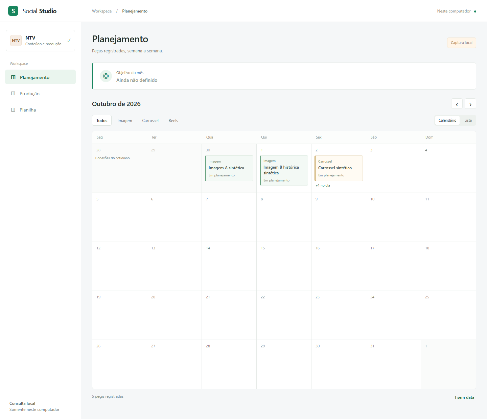
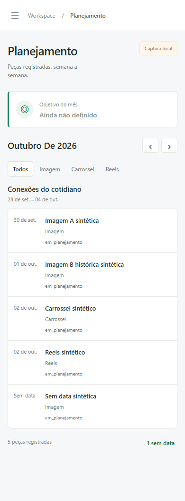

# Telas reais da primeira entrega

Como fotografias de uma agenda de demonstração, estes arquivos mostram a aplicação executável, preenchida somente com dados fictícios. São capturas de tela do código implementado em `src/web/`, diferentes do mockup e do protótipo históricos.

## Tema claro e escuro

Registro local de 06/10/2026, regenerado em 07/10/2026: **16 screenshots da aplicação executável**, exclusivamente com fixtures sintéticas em TEMP, nos temas claro/escuro e larguras 1440/390. O botão agora indica a ação: **☾ Escuro** no tema claro e **☀ Claro** no escuro, com aria-label correspondente e sem aria-pressed. Doze imagens mudaram; as quatro gavetas permaneceram iguais porque o diálogo oculta o botão. Estado de integração e checks no [PR #18](https://github.com/Browsher/crm-social/pull/18); merge condicionado ao gate e review vigentes. As imagens não representam o CRM privado do autor. Planejamento inclui objetivo sintético e três pautas; Produção inclui os três formatos, e Planilha mostra avisos e abas/Histórico da captura fictícia. Datas/horários são controlados em 04/10/2026 para a apresentação reproduzível, com duas capturas sintéticas de 02/10 e 03/10. A gaveta registra a janela de 1050 px de altura; as outras telas usam fullPage, conservando largura e a rolagem própria dos componentes. Sem montagem ou alteração da imagem.

| Tela | Claro 1440 | Claro 390 | Escuro 1440 | Escuro 390 |
| --- | --- | --- | --- | --- |
| Planejamento | [Abrir](tema-light-planejamento-1440.png) | [Abrir](tema-light-planejamento-390.png) | [Abrir](tema-dark-planejamento-1440.png) | [Abrir](tema-dark-planejamento-390.png) |
| Gaveta do dia | [Abrir](tema-light-gaveta-1440.png) | [Abrir](tema-light-gaveta-390.png) | [Abrir](tema-dark-gaveta-1440.png) | [Abrir](tema-dark-gaveta-390.png) |
| Produção | [Abrir](tema-light-producao-1440.png) | [Abrir](tema-light-producao-390.png) | [Abrir](tema-dark-producao-1440.png) | [Abrir](tema-dark-producao-390.png) |
| Planilha | [Abrir](tema-light-planilha-1440.png) | [Abrir](tema-light-planilha-390.png) | [Abrir](tema-dark-planilha-1440.png) | [Abrir](tema-dark-planilha-390.png) |

Reprodução, na raiz do repositório com Node existente definido por `CRM_NODE_PATH` e Playwright existente resolvido por `CRM_PLAYWRIGHT_MODULE` (ou `playwright` disponível):

```powershell
& $env:CRM_NODE_PATH scripts/screenshots-tema.cjs
```

O [script](../../../scripts/screenshots-tema.cjs) cria servidor loopback/porta efêmera, estado e mapa sintéticos em diretório TEMP próprio, bloqueia requisições externas e confere ausência de erros do navegador; fecha a instância criada e remove somente seu TEMP ao terminar. Substitui os 16 arquivos `tema-*.png` acima, sem usar a instância do autor, `data/` real, Google ou mídia remota. Os testes de teclado, persistência, preferência inicial, aplicação antes do CSS e contraste são provas distintas da aparência: [comportamento e resultados locais](../../modules/web.md#tema-claro-e-escuro). Gate Linux/review correntes serão conferidos no PR; UI/PowerShell mantêm SKIP explícito no CI. A segurança/reprodução do script também foi verificada em 07/10 por [três testes](../../../tests/screenshots-tema.test.cjs): dois VM do script real impedem limpeza fora de TEMP/prefixo permitido, e um CLI gera 16 PNG em cópia TEMP preservando diretório alheio. Os três passaram localmente; no CI, VM executa e CLI com navegador declara SKIP pela M8. Esses testes não reescreveram os PNG versionados nesta rodada. Gate final da árvore local: 356 PASS, incluindo três testes preexistentes do iniciador fora do PR; cobertura 96,3498%, agora incluindo o gerador no LCOV (antes 98,3871% com escopo menor). Imagens anteriores permanecem históricas.

## Histórico das primeiras entregas

Registro histórico das imagens de 04/10/2026: evidência visual local de T001–T034/US1–US5. Na geração destas imagens, as sete tarefas finais ainda não tinham sido executadas. Hoje T001–T041 estão concluídas; resultados e limites ficam na validação, sem imagens da captura privada. As duas imagens originais da US1 foram refeitas após a revisão da US1; oito imagens adicionais registram os quatro selos da US2. O coordenador gerou as imagens com servidor/estado em diretório temporário e Playwright existente. Não houve leitura Google, captura operacional, importação em `data/` real ou mídia carregada remotamente. Consulte o [registro de validação](../../../specs/001-consulta-local-producao/validacao.md).

| Arquivo | O que mostra |
| --- | --- |
| [001-planejamento-1440.png](001-planejamento-1440.png) | Desktop 1440 × 1240: cinco semanas de outubro, Em planejamento, Outubro de 2026 e fundo lateral até o rodapé |
| [001-planejamento-390.png](001-planejamento-390.png) | Celular 390 × 1050: lista semanal, estado legível e menu recolhido |

Fixture da demonstração: cinco peças NTV fictícias, uma sem data, duas em 02/10 e semana de 28/09 a 04/10/2026. Quantidades/datas são exemplos sintéticos, sem valor operacional. A imagem B histórica está representada no conjunto; o objetivo mensal permanece **Ainda não definido**.



Aplicação em execução, dados fictícios — calendário desktop da primeira entrega.



Aplicação em execução, dados fictícios — lista semanal mobile da primeira entrega.

## Limites da evidência

As imagens originais comprovam a aparência histórica do Planejamento da US1, não todas as interações, o CI Linux ou a feature completa. O selo **Captura local** dessas duas imagens era provisório e foi substituído na US2. US4/quadro e US5/abas, avisos e Histórico estão implementadas localmente. Iniciador e fechamento T039–T041 concluídos; limites da demonstração privada ficam na validação. Produção mostra quadro por semana; Planilha mostra captura/releitura, seis tabelas e Histórico. Revisão/integração corrente fica somente na validação.

Não substituir essas imagens por screenshots com dados privados. [Telas decididas](../telas.md) e [spec canônica](../../../specs/001-consulta-local-producao/spec.md) mantêm os requisitos completos; resultados de testes ficam no registro de validação, não deduzidos da imagem.

## US2 — quatro estados, desktop e celular

As oito imagens abaixo registram a implementação da US2 em 04/10/2026; procedência e head na [validação](../../../specs/001-consulta-local-producao/validacao.md). Desktop 1440 × 1240 e celular 390 × 1050. Agenda somente fictícia; captura.completedAt sintético de 04/10/2026 09:46 (hoje/falha) ou 03/10/2026 09:46 (anterior), no fuso America/Sao_Paulo. A ausência tem uma tentativa falha sem captura válida e conserva o selo cinza. Nenhuma imagem foi alterada para simular resultado.

| Selo | Desktop | Celular | Conferência visual |
| --- | --- | --- | --- |
| Atualizado hoje, 09:46 | [1440](001-us2-hoje-1440.png) | [390](001-us2-hoje-390.png) | Verde, horário vem do fim da captura |
| Dados de 03/10 | [1440](001-us2-anterior-1440.png) | [390](001-us2-anterior-390.png) | Âmbar, mesmas peças conservadas |
| Atualização falhou | [1440](001-us2-falha-1440.png) | [390](001-us2-falha-390.png) | Vermelho, última captura válida continua visível |
| Sem dados | [1440](001-us2-sem-dados-1440.png) | [390](001-us2-sem-dados-390.png) | Cinza, sem cartões ou fallback inventado |

O selo permanece no cabeçalho das três telas e abre Planilha. O teste real de interface e a inspeção no navegador conferiram detalhes/aviso e a legenda **Reler captura local; não consulta o Google**. As imagens documentam o estado de apresentação; somente os testes e o registro de validação comprovam as interações de releitura/conservação.

## US3 — gaveta com uma e várias peças

Quatro imagens da aplicação real com fixtures sintéticas, servidor loopback e
estado em TEMP, sem requisição externa ou erro de página. A gaveta de 01/10 contém
uma imagem; 02/10 contém carrossel com páginas e Reels com cenas. O segundo acordeão
foi aberto por clique somente para a imagem; a primeira abertura da gaveta mantém
apenas a primeira peça aberta, conforme o teste de interface. Versões antigas
permanecem recolhidas; revisão resolvida é cinza e responsável/correção são separados.

| Dia | Desktop | Celular |
| --- | --- | --- |
| Uma peça, janela de 1050 px de altura | [1440](001-us3-uma-peca-1440.png) | [390](001-us3-uma-peca-390.png) |
| Várias peças, janela de 4800 px de altura | [1440](001-us3-varias-pecas-1440.png) | [390](001-us3-varias-pecas-390.png) |

A altura maior registra o conteúdo completo dos dois acordeões, sem montagem ou
alteração da imagem. O teste móvel usa janela normal 390 × 1050 e confirma tela
cheia, rolagem interna e Esc/foco. Arquivos são registros com links por clique;
nenhuma mídia foi carregada e as URLs apontam exemplos fictícios. Evidências de
execução e revisão ficam apenas na [validação](../../../specs/001-consulta-local-producao/validacao.md).

## Gaveta compacta — primeira apresentação

Quatro imagens novas em janelas 1440/390 × 1050, aplicação real em loopback,
captura exclusivamente sintética em TEMP. A primeira peça fica aberta, o Reels
do dia com várias peças fica recolhido; seus registros/cenas continuam completos
na API e são exercitados nos testes ao expandir. Textos, versões anteriores e
Histórico também ficam recolhidos. Documentos da semana aparecem no fim do dia.

| Dia | Desktop | Celular |
| --- | --- | --- |
| Uma peça | [1440](001-us3-compacta-uma-peca-1440.png) | [390](001-us3-compacta-uma-peca-390.png) |
| Carrossel + Reels | [1440](001-us3-compacta-varias-pecas-1440.png) | [390](001-us3-compacta-varias-pecas-390.png) |

Conferidas visualmente sem corte horizontal, pageerror ou acesso externo. As
imagens anteriores são históricas; estes arquivos não as sobrescrevem. Nenhuma
imagem comprova captura Google, bytes de mídia, aprovação ou publicação remota.
[Desenho compactado](../mockups/gaveta-v2.html), [telas](../telas.md#2-gaveta-do-dia-001)
e [evidências](../../../specs/001-consulta-local-producao/validacao.md) registram os limites.

## Gaveta compacta — revisão legível

As duas imagens novas mostram carrossel e Reels sintéticos abertos no mesmo dia.
O segundo acordeão foi expandido por clique para conferir páginas e cenas; abrir
a gaveta continua deixando somente a primeira peça aberta. Texto registrado,
versões anteriores e Histórico permanecem recolhidos. A revisão tem título
legível e correção/tratamento; a cena distingue imagens/vídeo ausentes em um texto
humano, enquanto os escopos e avisos técnicos completos continuam na API.

| Desktop | Celular | Conteúdo |
| --- | --- | --- |
| [1440 × 1440](001-us3-final-varias-pecas-1440.png) | [390 × 1600](001-us3-final-varias-pecas-390.png) | Carrossel com páginas e Reels com cenas, dois acordeões abertos por clique |

Aplicação real em loopback, captura exclusivamente sintética e estado em TEMP;
conferência sem erro de página, requisição externa ou corte horizontal. Os arquivos
anteriores permanecem como evidência da apresentação anterior. Nenhuma imagem
comprova coleta Google, mídia conferida, aprovação ou publicação. Estado, revisão
e evidências de execução ficam somente na [validação](../../../specs/001-consulta-local-producao/validacao.md).

## Gaveta compacta — links e avisos relacionados

As capturas mais recentes mostram carrossel e Reels sintéticos no mesmo dia,
com identificação humana das unidades e avisos relacionados no contador da peça.
Arquivo ligado sem URL segura é **link não permitido**, distinto de mídia ausente;
URL recusada não é ecoada. A API conserva IDs e registros completos selecionados.

| Desktop | Celular |
| --- | --- |
| [1440](001-us3-ultima-varias-pecas-1440.png) | [390](001-us3-ultima-varias-pecas-390.png) |

Aplicação real em loopback, apenas fixture sintética e estado em TEMP, sem erro
de página, requisição externa ou corte horizontal. As imagens anteriores ficam
preservadas; nenhuma captura comprova coleta Google, bytes de mídia ou integração
operacional. Estado e evidências reais ficam na [validação](../../../specs/001-consulta-local-producao/validacao.md).

## US4 — quadro de Produção

Aplicação executável por semana/tema, oito colunas, status informativo, responsável
e correção separados e primeira pendência/+N. Captura e mapa exclusivamente
sintéticos em TEMP exercitam todas as colunas; configuração versionada mantém
nove etapas e liberação/revisão vazias. Outras distingue rótulos de cartões.

| Desktop | Celular |
| --- | --- |
| [1440 × 1200](001-us4-producao-1440.png) | [390 × 2488](001-us4-producao-390.png) |

Servidor loopback, sem dado operacional, erro de página, requisição externa ou
corte horizontal. Não comprova coleta Google, bytes de mídia ou a 001 completa;
PR/aceite corrente na [validação](../../../specs/001-consulta-local-producao/validacao.md).

## US4 — pendências do cartão por coluna

As duas capturas novas de 04/10/2026 mostram o quadro com oito colunas e dez
cartões, usando somente `capturaQuadro` e `mapaQuadroSintetico` em TEMP. **Mídia
ausente** aparece nos cartões de Mídia, Revisão, Pronta, Publicada e Outras;
Planejamento, Redação e Visual conservam as revisões sem mostrar ausência de
mídia. O resumo e **+N** consideram somente as pendências visíveis no cartão;
API e gaveta mantêm os detalhes. A regra está no [contrato](../../../specs/001-consulta-local-producao/contracts/captura-e-consulta.md#quadro-prioridade-aprovada-e-configuração-versionada)
e nas [telas](../telas.md#3-produção-001).

| Desktop | Celular |
| --- | --- |
| [1440 × 1200](001-us4-ajuste-producao-1440.png) | [390 × 2456](001-us4-ajuste-producao-390.png) |

Aplicação real em loopback, captura e mapa exclusivamente sintéticos; conferência
sem corte horizontal, erro de página ou requisição externa. Os arquivos anteriores
permanecem como evidência da apresentação anterior. As imagens não comprovam
captura Google, bytes de mídia ou integração operacional; revisão/integração
corrente fica na [validação](../../../specs/001-consulta-local-producao/validacao.md).

## US5 — Planilha, avisos e Histórico

As seis capturas novas de 04/10/2026 mostram a aplicação executável com captura
exclusivamente sintética e estado em TEMP. Seis abas apresentam mínimos triados,
contagens de linhas NTV e regiões próprias de rolagem; Histórico é a aba final.
O atalho da gaveta abre Produções e os avisos da peça em Aba/Linha/Campo/Motivo,
sem reduzir os dados NTV das seis tabelas. O Histórico reúne tentativas completas
e falhas confirmadas, recentes primeiro.

| Vista | Desktop | Celular |
| --- | --- | --- |
| Dados NTV | [1440 × 1565](001-us5-dados-1440.png) | [390 × 1892](001-us5-dados-390.png) |
| Avisos da peça | [1440 × 1332](001-us5-avisos-1440.png) | [390 × 1641](001-us5-avisos-390.png) |
| Histórico confirmado | [1440 × 1200](001-us5-historico-1440.png) | [390 × 1179](001-us5-historico-390.png) |

Servidor loopback e dados fictícios, sem corte horizontal, erro de página ou
requisição externa na conferência. Células dedicadas recusadas usam **link não
permitido**, com marcador de supressão preservado e texto livre legítimo mantido;
nenhuma célula navega ou carrega mídia. As interações de teclado/foco, releitura e
avisos são verificadas nos testes, com resultados na [validação](../../../specs/001-consulta-local-producao/validacao.md)
e [resumo sanitizado](../../reports/001-us5-local.json), sem deduzi-los só das imagens.

As capturas anteriores permanecem históricas. Estes arquivos não comprovam coleta
Google, captura operacional, bytes de mídia, integração ou aceite completo da 001.
Quando estas imagens foram geradas, T035–T041 estavam pendentes; seu fechamento posterior está na validação. As regras de apresentação ficam nas [telas](../telas.md#4-planilha-001)
e no [contrato](../../../specs/001-consulta-local-producao/contracts/captura-e-consulta.md#apresentação-de-planilha-e-alcance-das-urls).

## Planilha com origem compacta e motivos legíveis

Novas vistas sintéticas da apresentação, mantendo as anteriores como referência.
Origem resume falha e quantidade; a lista completa aparece somente na tabela.

| Vista | Desktop 1440 | Celular 390 |
| --- | --- | --- |
| Dados | [Abrir](001-us5-ajuste-dados-1440.png) | [Abrir](001-us5-ajuste-dados-390.png) |
| Avisos da peça | [Abrir](001-us5-ajuste-avisos-1440.png) | [Abrir](001-us5-ajuste-avisos-390.png) |
| Histórico | [Abrir](001-us5-ajuste-historico-1440.png) | [Abrir](001-us5-ajuste-historico-390.png) |

Evidências e limites permanecem na [validação](../../../specs/001-consulta-local-producao/validacao.md).
002: exemplos sintéticos de atualizando/sucesso/falha em 1440/390; imagens e procedência somente na [validação da 002](../../../specs/002-consulta-planilhas/validacao.md).

## 003 — objetivo mensal e Meses opcional

Doze capturas atuais de 05/10/2026 mostram os ajustes da aplicação em loopback com fixtures sintéticas e estado em TEMP: dez screenshots da 003 regenerados e dois novos para o singular **+1 pauta**. Objetivo definido aparece na cor principal; só **Ainda não definido**/**A confirmar** usam tom apagado. As imagens continuam evidência sintética da rodada anterior; a demonstração posterior de Meses não gerou screenshot versionado. Testes, procedência e limitações na [validação da 003](../../../specs/003-planejamento-mensal/validacao.md), com [gate local dos ajustes](../../reports/003-ajustes-local-gate.json).

| Vista | Desktop 1440 | Celular 390 |
| --- | --- | --- |
| Objetivo e pautas do mês | [Abrir](003-objetivo-1440.png) | [Abrir](003-objetivo-390.png) |
| Cinco pautas e +2 pautas | [Abrir](003-mais-1440.png) | [Abrir](003-mais-390.png) |
| Cinco pautas e +1 pauta | [Abrir](003-mais-um-1440.png) | [Abrir](003-mais-um-390.png) |
| Ainda não definido | [Abrir](003-indefinido-1440.png) | [Abrir](003-indefinido-390.png) |
| A confirmar por duplicata | [Abrir](003-confirmar-1440.png) | [Abrir](003-confirmar-390.png) |
| Meses na Planilha | [Abrir](003-planilha-1440.png) | [Abrir](003-planilha-390.png) |

Screenshots comprovam apresentação com dados fictícios; não comprovam conta/planilha real, integração, decisão editorial, mídia ou publicação. T002/T015 foram concluídas em demonstração posterior pelo CRM com uma linha fictícia marcada como teste; somente contagens/resultado na validação da 003. T021 atendida pelo PR #16 e código da 003 integrado pelo PR #15. Nenhum screenshot dessa demonstração foi acrescentado.

## 004 — Pautas no Planejamento

20 screenshots de 07/10/2026, exclusivamente sintéticos, gerados por `scripts/screenshots-pautas.cjs` com servidor próprio em TEMP, porta efêmera e relógio fixo fictício em novembro de 2026. Quatro pautas, quatro modelos, status variados e S2 do autor; dezembro demonstra fallback do resumo textual de Meses. Nenhuma leitura da planilha operacional. A galeria anterior foi preservada.

| Vista | Claro 1440 | Claro 390 | Escuro 1440 | Escuro 390 |
| --- | --- | --- | --- | --- |
| Card com 4 pautas | [Abrir](pautas-light-card-1440.png) | [Abrir](pautas-light-card-390.png) | [Abrir](pautas-dark-card-1440.png) | [Abrir](pautas-dark-card-390.png) |
| Semana com origem e foco | [Abrir](pautas-light-semana-origem-1440.png) | [Abrir](pautas-light-semana-origem-390.png) | [Abrir](pautas-dark-semana-origem-1440.png) | [Abrir](pautas-dark-semana-origem-390.png) |
| Gaveta com origem | [Abrir](pautas-light-gaveta-1440.png) | [Abrir](pautas-light-gaveta-390.png) | [Abrir](pautas-dark-gaveta-1440.png) | [Abrir](pautas-dark-gaveta-390.png) |
| Mês sem pautas | [Abrir](pautas-light-mes-sem-pautas-1440.png) | [Abrir](pautas-light-mes-sem-pautas-390.png) | [Abrir](pautas-dark-mes-sem-pautas-1440.png) | [Abrir](pautas-dark-mes-sem-pautas-390.png) |
| Pautas na Planilha | [Abrir](pautas-light-planilha-1440.png) | [Abrir](pautas-light-planilha-390.png) | [Abrir](pautas-dark-planilha-1440.png) | [Abrir](pautas-dark-planilha-390.png) |

As tabelas têm rolagem horizontal própria, sem corte da página. Testes de comportamento, contraste, integridade e limites estão na [validação da 004](../../../specs/004-pautas-planejamento/validacao.md); imagens não comprovam operação editorial ou coleta real.

Reprodução com Node/Playwright existentes configurados, na raiz do repositório:

```powershell
& $env:CRM_NODE_PATH scripts/screenshots-pautas.cjs
```

O [gerador](../../../scripts/screenshots-pautas.cjs) importa a [fixture de pautas](../../../tests/pautas-fixtures.cjs) e os helpers sintéticos existentes; substitui somente os 20 `pautas-*.png` da galeria. Bloqueia requisições externas, confere erros do navegador e fecha sua instância; a limpeza exige TEMP e prefixo próprios antes de remover a pasta criada. [Quatro testes do script real](../../../tests/screenshots-pautas.test.cjs) cobrem as guardas, falha do navegador e CLI em cópia TEMP. Galeria regenerada após as correções do review, sem mudança visual; gate Windows da árvore final **434 PASS**. [PR #20](https://github.com/Browsher/crm-social/pull/20) aberto para avaliação do autor, sem merge ou integração; resultados de gate/review por head na [validação da 004](../../../specs/004-pautas-planejamento/validacao.md); a prova visual é distinta dos testes de comportamento e da integração.
