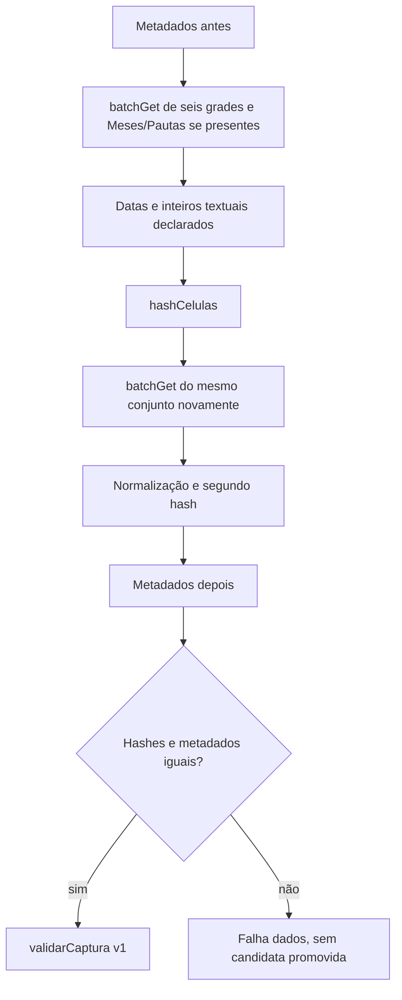

# Coleta tipada das seis abas e opcionais

Como fotografar duas vezes o mesmo conjunto e conferir as etiquetas, [src/coleta.cjs](../../src/coleta.cjs) só devolve a candidata quando as duas leituras e os metadados concordam. Não grava arquivos. Estado/testes na [validação da 002](../../specs/002-consulta-planilhas/validacao.md) e extensão mensal na [validação da 003](../../specs/003-planejamento-mensal/validacao.md).

coletarCaptura(client,{now,capturaId}) recebe cliente injetado e produz envelope v1. As seis abas são Semanas, Produções, Páginas, Cenas, Arquivos e Revisoes; Meses/Pautas entram independentemente quando seus títulos exatos existem nos metadados iniciais; outras abas da fonte não entram. Ausência estável não gera range inexistente nem aviso. O conjunto de seis, sete ou oito ranges é o mesmo nas duas leituras; criação/remoção de qualquer opcional ou alteração de ID/dimensões/fuso até os metadados finais recusa a candidata. Cada range vai de A1 até a última linha/coluna alocada. Antes/depois são conferidos identidade da fonte, ID de aba, dimensões e fuso.

O cliente pede ROWS, UNFORMATTED_VALUE e SERIAL_NUMBER. Ranges/respostas incompletos, cabeçalho obrigatório ausente, escalar inválido e mudanças são recusados. Finais vazios omitidos pela API são permitidos dentro da grade. hashCelulas e letraColuna são os helpers do validador existente, não uma segunda definição do formato.

dataSerial converte números somente em inicio_semana/data_prevista (dia civil inteiro) e publicado_em (instante no fuso da planilha). Textos canônicos com inteiro seguro são convertidos somente nos campos numéricos do contrato antes dos dois hashes; outros textos continuam originais/com aviso quando preenchidos. Números nativos permanecem números. Datas textuais não são convertidas. Época 1899-12-30, precisão de milissegundo. Round-trip do horário civil exige um instante único: horário ambíguo/inexistente em DST recusa. Nenhuma data é inferida de outro campo.

Envelope source=google-sheets-api; fonte da Central continua google-drive-connector. O [contrato](../../specs/002-consulta-planilhas/contracts/leitura-planilha.md) define o restante. [tests/coleta.test.cjs](../../tests/coleta.test.cjs) usa cliente falso; não consulta a planilha real. Limite: duas observações não são transação remota e não detectam necessariamente uma alteração desfeita entre elas. T021 demonstrada; resultados sanitizados na validação. Tipagem válida não transforma versão distinta em vigente nem comprova mídia.

`mes` conserva o escalar recebido, sem conversão serial ou numérica; validação semântica pertence à triagem. A 003 mantém POST e guardas existentes; presença/ausência, criação/remoção e hash da opcional usam cliente falso, sem substituir a demonstração pelo CRM com uma linha fictícia marcada como teste, registrada na validação da 003.

Na 004, `Pautas.semana` integra a lista declarada de inteiros textuais canônicos seguros, convertidos antes dos dois hashes; valores não canônicos continuam originais e recebem aviso semântico na projeção. `Pautas.inicio_semana` usa a mesma conversão serial de dia civil de Semanas; IDs e `mes` não são convertidos. Arquivos importados mantêm sua tipagem original. As quatro combinações opcionais, inconsistências e promoção/falha são exercitadas com cliente falso em [tests/pautas.test.cjs](../../tests/pautas.test.cjs). Implementada/testada localmente e entregue no [PR #20](https://github.com/Browsher/crm-social/pull/20), aberto para avaliação do autor, sem merge ou integração; resultados por head na [validação da 004](../../specs/004-pautas-planejamento/validacao.md). Nenhuma rota, credencial, escopo ou dependência foi acrescentada.

C04 percorre a coleta completa com metadados `America/Sao_Paulo`, `inicio_semana` e `publicado_em` seriais. Confere a publicação UTC no envelope e os dois hashes sobre os valores convertidos, com resultado esperado literal; essa prova sintética não valida o fuso ou a conta da planilha real.
