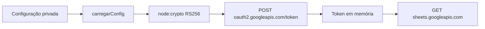

# Cliente Google de leitura

Como um crachá temporário de leitor, o JWT identifica o servidor; o navegador nunca recebe a chave nem o token. [src/google.cjs](../../src/google.cjs) implementa configuração, assinatura e transporte nativos. Estado e provas na [validação da 002](../../specs/002-consulta-planilhas/validacao.md); conta e demonstração reais pendentes.

| Interface | Comportamento observado |
| --- | --- |
| carregarConfig({env,repoRoot}) | JSON service_account, e-mail estruturalmente válido e chave RSA ≥2048; caminho absoluto lexicalmente fora do projeto |
| assinarJwt(config,now) | RS256/PKCS1, iss, scope spreadsheets.readonly, aud OAuth fixo, iat em segundos e exp +3600; sem subject |
| criarClienteGoogle({env,repoRoot,fetchImpl,now,timeoutMs}) | getMetadata e batchGet; transporte/relógio injetáveis, token fechado em memória |
| falha / MOTIVOS | Quatro categorias e mensagens fixas, sem erro bruto |

CRM_GOOGLE_CREDENTIALS_FILE aponta para chave privada externa. CRM_SPREADSHEET_ID identifica a fonte privada; ambos só no ambiente do servidor. Nenhum valor é registrado nesta documentação. Configuração é carregada somente na atualização, não no GET ou no início do servidor.

OAuth recebe formulário JWT bearer no endpoint fixo https://oauth2.googleapis.com/token. A resposta exige access_token não vazio/sem espaço, token_type Bearer e expires_in positivo/finito. Cache tem validade máxima de uma hora e margem de 30 segundos. Sheets recebe apenas GET com Authorization; ID codificado no caminho e parâmetros de renderização tipada na query. Não há token na URL nem redirect/retry.

Cada fetch usa redirect:error e AbortSignal.timeout (15 segundos por chamada, incluindo leitura do JSON). 401/403 ou invalid_grant viram acesso; transporte/timeout/OAuth inválido viram rede; JSON inválido de Sheets vira dados. O corpo e o erro externo nunca são ecoados. [tests/google.test.cjs](../../tests/google.test.cjs) gera RSA durante o teste, grava a chave somente em TEMP e usa fetch falso.

Limite deliberado: caminho externo é conferido lexicalmente; junction/symlink não é resolvido. Isso não prova acesso real ao Google, nem substitui a configuração privada pelo autor.

Cache por instância: o servidor padrão cria um cliente por POST. Token é reutilizado nas chamadas da mesma coleta; o próximo clique relê a chave e troca novo JWT. Não há cache global entre atualizações.
