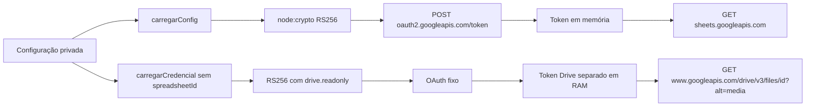

# Cliente Google de leitura

Como um crachá temporário de leitor, o JWT identifica o servidor; o navegador nunca recebe a chave nem o token. [src/google.cjs](../../src/google.cjs) implementa configuração, assinatura e transporte nativos. Estado e provas na [validação da 002](../../specs/002-consulta-planilhas/validacao.md); T021 demonstrada, com resultados sanitizados na validação.

| Interface | Comportamento observado |
| --- | --- |
| carregarConfig({env,repoRoot}) | JSON service_account, e-mail estruturalmente válido e chave RSA ≥2048; caminho absoluto lexicalmente fora do projeto |
| assinarJwt(config,now) | RS256/PKCS1, iss, scope spreadsheets.readonly, aud OAuth fixo, iat em segundos e exp +3600; sem subject |
| criarClienteGoogle({env,repoRoot,fetchImpl,now,timeoutMs}) | getMetadata e batchGet; transporte/relógio injetáveis, token fechado em memória |
| criarClienteDrive({env,repoRoot,fetchImpl,now,timeoutMs}) | getMidia(idDrive), bytes com limite real e timeout; configuração independente de CRM_SPREADSHEET_ID, scope Drive readonly |
| falha / MOTIVOS | Quatro categorias e mensagens fixas, sem erro bruto |

CRM_GOOGLE_CREDENTIALS_FILE aponta para chave privada externa. CRM_SPREADSHEET_ID identifica a fonte privada; ambos só no ambiente do servidor. Nenhum valor é registrado nesta documentação. Sheets carrega configuração no POST de atualização. Drive carrega a mesma credencial externa somente no primeiro cache miss de mídia; não exige CRM_SPREADSHEET_ID. Inicialização e GET /api/visao continuam sem carregar credencial ou consultar Google.

OAuth recebe formulário JWT bearer no endpoint fixo https://oauth2.googleapis.com/token. A resposta exige access_token não vazio/sem espaço, token_type Bearer e expires_in positivo/finito. Cache tem validade máxima de uma hora e margem de 30 segundos. Sheets recebe apenas GET com Authorization; ID codificado no caminho e parâmetros de renderização tipada na query. Não há token na URL nem redirect/retry.

Cada fetch usa redirect:error e AbortSignal.timeout (15 segundos por chamada, incluindo leitura do JSON). 401/403 ou invalid_grant viram acesso; transporte/timeout/OAuth inválido viram rede; JSON inválido de Sheets vira dados. O corpo e o erro externo nunca são ecoados. [tests/google.test.cjs](../../tests/google.test.cjs) gera RSA durante o teste, grava a chave somente em TEMP e usa fetch falso.

Limite deliberado: caminho externo é conferido lexicalmente; junction/symlink não é resolvido. Isso não prova acesso real ao Google, nem substitui a configuração privada pelo autor.

Cache Sheets por instância: o servidor padrão cria um cliente por POST. Token é reutilizado nas chamadas da mesma coleta; o próximo clique relê a chave e troca novo JWT. Não há cache global entre atualizações.

## Leitura de imagens — 005

`criarClienteDrive` reutiliza `carregarCredencial`, `assinarJwtEscopo` e `validarToken`, preservando os exports e comportamento de Sheets. Cada factory solicita somente seu escopo: Sheets `https://www.googleapis.com/auth/spreadsheets.readonly`; Drive `https://www.googleapis.com/auth/drive.readonly`. JWT não contém delegação de domínio. A constituição 1.2.0 foi aprovada em 2026-10-08; compartilhamento real da pasta pelo autor permanece pendente e os testes não o demonstram.

O ID remoto vem do [serviço de mídia](midia.md), após resolver Arquivos na captura. `getMidia` exige somente caracteres `A–Z`, `a–z`, `0–9`, `_`, `-`; OAuth e download usam hosts/caminhos fixos. O download faz GET `https://www.googleapis.com/drive/v3/files/<id codificado>?alt=media`, com Authorization no header, `redirect:error` e nenhum retry ou repasse do corpo de erro Google.

`requisitarDrive` aplica prazo de 15.000 ms por fase: obtenção do token e download completo, incluindo stream depois dos headers. `lerBytesMidia` conta bytes efetivos até **15.000.000 inclusive**, independentemente de Content-Length; excesso cancela o reader e gera 422. Timeout/rede/permissão/configuração geram 503. A mensagem é sempre **Prévia indisponível**. O MIME remoto não autoriza bytes; assinatura/hash são conferidos por midia.cjs.

O cliente Drive fica na instância do serviço após o primeiro miss, com token somente em RAM, validade máxima de uma hora e margem de 30 segundos. Pedidos concorrentes coalescem a obtenção do token; Sheets e Drive não compartilham token. Hits do cache validado não precisam instanciar o cliente, ler a chave ou usar OAuth.

[tests/google-midia.test.cjs](../../tests/google-midia.test.cjs) exercita JWT/scopes, hosts, redirects, stream, excesso, timeout e erros com RSA gerado em RAM/TEMP e transporte falso. [Validação da 005](../../specs/005-previas-imagens/validacao.md): código/testes locais, sem integração ou acesso operacional comprovado.
