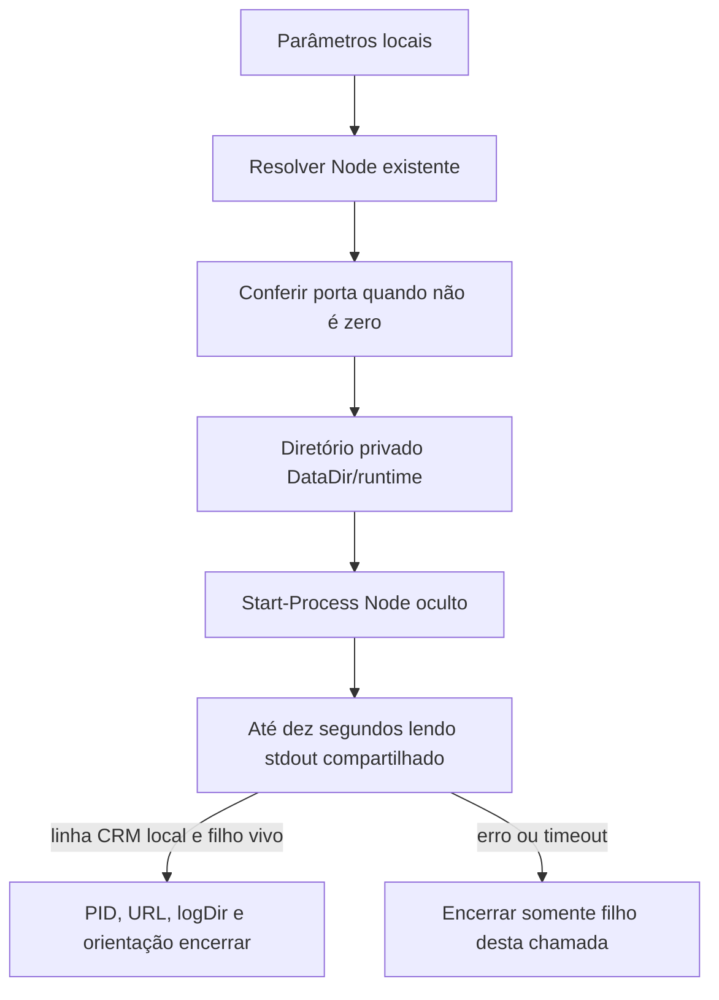

# Iniciador local no Windows

Como uma chave que abre somente este álbum, o iniciador escolhe o Node existente e abre uma instância do CRM neste computador. Ele não importa captura, consulta Google ou comanda a produção.

Implementado e verificado localmente em T035–T038; evidências e limites na [validação](../../specs/001-consulta-local-producao/validacao.md). Fonte: [Iniciar CRM.ps1](../../Iniciar%20CRM.ps1), para Windows PowerShell 5.1. A captura real e o aceite operacional continuam pendentes.

## Entrada e escolha do runtime

```powershell
$crmSession = & './Iniciar CRM.ps1' -NodePath $crmNode
```

| Parâmetro / ambiente | Regra real |
| --- | --- |
| `-DataDir <diretorio-local>` | Padrão `data/` relativo à raiz do projeto; relativo explícito resolve pelo diretório atual; logs ficam nesse diretório privado |
| `-Port <inteiro>` | Padrão 4318, aceita 0–65535; 0 deixa o servidor escolher porta efêmera |
| `-NodePath <exe>` | Node existente explícito; não instala runtime |
| `CRM_NODE_PATH` | Usado quando -NodePath está vazio |
| `PATH` | Última alternativa: resolver `node.exe` como aplicação |

Conferir Node 24.19.0 conforme o [quickstart](../../specs/001-consulta-local-producao/quickstart.md). O script valida que o executável existe, mas não impõe a versão; esse pré-requisito continua com o operador. Não persistir caminho pessoal no repositório.

## Início, retorno e logs



`Start-Process` usa `-WindowStyle Hidden`, redireciona stdout/stderr e mantém os argumentos com aspas para caminhos com espaços no PowerShell 5.1. Logs ficam em `<DataDir>/runtime/iniciador-<id>/stdout.log` e `stderr.log`, fora do HTTP e do Git. São privados; o script não limpa logs de chamadas anteriores.

A confirmação lê stdout com compartilhamento de leitura/escrita, reconhece a linha `CRM local: http://127.0.0.1:<porta>` e verifica se o filho continua vivo. Isso confirma o início do servidor, não captura válida ou integração operacional. Não há requisição de saúde nem coleta externa nessa espera.

| Campo de retorno | Uso |
| --- | --- |
| `processId` | PID do processo Node criado por esta chamada |
| `url` | URL loopback com a porta efetiva, inclusive quando -Port é 0 |
| `logDir` | Diretório privado desta chamada |
| `encerrar` | Texto de orientação `Stop-Process -Id <PID>`; conferir propriedade antes de executar |

## Encerramento e falhas

Depois do retorno, conservar a identidade da instância e abrir a URL somente por ação local:

```powershell
$crmOwnedProcess = Get-Process -Id $crmSession.processId -ErrorAction Stop
$crmOwnedStart = $crmOwnedProcess.StartTime
$crmOwnedPath = $crmOwnedProcess.Path
Start-Process $crmSession.url
```

Antes de encerrar, comparar a instância atual com a que foi criada:

```powershell
$crmCurrentProcess = Get-Process -Id $crmSession.processId -ErrorAction Stop
if ($crmCurrentProcess.StartTime -ne $crmOwnedStart -or $crmCurrentProcess.Path -ne $crmOwnedPath) {
  throw 'O PID não pertence mais à instância criada; confira antes de encerrar.'
}
Stop-Process -InputObject $crmCurrentProcess
```

Runtime ausente, porta inválida ou ocupada geram erro útil. A conferência da porta solta somente seu próprio listener; uma corrida posterior pode impedir o filho de iniciar, mas nunca encerra o ocupante. Em falha de início/timeout, o script encerra apenas seu filho ainda vivo. Não procurar ou parar processos por nome global.

[tests/iniciador.test.cjs](../../tests/iniciador.test.cjs) usa o script real com PowerShell 5.1, Node existente, diretórios temporários e portas isoladas. Fora de `win32`, os casos declaram SKIP por plataforma; no Windows local devem executar. Resultados e fronteira M8 ficam somente na [validação](../../specs/001-consulta-local-producao/validacao.md).

Os seis casos executados não exercitam timeout/saída precoce depois da criação do filho, seleção por `CRM_NODE_PATH`, porta padrão ou `DataDir` relativo. Esses caminhos foram conferidos por leitura, sem prova de execução; são limites conhecidos. Em falha, a mensagem também não indica o diretório dos logs, e não existe política automática de limpeza.
