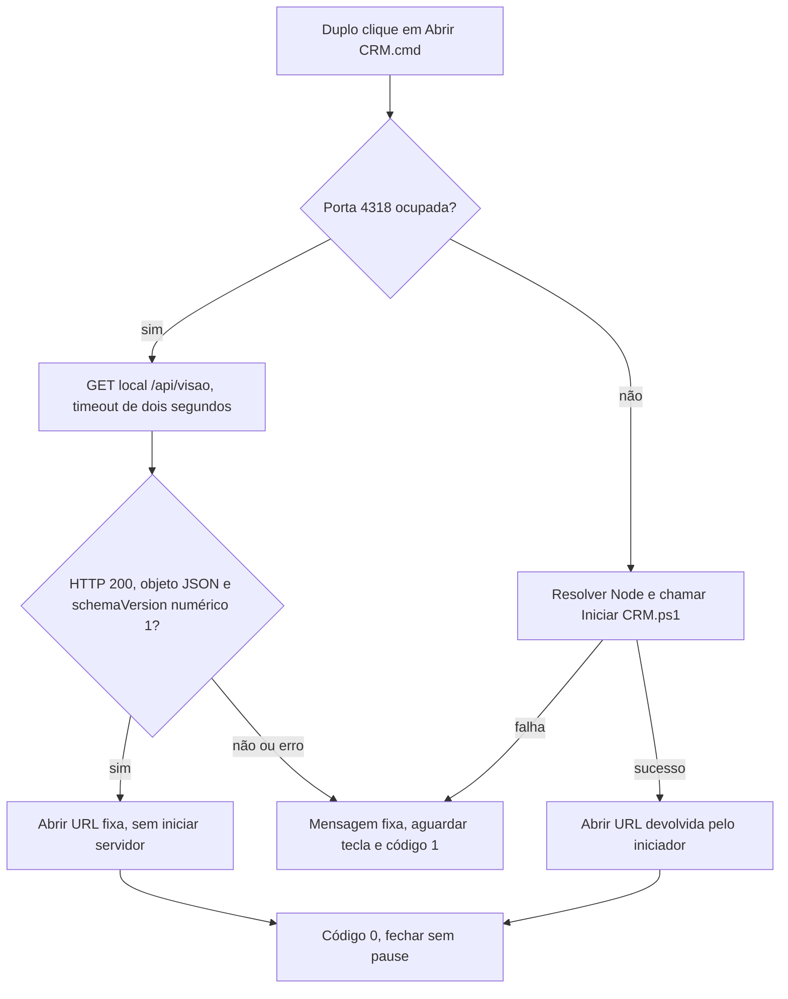
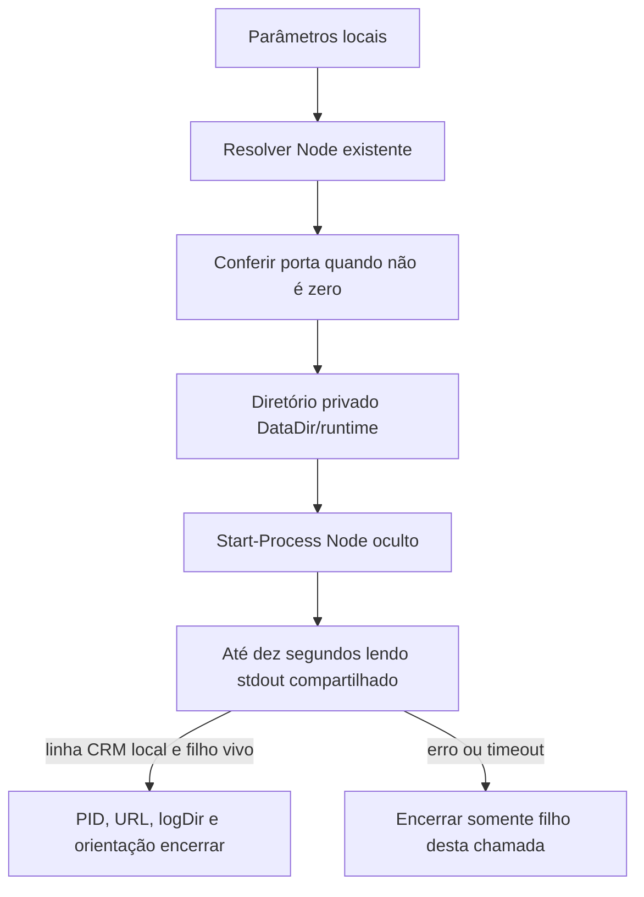

# Iniciador local no Windows

Como uma chave que abre somente este álbum, a entrada por duplo clique abre o CRM já disponível ou usa o iniciador para criar uma instância neste computador. O iniciador escolhe o Node existente; abrir o CRM não importa captura, consulta Google ou comanda a produção.

Implementado e verificado localmente em T035–T038; evidências e limites na [validação](../../specs/001-consulta-local-producao/validacao.md). Fonte: [Iniciar CRM.ps1](../../Iniciar%20CRM.ps1), para Windows PowerShell 5.1. Demonstração privada e onboarding final concluídos; resultados e limites na validação.

## Entrada por duplo clique

No Windows, dê dois cliques em [Abrir CRM.cmd](../../Abrir%20CRM.cmd), na raiz do projeto. Com a porta 4318 livre, o `.cmd` chama `Iniciar CRM.ps1` da própria pasta e abre no navegador a URL devolvida pelo iniciador. Se a porta já estiver ocupada pelo CRM reconhecido pela resposta abaixo, abre a URL fixa `http://127.0.0.1:4318`, sem iniciar outro servidor. Duplo clique no `.ps1` pode abrir o Bloco de Notas conforme a associação do Windows; o ajuste não altera essa associação.

O despacho usa `"%SystemRoot%\System32\WindowsPowerShell\v1.0\powershell.exe" -NoLogo -NoProfile -ExecutionPolicy Bypass` somente para esse processo. O caminho explícito evita selecionar um `powershell.exe` alheio no diretório atual. `setlocal DisableDelayedExpansion` explicita a preservação de `!` no comando e em caminhos, mesmo quando o chamador habilita expansão tardia. A conferência da porta vem antes da escolha do Node. Se livre, usa `CRM_NODE_PATH` quando preenchido; caso contrário, resolve aplicações `node.exe` pelo PATH, seleciona somente a primeira e passa seu caminho por `-NodePath`. Assim, vários Node no PATH não viram um argumento ambíguo no iniciador original, que permanece intacto. Não altera a política global, não instala Node e não muda o servidor ou a captura.

Quando a porta 4318 está ocupada, faz somente `GET /api/visao` em loopback com `HttpClient` do .NET, sem proxy nem redirecionamento. O timeout de dois segundos abrange a resposta e seu corpo. Aceita somente HTTP 200 com objeto JSON e `schemaVersion` numérico igual a 1; texto `"1"`, outra versão, array, JSON inválido, erro HTTP e timeout falham. O critério é o reconhecimento mínimo solicitado, não autenticação do processo: qualquer endpoint local que responda nesse formato é aceito. A URL aberta é fixa e não é extraída da resposta. O ramo reconhecido não resolve Node nem chama `Iniciar CRM.ps1`; GET consulta a captura local, sem Google.

Em sucesso, seja criando ou reaproveitando o CRM, retorna código 0 e a janela fecha sozinha, sem `pause`. Em falha de início ou reconhecimento, mostra a mensagem fixa `Nao foi possivel abrir o CRM. Confira se o Node esta configurado e se a porta 4318 esta livre.`, aguarda uma tecla e retorna código 1. Isso também ocorre se o próprio CRM responder HTTP 503 por falha ao ler a captura, como corrupção; o contrato pedido mantém a mesma mensagem fixa. Ausência de captura sem falha retorna HTTP 200 e é aceita. Não expõe a resposta nem detalhes privados do erro e jamais encerra o ocupante. Fechar a aba do navegador mantém o servidor em execução; para conservar a identidade e a orientação de encerramento de uma nova instância, use o iniciador com parâmetros na seção seguinte e confira o PID antes de encerrá-la.



**Histórico de 06/10/2026:** entrada inicial implementada/testada localmente e ainda sem commit naquela ocasião. O PR #19 reúne a integração dessa entrada por duplo clique com a reabertura de 07/10. Os três casos originais usam CMD/PowerShell reais em TEMP, caminhos com espaços, `&` e apóstrofo, navegador interceptado e seleção única do primeiro Node no PATH. TDD inicial: 2 FAIL antes do `.cmd`, depois 2 PASS; terceiro caso: 2 PASS/1 FAIL, depois 3 PASS. Gate Windows daquela árvore: **353 PASS**, cobertura **98,3871%**, drop **0**, complexidade PASS com **17 avisos**, baseline preservada e exit **0**; Semgrep SKIP e audit N/A. A prova adicional de seis casos L01/L02 com Node 24.14 já instalado permanece histórica e não altera o runtime oficial.

**Implementado e testado localmente em 07/10/2026:** [tests/abrir-crm.test.cjs](../../tests/abrir-crm.test.cjs) passou de **3 PASS/9 FAIL** no RED para **12 PASS** na primeira etapa; a suíte final tem **18 PASS sem pulos**. Usa CMD/PowerShell reais, substituto do iniciador que registra sua chamada e navegador interceptado; a cópia TEMP remapeia 4318 para portas efêmeras e não consulta a porta operacional. Verifica reabertura sem novo servidor, ocupante alheio ainda ativo, versão textual/2, array, JSON inválido, HTTP 503, redirecionamento e silêncio até timeout. O stdin permanece aberto para provar que sucesso dispensa tecla; na falha, observa o prompt real de `pause` em português/inglês e confirma o processo vivo por 350 ms antes de enviar a tecla. O helper espera `close`, encerrando a observação histórica sobre coleta de stdout em `exit`.

Os casos adicionais usam `criarServidor` real, sem captura e com captura sintética incluindo Meses em TEMP. Exercitam as guardas de Host, o payload real decodificado por `ConvertFrom-Json`, saída 0 e URL esperada, sem chamar o iniciador ou executar POST; o servidor existente continua ativo. Outro caso colocou um `powershell.exe` sintético no diretório atual: falhou antes da correção do caminho e passou depois. As caracterizações com CMD `/v:on` e chamador `EnableDelayedExpansion`/`CALL`, com probe real `ativo`, passaram antes e depois de `DisableDelayedExpansion`; essa explicitação foi preventiva, sem defeito reproduzido. Uma cópia com finais de linha LF também reconheceu o CRM e terminou sem pausa. Não houve prova de duplo clique manual nem acesso a dados privados ou Google.

[Gate Windows local normal final](../reports/019-iniciador-local-gate.json), com Node 24.19.0 e Playwright existentes: **371 PASS**, cobertura **96,3498%**, drop **0**, complexidade PASS com **17 avisos**, baseline preservada e exit **0**; Semgrep SKIP por ausência e audit N/A. O relatório vincula código/testes por SHA-256 de UTF-8 com finais de linha normalizados para LF; `baseCommit` identifica a base da rodada, não o commit final. Documentação posterior não integra o código executado. Uma tentativa estrita local anterior terminou com exit 1 somente por Semgrep ausente; o modo estrito não foi executado novamente nesta árvore final. Integração condicionada ao quality-gate estrito e review vigentes do [PR #19](https://github.com/Browsher/crm-social/pull/19). CI Linux declara SKIP para o iniciador Windows e não substitui esta prova local. A suíte de `Iniciar CRM.ps1` permanece preservada; o script continua recusando porta ocupada quando chamado diretamente.

## Entrada e escolha do runtime

```powershell
$crmSession = & './Iniciar CRM.ps1' -NodePath $crmNode
```

| Parâmetro / ambiente | Regra real |
| --- | --- |
| `-DataDir <diretorio-local>` | Padrão `data/` relativo à raiz do projeto; relativo explícito resolve pelo diretório atual; logs ficam nesse diretório privado |
| `-Port <inteiro>` | Padrão 4318, aceita 0–65535; 0 deixa o servidor escolher porta efêmera |
| `-NodePath <exe>` | Node existente explícito; não instala runtime |
| `CRM_NODE_PATH` | Usado quando -NodePath está vazio |
| `PATH` | Última alternativa: resolver `node.exe` como aplicação |

Conferir Node 24.19.0 conforme o [quickstart](../../specs/001-consulta-local-producao/quickstart.md). O script valida que o executável existe, mas não impõe a versão; esse pré-requisito continua com o operador. Não persistir caminho pessoal no repositório.

## Início, retorno e logs



`Start-Process` usa `-WindowStyle Hidden`, redireciona stdout/stderr e mantém os argumentos com aspas para caminhos com espaços no PowerShell 5.1. Logs ficam em `<DataDir>/runtime/iniciador-<id>/stdout.log` e `stderr.log`, fora do HTTP e do Git. São privados; o script não limpa logs de chamadas anteriores.

A confirmação lê stdout com compartilhamento de leitura/escrita, reconhece a linha `CRM local: http://127.0.0.1:<porta>` e verifica se o filho continua vivo. Isso confirma o início do servidor, não captura válida ou integração operacional. Não há requisição de saúde nem coleta externa nessa espera.

| Campo de retorno | Uso |
| --- | --- |
| `processId` | PID do processo Node criado por esta chamada |
| `url` | URL loopback com a porta efetiva, inclusive quando -Port é 0 |
| `logDir` | Diretório privado desta chamada |
| `encerrar` | Texto de orientação `Stop-Process -Id <PID>`; conferir propriedade antes de executar |

## Encerramento e falhas

Depois do retorno, conservar a identidade da instância e abrir a URL somente por ação local:

```powershell
$crmOwnedProcess = Get-Process -Id $crmSession.processId -ErrorAction Stop
$crmOwnedStart = $crmOwnedProcess.StartTime
$crmOwnedPath = $crmOwnedProcess.Path
Start-Process $crmSession.url
```

Antes de encerrar, comparar a instância atual com a que foi criada:

```powershell
$crmCurrentProcess = Get-Process -Id $crmSession.processId -ErrorAction Stop
if ($crmCurrentProcess.StartTime -ne $crmOwnedStart -or $crmCurrentProcess.Path -ne $crmOwnedPath) {
  throw 'O PID não pertence mais à instância criada; confira antes de encerrar.'
}
Stop-Process -InputObject $crmCurrentProcess
```

Runtime ausente, porta inválida ou ocupada geram erro útil. A conferência da porta solta somente seu próprio listener; uma corrida posterior pode impedir o filho de iniciar, mas nunca encerra o ocupante. Em falha de início/timeout, o script encerra apenas seu filho ainda vivo. Não procurar ou parar processos por nome global.

[tests/iniciador.test.cjs](../../tests/iniciador.test.cjs) usa o script real com PowerShell 5.1, Node existente, diretórios temporários e portas isoladas. Fora de `win32`, os casos declaram SKIP por plataforma; no Windows local devem executar. Resultados e fronteira M8 ficam somente na [validação](../../specs/001-consulta-local-producao/validacao.md).

Os seis casos executados não exercitam timeout/saída precoce depois da criação do filho, seleção por `CRM_NODE_PATH`, porta padrão ou `DataDir` relativo. Esses caminhos foram conferidos por leitura, sem prova de execução; são limites conhecidos. Em falha, a mensagem também não indica o diretório dos logs, e não existe política automática de limpeza.
