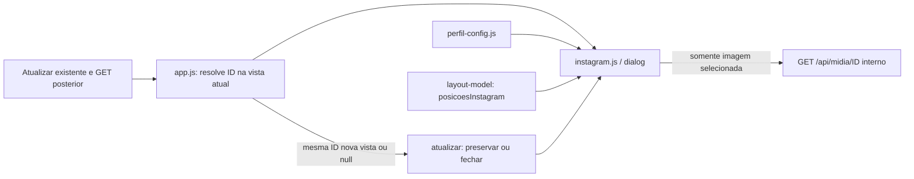

# Prévia local de Instagram

Como um celular de demonstração, a prévia permite conferir a arte e o texto antes da publicação manual. Ela usa os arquivos já vinculados à peça e não consulta Instagram.

[src/web/instagram.js](../../src/web/instagram.js) é um módulo de navegador implementado e testado na Parte B da 006, integrada em c4660d7 após aprovação expressa do autor, com 32 IDs mantidos. A revisão visual 08ba10b está implementada/testada localmente, gate bc74d6e PASS/756 testes, push realizado, CI estrito a5c964c SUCCESS/Semgrep PASS; revisão independente do delta a5c964c sem achados; review remoto adjudicado sem bloqueio: I1 não reproduzido, I2 histórico corrigido; resultados do head final são conferidos no PR; CI/review anteriores são históricos. Carregado com `defer` depois de [layout-model.js](layout-model.md) e [perfil-config.js](perfil-config.md), expõe `globalThis.CrmInstagram`; [app.js](web.md) resolve a peça atual pelo ID antes de abrir a prévia em Produção, Publicar ou na gaveta. [Contrato canônico](../../specs/006-layout-v3/contracts/apresentacao.md) e [provas locais](../../specs/006-layout-v3/validacao.md).

A manutenção visual `028778a` está implementada/testada localmente, não integrada; checks/review do head final ficam no PR. [Provas e antes/depois](../reports/006-ajustes-visuais-validacao.md).

| Interface | Efeito visual |
| --- | --- |
| `abrir({peca,acionador})` | Cria/reutiliza `dialog`/.phone preta, começa na posição 1, mostra avatar/perfil configurados, imagem 4:5 com `contain`, legenda/hashtags literais; dá foco a Fechar prévia, acima/fora da moldura. |
| `atualizar(peca)` | Atualiza a mesma identidade sem fechar; preserva o índice ou limita à última posição disponível. |
| `atualizar(null)` / peça de outra identidade | Fecha e restaura o foco. |
| `fechar()` | Fecha somente a prévia, libera a imagem e restaura o acionador conectado ou o título da tela; controles de captura já permanecem no topo. |
| `pecaId` | Getter da identidade exibida, ou `null`; permite à releitura reencontrar a mesma peça. |

Todas as páginas vigentes contam, inclusive sem arquivo ou bytes: a posição original mostra **prévia indisponível**. Empates e versões de mídia ligadas são preservados; cenas usam posições de início/final. Imagem única fica em 1/1 mesmo indisponível: a primeira posição lógica é preservada, sem saltar para a próxima imagem disponível; miniaturas/galeria podem escolher a próxima disponível pela seleção histórica 005, deliberadamente distinta. Só a imagem selecionada recebe URL local; não há preload de todas as páginas ou extração de ZIP. A galeria histórica da 005 mantém sua própria seleção.

A moldura .phone usa fundo preto nos dois temas, largura próxima de 360 px com margem em 390, borda escura 10 px e cantos 38 px. Fechar fica acima/fora; cabeçalho tem avatar circular de 40 px/fonte 7,5 px com siglaMarca, comportando três/quatro caracteres sintéticos, inclusive WWW/WWWW, perfil forte, Prévia · não publicado e ⋯ decorativo. Arte 4:5 sem corte tem setas laterais e contador sobrepostos, pontos abaixo; ícones ♡ 💬 ↗ … e SVG de salvar com traço `currentColor` são decorativos/aria-hidden e não recebem foco; o emoji de salvar pertence à referência histórica anterior. Legenda exibe perfil em negrito, espaço e texto literal; hashtags são azuis. Imagem única conserva 1/1 e oculta setas/pontos.

Setas, pontos com nome acessível, ←/→ e arrasto horizontal dominante de pelo menos 40 px navegam sem wrap. Arrasto vertical não muda a página. Para Reels, pontos e setas anunciam Cena N · início/final do destino; nomes são atualizados mesmo quando a releitura conserva o mesmo total. Carrossel mantém Página. O contador é `role=status`/`aria-live`; ao alcançar um limite que desabilita a seta focada, marcarPosicao preserva a referência de foco e transfere-o à outra seta habilitada, ou a Fechar se nenhuma permitir navegação. Se releitura reduzir para uma posição e ocultar a seta ou ponto focados, foco vai a Fechar; quando pontos forem recriados com mais de uma posição, o ponto corrente recebe foco. Tab/Shift+Tab ficam no diálogo e Esc fecha apenas a prévia, conservando a gaveta de origem. Em viewport baixa, a arte diminui proporcionalmente e os textos têm rolagem interna.

Selo, Dados a confirmar, ⟳ Atualizar e feedback permanecem somente na página; não existe transporte/clonagem desses nós, nem título visível no pop-up. showModal torna o fundo inerte: o usuário fecha a prévia para iniciar outra atualização pelo topo. Atualização iniciada por clique real antes de abrir ou releitura programática recebida enquanto aberta conserva a mesma peça/índice, fecha se removida e mantém conteúdo na falha; o teste programático no botão real durante o modal não comprova acionamento pelo usuário no fundo. Botões da gaveta resolvem ID na vista vigente, sem reabrir objeto removido.

No fechamento histórico 08ba10b, `tests/instagram-interface.test.cjs` cobriu 26 casos de mídia, configuração, slots, foco, controles, gesto e atualização; `tests/layout-interface.test.cjs` acrescenta abertura real de Produção/Publicar/gaveta, atualizações e remoção. Servidor real em TEMP/porta efêmera, transporte falso e rede externa bloqueada. A revisão visual teve RED 5 FAIL (quatro visuais/avatar), GREEN 109 PASS/0 SKIP (26 Instagram+83 Layout) e focal 6 PASS/0 SKIP após centralização fit-content/viewport baixa. A prova não demonstra arrasto físico, acesso real ao Drive ou publicação. O módulo fica fora do LCOV, com comportamento verificado por Playwright; fontes e gate somente na validação. Não houve ensaio com leitor de tela real. O review sugeriu conferir futuramente o anúncio de status ao sair de hidden e a possível redundância de ponto, tipo e nome da semana no Mês; não há falha reproduzida do contrato de teclado/foco e essa sugestão não muda o escopo atual.
