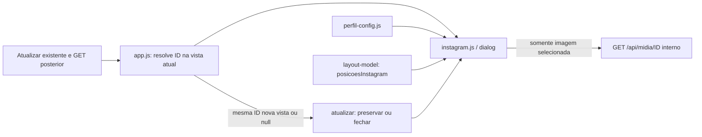

# Prévia local de Instagram

Como um celular de demonstração, a prévia permite conferir a arte e o texto antes da publicação manual. Ela usa os arquivos já vinculados à peça e não consulta Instagram.

[src/web/instagram.js](../../src/web/instagram.js) é um módulo de navegador implementado e testado na Parte B da 006, entregável e não integrada, com 32/32 tarefas executadas. CI estrito da099ab SUCCESS/Semgrep PASS, revisão independente completa aprovada e review remoto sem bloqueio de código/arquitetura/segurança, condição CI atendida; metadados finais são reconferidos por head no PR. Carregado com `defer` depois de [layout-model.js](layout-model.md) e [perfil-config.js](perfil-config.md), expõe `globalThis.CrmInstagram`; [app.js](web.md) resolve a peça atual pelo ID antes de abrir a prévia em Produção, Publicar ou na gaveta. [Contrato canônico](../../specs/006-layout-v3/contracts/apresentacao.md) e [provas locais](../../specs/006-layout-v3/validacao.md).

| Interface | Efeito visual |
| --- | --- |
| `abrir({peca,acionador})` | Cria/reutiliza `dialog`, começa na posição 1, mostra perfil, imagem 4:5 com `contain`, legenda e hashtags literais; dá foco a Fechar prévia. |
| `atualizar(peca)` | Atualiza a mesma identidade sem fechar; preserva o índice ou limita à última posição disponível. |
| `atualizar(null)` / peça de outra identidade | Fecha e restaura o foco. |
| `fechar()` | Fecha somente a prévia; libera a imagem, devolve os controles comuns ao topo e restaura o acionador conectado, ou o título da tela. |
| `pecaId` | Getter da identidade exibida, ou `null`; permite à releitura reencontrar a mesma peça. |

Todas as páginas vigentes contam, inclusive sem arquivo ou bytes: a posição original mostra **prévia indisponível**. Empates e versões de mídia ligadas são preservados; cenas usam posições de início/final. Imagem única fica em 1/1 mesmo indisponível: a primeira posição lógica é preservada, sem saltar para a próxima imagem disponível; miniaturas/galeria podem escolher a próxima disponível pela seleção histórica 005, deliberadamente distinta. Só a imagem selecionada recebe URL local; não há preload de todas as páginas ou extração de ZIP. A galeria histórica da 005 mantém sua própria seleção.

Setas, pontos com nome acessível, ←/→ e arrasto horizontal dominante de pelo menos 40 px navegam sem wrap. Arrasto vertical não muda a página. Para Reels, pontos e setas anunciam Cena N · início/final do destino; nomes são atualizados mesmo quando a releitura conserva o mesmo total. Carrossel mantém Página. O contador é `role=status`/`aria-live`; ao alcançar um limite que desabilita a seta focada, marcarPosicao preserva a referência de foco e transfere-o à outra seta habilitada, ou a Fechar se nenhuma permitir navegação. Tab/Shift+Tab ficam no diálogo e Esc fecha apenas a prévia, conservando a gaveta de origem. Em viewport baixa, a arte diminui proporcionalmente e os textos têm rolagem interna.

Com o diálogo aberto, os nós únicos `.capture-actions`, `#resultado-atualizacao` e `#erro` são movidos para ele e restaurados por marcadores ao fechar. Isso mantém selo, **Dados a confirmar** global, botão **⟳ Atualizar** e feedback acessíveis enquanto o fundo nativo fica inerte, sem clonar IDs. O POST/GET é o já existente; falha conserva a vista e a prévia anterior. Botões da gaveta reencontram a identidade na vista vigente no clique, inclusive após atualização: uma peça removida não é reaberta pelo objeto antigo.

`tests/instagram-interface.test.cjs` cobre 20 casos de mídia, configuração, slots, foco, controles, gesto e atualização; `tests/layout-interface.test.cjs` acrescenta abertura real de Produção/Publicar/gaveta, atualizações e remoção. Servidor real em TEMP/porta efêmera, transporte falso e rede externa bloqueada. A prova não demonstra arrasto físico, acesso real ao Drive ou publicação. O módulo fica fora do LCOV, com comportamento verificado por Playwright; fontes e gate somente na validação. Não houve ensaio com leitor de tela real. O review sugeriu conferir futuramente o anúncio de status ao sair de hidden e a possível redundância de ponto, tipo e nome da semana no Mês; não há falha reproduzida do contrato de teclado/foco e essa sugestão não muda o escopo atual.
