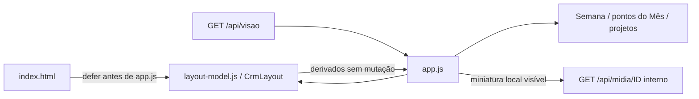

# Modelo visual do Layout v3 — Parte A

Como a legenda de uma agenda, este módulo traduz os estados já consultados para os cartões e projetos. Não decide o trabalho editorial: a projeção continua sendo a autoridade sobre estado, vínculos, vigência e avisos.

[src/web/layout-model.js](../../src/web/layout-model.js) está implementado e testado localmente na Parte A da 006, sem integração. Exporta a mesma API em `globalThis.CrmLayout` no navegador e `module.exports` nos testes. Não lê DOM, arquivos, credenciais ou rede; não modifica a vista recebida. [Contrato canônico](../../specs/006-layout-v3/contracts/apresentacao.md) e [validação](../../specs/006-layout-v3/validacao.md).

| Função exportada | Entrada e resultado |
| --- | --- |
| `estadoSimples(p)` | Usa `p.quadro.coluna`: Planejamento → Planejada; Redação/Visual/Mídia/Outras → Criação; Revisão, Pronta e Publicada mantêm o nome. Não interpreta `status` textual. |
| `motivoTravado(p)` | Pronta/Publicada retornam vazio; pendência projetada de revisão gera **Travado: precisa de correção**; sem ela, Mídia com pendência de mídia gera **Travado: falta gerar mídia**. Falha de bytes da prévia não trava a peça. |
| `progresso(pecas)` | Retorna `{prontas,total,percentual}`; conta Pronta/Publicada. Total zero tem percentual `null`, sem meta inventada. |
| `imagensDaPeca(p)` | Preserva seleção da galeria da 005: unidades vigentes ordenadas por índice/ID, até uma imagem por página e duas por cena; mantém ponteiros resolvidos e versões distintas. Sem unidades, fallback somente para Imagem com versão inteira positiva segura e arquivos exatos de produção/versão. |
| `segundaDaSemana(isoCivil)` | Valida data civil canônica e retorna segunda-feira; inválida retorna `null`. Operações UTC evitam deslocar o dia civil recebido. |
| `ordenarSemanas(semanas,hojeCivil)` | Retorna nova lista: atual/futuras crescentes, passadas decrescentes, períodos inválidos ao final. Hoje inválido mantém a ordem em cópia independente. |

A integração DOM permanece em `app.js`: agrupa Planejamento pela data civil e Produção pela semana registrada, preserva Sem data/órfãs, passa ao progresso apenas peças visíveis pelo filtro de formato no Planejamento e o projeto inteiro na Produção, monta os cinco passos e troca-os por motivo de travamento. A miniatura usa a primeira imagem disponível da seleção, caixa 4:5 com `contain` e placeholder quando faltar/falhar. Telas ocultas e Mês não iniciam imagens; a gaveta continua carregando sua galeria ao abrir. A seleção histórica da galeria filtra registros sem arquivo: o contrato futuro do pop-up da Parte B exige preservar todos os slots indisponíveis no contador e ainda não está implementado.

`tests/layout-model.test.cjs` observou RED 1 PASS/41 FAIL e GREEN 42 PASS, incluindo precedência, vigência, ordenação e ausência de mutação. Regras de captura, cache e transporte permanecem nos módulos [projeção](projecao.md), [mídia](midia.md) e [servidor](servidor.md). Não há fila de Publicar, perfil ou modal neste módulo da Parte A. layout-model.js é medido no LCOV, assim como os geradores sintéticos já incluídos antes da última rodada de review; src/web/app.js e src/web/theme.js permanecem fora do LCOV e têm verificação comportamental de navegador. A mudança de percentual entre rodadas não representa a entrada desses arquivos no escopo medido.
