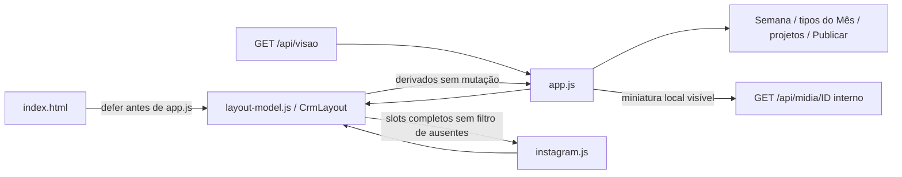

# Modelo visual do Layout v3

Como a legenda de uma agenda, este módulo traduz os estados já consultados para os cartões e projetos. Não decide o trabalho editorial: a projeção continua sendo a autoridade sobre estado, vínculos, vigência e avisos.

[src/web/layout-model.js](../../src/web/layout-model.js) foi integrado na A da 006 e ampliado na B, implementada/testada e entregável, não integrada, com 32/32 tarefas executadas. CI estrito da099ab SUCCESS/Semgrep PASS, revisão independente completa aprovada e review remoto sem bloqueio de código/arquitetura/segurança, condição CI atendida; metadados finais são reconferidos por head no PR. Exporta a mesma API em `globalThis.CrmLayout` no navegador e `module.exports` nos testes. Não lê DOM, arquivos, credenciais ou rede; não modifica a vista recebida. [Contrato canônico](../../specs/006-layout-v3/contracts/apresentacao.md) e [validação](../../specs/006-layout-v3/validacao.md).

| Função exportada | Entrada e resultado |
| --- | --- |
| `estadoSimples(p)` | Usa `p.quadro.coluna`: Planejamento → Planejada; Redação/Visual/Mídia/Outras → Criação; Revisão, Pronta e Publicada mantêm o nome. Coluna desconhecida usa Criação; consulta somente chaves próprias do mapa. Não interpreta `status` textual. |
| `motivoTravado(p)` | Pronta/Publicada retornam vazio; pendência projetada de revisão gera **Travado: precisa de correção**; sem ela, Mídia com pendência de mídia gera **Travado: falta gerar mídia**. Falha de bytes da prévia não trava a peça. |
| `progresso(pecas)` | Retorna `{prontas,total,percentual}`; conta Pronta/Publicada. Total zero tem percentual `null`, sem meta inventada. |
| `imagensDaPeca(p)` | Preserva seleção da galeria da 005: unidades vigentes ordenadas por índice/ID, até uma imagem por página e duas por cena; mantém ponteiros resolvidos e versões distintas. Sem unidades, fallback somente para Imagem com versão inteira positiva segura e arquivos exatos de produção/versão. |
| `segundaDaSemana(isoCivil)` | Valida data civil canônica e retorna segunda-feira; inválida retorna `null`. Operações UTC evitam deslocar o dia civil recebido. |
| `ordenarSemanas(semanas,hojeCivil)` | Retorna nova lista: atual/futuras crescentes, passadas decrescentes, períodos inválidos ao final. Hoje inválido mantém a ordem em cópia independente. |
| `filaPublicar(pecas)` | Liberação literal liberado e publicação vazia; data civil válida crescente, ausente/inválida ao final, desempate por ID. Retorna nova lista sem mutação. |
| `publicadasRecentes(pecas)` | Publicação preenchida, instantes válidos decrescentes, inválidos ao final por ID; limita a dez. |
| `posicoesInstagram(p)` | Páginas/cenas vigentes por índice/ID, incluindo posições sem arquivo; Imagem exatamente a primeira posição lógica, inclusive null, sem saltar para a próxima disponível; se não houver posições, delega a seleção/fallback 005. Demais sem posições têm um placeholder. Preserva empates e dois slots por cena. |
| `instantePublicacao(value)` | Valida ISO com fuso, horário e dia civil real antes de Date.parse; inválida retorna null. Compartilhada pela ordenação e pelo texto da UI. |

A integração DOM permanece em `app.js`: agrupa Planejamento pela data civil e Produção pela semana registrada, preserva Sem data/órfãs, passa ao progresso apenas peças visíveis pelo filtro de formato no Planejamento e o projeto inteiro na Produção, monta os cinco passos e troca-os por motivo de travamento. A miniatura usa a primeira imagem disponível da seleção, caixa 4:5 com `contain` e placeholder quando faltar/falhar. Telas ocultas e Mês não iniciam imagens; a gaveta continua carregando sua galeria ao abrir. A seleção histórica da galeria filtra registros sem arquivo: miniatura pode mostrar a próxima imagem disponível, enquanto o modal Imagem única mantém a primeira posição lógica null em 1/1. Essa divergência deliberada preserva a galeria 005 e o slot do pop-up; posicoesInstagram, acrescentada na B, preserva slots indisponíveis no contador do pop-up sem modificar a galeria.

`tests/layout-model.test.cjs` observou RED 1 PASS/41 FAIL e GREEN inicial 42 PASS; a guarda defensiva de chaves próprias acrescentou três casos RED→GREEN (constructor/toString/__proto__), totalizando 45 PASS na rodada 01d772b, incluindo precedência, vigência, ordenação e ausência de mutação. Regras de captura, cache e transporte permanecem nos módulos [projeção](projecao.md), [mídia](midia.md) e [servidor](servidor.md). Na rodada histórica A havia seis funções; B acrescenta filaPublicar/publicadasRecentes/posicoesInstagram/instantePublicacao, totalizando dez exports. Perfil e modal são módulos separados; o teste puro inicial B registrou 57 PASS, com RED 44 PASS/13 FAIL antes dos novos derivados. A correção final de Imagem única observou RED 57 PASS/3 FAIL → GREEN 60 PASS: primeira posição lógica ausente permanece null em 1/1, sem substituir por outro arquivo; a galeria 005 continua filtrando ausentes segundo seu contrato. layout-model.js é medido no LCOV, assim como os geradores sintéticos já incluídos antes da última rodada de review; src/web/app.js, src/web/theme.js, src/web/instagram.js e src/web/perfil-config.js permanecem fora do LCOV e têm verificação comportamental de navegador. A mudança de percentual entre rodadas não representa a entrada desses arquivos no escopo medido.
