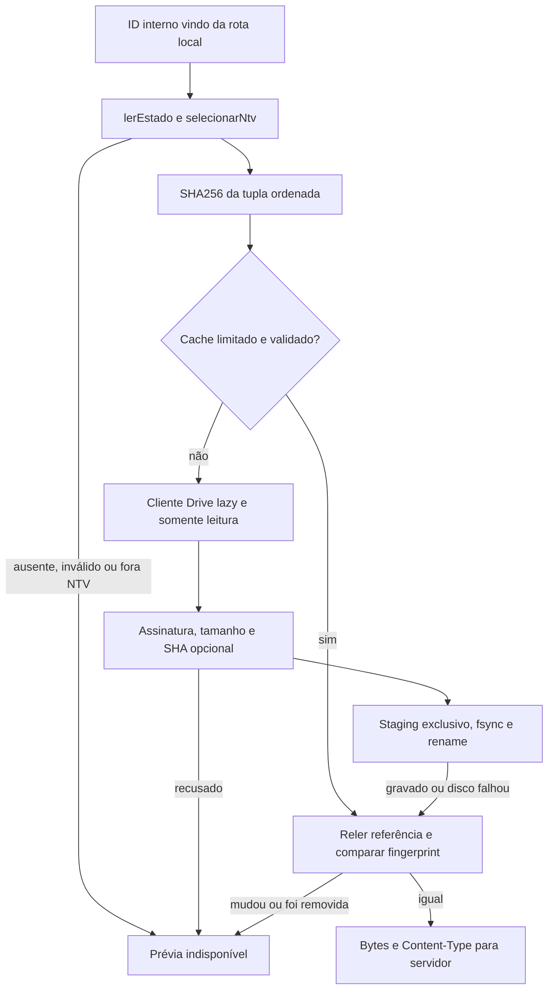

# Prévias de imagens e cache local

Como uma folha de contato ao lado de cada texto, a prévia ajuda a reconhecer imagens já registradas. A captura continua sendo a etiqueta que autoriza a leitura; o cache guarda somente bytes conferidos e não cria estado editorial.

Implementado/testado localmente na 005, no [PR #23](https://github.com/Browsher/crm-social/pull/23), sem integração ou merge. Fonte do código/testes/gate: `392e1090c02fa4a52ab887c20887a6b79e5aee69`; [validação](../../specs/005-previas-imagens/validacao.md). Código: [src/midia.cjs](../../src/midia.cjs); contrato público: [contracts/midia.md](../../specs/005-previas-imagens/contracts/midia.md). Compartilhamento real pelo autor segue pendente e não é comprovado pelos fakes.

## Interfaces e dependências

| Export / entrada | Comportamento real |
| --- | --- |
| `validarImagem(bytes,sha256)` | Buffer até 15.000.000 bytes, assinatura PNG/JPEG/WEBP e SHA opcional; retorna MIME ou erro422 constante |
| `resolverArquivo(estado,arquivoId)` | Recorte NTV por triagem, ID interno exato e único, versão positiva segura, id_drive canônico e SHA normalizado |
| `criarServicoMidia({dataDir,criarCliente}).obter(arquivoId)` | Resolve snapshot vigente, cache/download validado, fingerprint final; retorna `{bytes,contentType}` |
| `dataDir` | Caminho confiável do servidor, padrão data/; navegador não o escolhe |
| `criarCliente` | Factory privada, padrão criarClienteDrive; instanciada no primeiro miss, injetável nos testes |

Imports locais reais: [snapshot](snapshot.md) (`lerEstado`), [triagem](triagem.md) (`selecionarNtv`) e [Google](google.md) (`criarClienteDrive`). APIs nativas: crypto, fs e path. [Servidor](servidor.md) importa o módulo para a rota GET /api/midia/ID-interno; não há dependência nova de aplicação ou ciclo novo.

## Resolução e validação

Cada pedido começa com `referenciaAtual`: snapshot válido e recorte NTV, sem fallback por URL/nome. `arquivo_id` exato ausente/fora do recorte dá404; captura/recibo ilegível dá503. Registro exige versão inteira positiva segura, id_drive preenchido com `A–Z`, `a–z`, `0–9`, `_`, `-`, e SHA vazio ou 64 hex. Registro recusado dá422 antes de cliente/rede. Duplicidade detectada no resolver puro dá422; duplicidade já recusada pelo parser do snapshot dá503.

Bytes, e não MIME/extensão/tipo declarados, decidem o conteúdo. PNG exige oito bytes completos; JPEG `FF D8 FF`; WEBP os bytes exatos de `RIFF` e `WEBP`, em pelo menos 12 bytes. SVG/GIF/vídeo/ZIP/HTML/JSON e truncados são recusados. Até **15.000.000 bytes inclusive**; SHA preenchido exige SHA-256 igual, sem diferença de caixa na representação hex. A validação é mínima de assinatura, sem decodificação integral: o fallback `img.onerror` da [interface](web.md#prévias-de-imagens--005) cobre bytes indecodificáveis.

## Cache e concorrência

`chaveArquivo` calcula SHA-256 de `JSON.stringify([arquivo_id,versao,id_drive,sha256Normalizado])`. O nome é hexadecimal sob `data/midias/<chave>.bin`, nunca o ID ou caminho da requisição. Cache é privado e ignorado por Git. Mudança de ID, versão, referência remota ou SHA muda a chave; caixa diferente do mesmo SHA não muda.

`lerLimitado` lê no máximo limite+1, em blocos de até 64 KiB, e fecha o descritor. Cache hit reconfere MIME/tamanho/hash. Diretório de cache precisa ser diretório sem symlink; entrada precisa ser arquivo regular. Corrupção, excesso, parcial ou erro de leitura viram miss/refetch; não concedem autorização sem snapshot válido.

`promoverCache` cria staging exclusivo por UUID, escreve/fsync/fecha e promove por rename. Limpa somente seu próprio staging. Falha de mkdir/escrita/promoção pode servir os bytes novos já validados sem persistência; não muda captura, recibos, aprovação ou publicação. Promessas da mesma chave coalescem download e são removidas ao finalizar, inclusive na falha; não há Buffer global permanente. Cada chamador reconfere a referência após cache/download: alteração, remoção ou estado inválido gera503, impedindo servir a referência anterior como atual. Captura nova com a mesma referência permite resposta.

## Fronteira pública, testes e limites

O serviço devolve somente bytes/contentType ou `Error('Prévia indisponível')` com status404/422/503. O adaptador HTTP aplica origem/método/forma, headers e demais status do contrato. Nenhum ID remoto, e-mail, mensagem Google ou caminho acompanha falhas. O cliente lê Drive somente no servidor; as permissões dependem da pasta compartilhada pelo autor.

[tests/midia.test.cjs](../../tests/midia.test.cjs) importa e exercita o módulo explicitamente: 30 casos de regras, TEMP real, hits/misses, corrupção, falha de disco/staging, concorrência e fingerprint. [HTTP real](../../tests/midia-http.test.cjs) cobre a composição até o cliente nativo com transporte falso; [UI](../../tests/previas-interface.test.cjs) cobre demanda, galeria, fallback e foco. As cinco camadas passaram no gate local registrado; UI fica fora do LCOV e CI Linux conserva seus pulos explícitos.

Sem SHA declarado, referência igual não prova imutabilidade remota. Não há eviction, quota, limpeza automática ou agenda de revalidação. Não há transcodificação, vídeo, extração/manifesto ZIP ou nova inferência editorial. Cache continua removível localmente sem alterar a captura; testes sintéticos não demonstram compartilhamento ou acesso operacional real.
