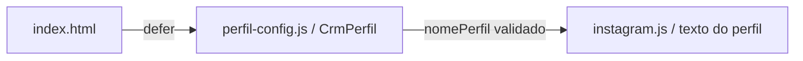

# Configuração visual do perfil

Como o nome impresso no topo de um cartão, esta configuração identifica a prévia local. Ela não conecta uma conta nem autentica serviços.

[src/web/perfil-config.js](../../src/web/perfil-config.js) define somente `globalThis.CrmPerfil={nomePerfil:'perfil.exemplo'}`. O valor é sintético, público e versionado; não incluir credenciais, endereço de conta, ID de serviço ou dados operacionais. Implementado e testado na Parte B da 006, entregável e não integrada, com 32/32 tarefas executadas. CI estrito da099ab SUCCESS/Semgrep PASS, revisão independente completa aprovada e review remoto sem bloqueio de código/arquitetura/segurança, condição CI atendida; metadados finais são reconferidos por head no PR.

| Campo | Validação no consumidor |
| --- | --- |
| `nomePerfil` | String não vazia após `trim`, até 80 caracteres, sem controles C0/DEL; inválida ou ausente mostra **Perfil não configurado**. |

`index.html` carrega o arquivo com `defer` antes de [instagram.js](instagram.md); o consumidor valida o objeto e escreve o nome com `textContent`. O servidor oferece somente `/perfil-config.js` pela allowlist explícita de estáticos, sob as mesmas guardas de método/Host/CSP/MIME. Não há nova variável de ambiente, endpoint de dados ou dependência.

Para personalizar o nome neste computador, editar nomePerfil somente no checkout local. O nome real do perfil é personalização privada: **não commitar**, publicar em PR/log nem usar em screenshots compartilhados. Antes de preparar um commit, restaurar o exemplo sintético versionado. Nenhum nome real foi fornecido ou consultado nesta entrega; não há mecanismo de configuração ignorada ou variável de ambiente implementado para essa personalização.

Dívida de processo sugerida no review: editar o arquivo versionado exige cuidado para não incluir a personalização privada em um commit. Um override local ignorado reduziria esse risco em trabalho futuro; ele não foi implementado nem autorizado como parte desta entrega e não implica novo endpoint. A configuração pública continua exclusivamente sintética.

Testes reais de HTTP e de navegador cobrem disponibilidade, guardas, valor sintético e fallback inválido. Este arquivo também fica fora do LCOV; [contrato](../../specs/006-layout-v3/contracts/apresentacao.md) e [validação](../../specs/006-layout-v3/validacao.md) registram a evidência da fonte de código/testes final 7a0dd56, sem atribuir o CI de código a um head documental posterior.
