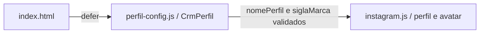

# Configuração visual do perfil

Como o nome impresso no topo de um cartão, esta configuração identifica a prévia local. Ela não conecta uma conta nem autentica serviços.

[src/web/perfil-config.js](../../src/web/perfil-config.js) define somente `globalThis.CrmPerfil={nomePerfil:'perfil.exemplo',siglaMarca:'DEMO'}`. O valor é sintético, público e versionado; não incluir credenciais, endereço de conta, ID de serviço ou dados operacionais. Implementado e testado na Parte B da 006, integrada em c4660d7 após aprovação expressa do autor, com 32 IDs mantidos. A revisão visual 08ba10b acrescenta siglaMarca ao avatar, validada localmente; gate bc74d6e PASS/756 testes, push realizado, CI estrito do head aprovado a5c964c SUCCESS/Semgrep PASS e revisão independente aprovada, Minor documental corrigido; review remoto adjudicado sem bloqueio: I1 não reproduzido, I2 histórico corrigido; resultados do head final são conferidos no PR. Provas remotas anteriores são históricas.

| Campo | Validação no consumidor |
| --- | --- |
| `nomePerfil` | String não vazia após `trim`, até 80 caracteres, sem controles C0/DEL; inválida/ausente mostra **Perfil não configurado**. |
| `siglaMarca` | String não vazia após `trim`, até cinco caracteres, sem C0/DEL; exibida em maiúsculas como texto literal no avatar. Inválida/ausente mostra **•**. |

`index.html` carrega o arquivo com `defer` antes de [instagram.js](instagram.md); o consumidor valida o objeto e escreve nome/sigla com `textContent`, sem tratar configuração como HTML. O servidor oferece somente `/perfil-config.js` pela allowlist explícita de estáticos, sob as mesmas guardas de método/Host/CSP/MIME. Não há nova variável de ambiente, endpoint de dados ou dependência.

Para personalizar o nome neste computador, editar nomePerfil/siglaMarca somente no checkout local; ambos os exemplos versionados são sintéticos. O nome real do perfil é personalização privada: **não commitar**, publicar em PR/log nem usar em screenshots compartilhados. Antes de preparar um commit, restaurar o exemplo sintético versionado. Nenhum nome real foi fornecido ou consultado nesta entrega; não há mecanismo de configuração ignorada ou variável de ambiente implementado para essa personalização.

Dívida de processo sugerida no review: editar o arquivo versionado exige cuidado para não incluir a personalização privada em um commit. Um override local ignorado reduziria esse risco em trabalho futuro; ele não foi implementado nem autorizado como parte desta entrega e não implica novo endpoint. A configuração pública continua exclusivamente sintética.

Testes reais de HTTP e de navegador cobrem disponibilidade, guardas, valor sintético e fallback inválido. Este arquivo também fica fora do LCOV; [contrato](../../specs/006-layout-v3/contracts/apresentacao.md) e [validação](../../specs/006-layout-v3/validacao.md) registram a evidência da fonte de código/testes 08ba10b/gate bc74d6e da revisão visual, sem atribuir o CI de código a um head documental posterior.
