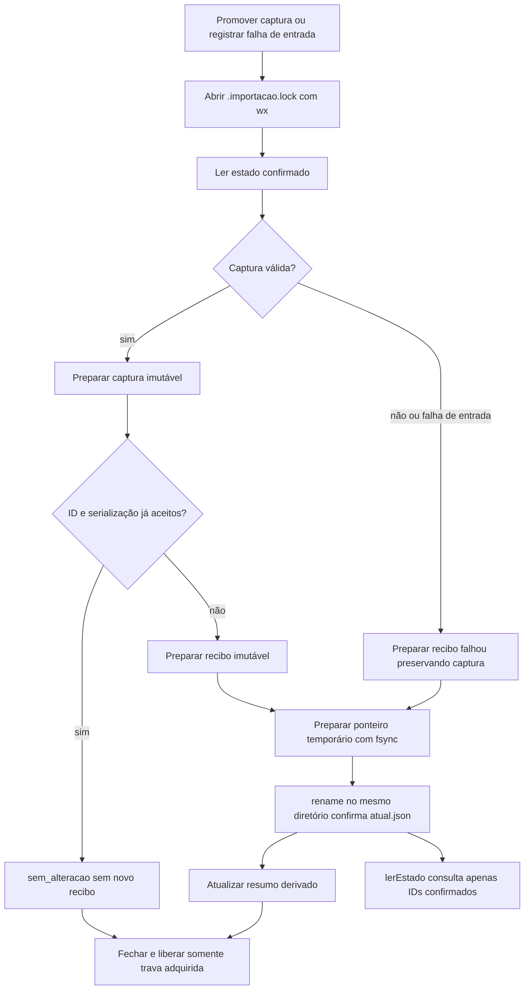

# Estado privado e persistência

Como um álbum que só troca a capa depois de guardar as novas páginas, este módulo prepara arquivos e confirma o estado por um único ponteiro. Uma captura rejeitada não substitui a última válida.

Estado em 04/10/2026: T006 implementada, com regressões de falha de entrada e concorrência após revisão independente. Fonte: [src/snapshot.cjs](../../src/snapshot.cjs), `ponteiro` (linha 7), `lerEstado` (20), `confirmar` (43), `exclusiva` (67), `registrarFalhaEntrada` (85), `promoverComTrava` (96) e `promoverCaptura` (113).

## Interfaces

| Export | Responsabilidade |
| --- | --- |
| `lerEstado(dataDir)` | Lê ponteiro, recibos confirmados e captura validada; não escreve |
| `promoverCaptura(raw, dataDir)` | Adquire exclusividade, valida, prepara arquivos e promove ou confirma falha |
| `registrarFalhaEntrada(dataDir, codigo)` | Confirma falha de arquivo/JSON que não chegou à validação, preservando captura |

Não há rota, variável de ambiente ou rede. Imports nativos: fs, path e randomUUID; import local: [validação](captura.md). `dataDir` é argumento do chamador confiável, não dado de uma requisição.

## Arquivos e autoridade

| Caminho relativo ao diretório privado | Papel |
| --- | --- |
| `.importacao.lock` | Exclusividade de escrita por diretório; contém PID e instante do processo proprietário |
| `capturas/<capturaId>.json` | Serialização do envelope validado; criada exclusivamente, sem sobrescrita |
| `tentativas/<tentativaId>.json` | Recibo imutável preparado |
| `atual.json` | Única autoridade: `{capturaId, ultimaTentativaId, historicoIds}` |
| `atual-<uuid>.tmp` | Novo ponteiro preparado no mesmo diretório antes do rename |
| `ultima-tentativa.json` | Resumo derivado; falha deste cache não desfaz confirmação |

Recibo privado: `{tentativaId, capturaId, concluidaEm, resultado, motivoResumo}`. Resultado é `completa` ou `falhou`; ID de captura pode ser null. Apenas IDs em `historicoIds` são tentativas confirmadas; `ultimaTentativaId` deve corresponder ao último ID, ou null com lista vazia. Diretório sem ponteiro retorna ausência estruturada.

## Fluxo de escrita e leitura

As gravações duráveis usam abertura `wx`, write, fsync e close. Arquivo imutável existente só é reaproveitado se o conteúdo for igual. A substituição de `atual.json` confirma captura, última tentativa e Histórico juntos.

O `finally` da importação normal libera sua própria trava. Uma segunda instância, inclusive tentando registrar entrada inválida, falha com **importação em andamento**, antes de ler/mutar o estado. O teste usa dois processos reais e uma barreira antes da confirmação.

Se o processo for interrompido, a trava pode permanecer. **Não há expiração ou remoção automática**: conferir proprietário/PID, processo vivo e estado confirmado antes de qualquer recuperação manual. Nunca remover uma trava apenas porque outra importação falhou. Arquivos preparados sem confirmação não comprovam sucesso e não entram no Histórico.

## Idempotência e falhas

| Situação | Resultado real |
| --- | --- |
| ID e serialização já aceitos em recibo confirmado | `sem_alteracao`; não cria recibo, volta a captura antiga ou encerra falha posterior |
| Mesmo ID, serialização diferente | Recibo falhou por conflito; captura existente não é sobrescrita |
| Mesmos bytes preparados, sem aceitação confirmada | Revalida e tenta nova promoção; não aplica no-op falso |
| Captura inválida ou gravação/promoção recuperável falhou | Tenta confirmar falha mantendo `capturaId` anterior |
| Arquivo ausente/ilegível ou JSON quebrado | Mensagens fixas de entrada; capturaId do recibo null |
| Persistência impossibilita confirmar a falha | Erro explícito **falha não pôde ser registrada**; sem garantia de Histórico durável |
| GET/reinício/releitura | Lê o mesmo estado; não renova horário ou apaga falha |
| Falha ao liberar trava | Erro explícito para conferir estado local; não anuncia sucesso silencioso |

A comparação de identidade é entre bytes de `JSON.stringify(raw)`, não entre espaços/indentação do arquivo de entrada. Ordem de propriedades faz parte dessa serialização. Captura aceita previamente não é reativada por reimportar seu ID.

## Verificação e pegadinhas

[tests/snapshot.test.cjs](../../tests/snapshot.test.cjs) prova ausência, imutabilidade, no-op, conflito, falha, órfãos e promoção após interrupção da confirmação. [tests/importador.test.cjs](../../tests/importador.test.cjs) cobre os recibos de falha de leitura e duas instâncias reais concorrentes. Tudo fica em TEMP; evidência em [validacao.md](../../specs/001-consulta-local-producao/validacao.md).

O nome “Histórico” aqui significa recibos persistidos/projetados; a tela de Histórico só será entregue em US5. A captura é revalidada na leitura. Falha de rename testada não comprova resistência a queda de energia. Recibos preparados e temporários órfãos permanecem preservados; não há limpeza automática nem restauração que fabrique aceitação.
