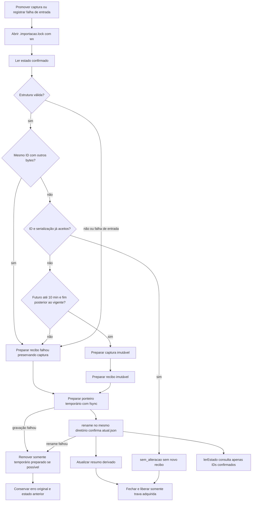

# Estado privado e persistência

Como um álbum que só troca a capa depois de guardar as novas páginas, este módulo prepara arquivos e confirma o estado por um único ponteiro. Uma captura rejeitada não substitui a última válida.

Persistência implementada com rejeição temporal antes da promoção; estado e evidências na [validação](../../specs/001-consulta-local-producao/validacao.md). Fonte: [src/snapshot.cjs](../../src/snapshot.cjs), `ponteiro` (linha 7), `lerEstado` (20), `confirmar` (43), `exclusiva` (72), `registrarFalhaEntrada` (97), `promoverComTrava` (108) e `promoverCaptura` (129).

## Interfaces

| Export | Responsabilidade |
| --- | --- |
| `lerEstado(dataDir)` | Lê ponteiro, recibos confirmados e captura estruturalmente validada; não escreve nem reaplica a política temporal relativa |
| `promoverCaptura(raw, dataDir)` | Adquire exclusividade, confere estrutura/identidade/tempo, prepara arquivos e promove ou confirma falha |
| `registrarFalhaEntrada(dataDir, codigo)` | Confirma falha de arquivo/JSON que não chegou à validação, preservando captura |

Não há rota, variável de ambiente ou rede. Imports nativos: fs, path e randomUUID; import local: [validação](captura.md). `dataDir` é argumento do chamador confiável, não dado de uma requisição.

## Arquivos e autoridade

| Caminho relativo ao diretório privado | Papel |
| --- | --- |
| `.importacao.lock` | Exclusividade de escrita por diretório; contém PID e instante do processo proprietário |
| `capturas/<capturaId>.json` | Serialização do envelope validado; criada exclusivamente, sem sobrescrita |
| `tentativas/<tentativaId>.json` | Recibo imutável preparado |
| `atual.json` | Única autoridade: `{capturaId, ultimaTentativaId, historicoIds}` |
| `atual-<uuid>.tmp` | Novo ponteiro preparado no mesmo diretório antes do rename |
| `ultima-tentativa.json` | Resumo derivado; falha deste cache não desfaz confirmação |

Recibo privado: `{tentativaId, capturaId, concluidaEm, resultado, motivoResumo}`. Resultado é `completa` ou `falhou`; ID de captura pode ser null. Apenas IDs em `historicoIds` são tentativas confirmadas; `ultimaTentativaId` deve corresponder ao último ID, ou null com lista vazia. Diretório sem ponteiro retorna ausência estruturada.

## Fluxo de escrita e leitura

As gravações duráveis usam abertura `wx`, write, fsync e close. Arquivo imutável existente só é reaproveitado se o conteúdo for igual. A substituição de `atual.json` confirma captura, última tentativa e Histórico juntos. Falha na gravação/rename do ponteiro tenta remover somente o `atual-<uuid>.tmp` preparado, sem trocar o erro original por uma falha de limpeza. Essa remoção é tentativa, não garantia de recuperação após interrupção do processo.

O `finally` tenta fechar o descritor e remover sua própria trava separadamente: falha no close não impede a tentativa de unlink. O resultado da operação ou seu erro original é preservado; falha de liberação acrescenta `avisos` transitórios ao objeto devolvido/erro, sem mudar o recibo persistido. O [CLI](importador.md) escreve esses avisos em stderr e mantém o exit correspondente ao resultado original. Uma segunda instância, inclusive tentando registrar entrada inválida, falha com **importação em andamento**, antes de ler/mutar o estado. O teste usa dois processos reais e uma barreira antes da confirmação.

Se o processo for interrompido, a trava pode permanecer. **Não há expiração ou remoção automática**: conferir proprietário/PID, processo vivo e estado confirmado antes de qualquer recuperação manual. Nunca remover uma trava apenas porque outra importação falhou. Arquivos preparados sem confirmação não comprovam sucesso e não entram no Histórico.

## Idempotência e falhas

| Situação | Resultado real |
| --- | --- |
| ID e serialização já aceitos em recibo confirmado | `sem_alteracao`; não cria recibo, volta a captura antiga ou encerra falha posterior |
| Mesmo ID, serialização diferente | Recibo falhou por conflito; captura existente não é sobrescrita |
| Candidata mais de 10 minutos à frente do relógio local | Recibo falhou por captura inválida; vigente preservada, sem gravar a candidata |
| ID novo com fim igual ou anterior ao da vigente | Recibo falhou por captura desatualizada; vigente preservada, sem gravar a candidata |
| Mesmos bytes preparados, sem aceitação confirmada | Revalida e tenta nova promoção; não aplica no-op falso |
| Captura inválida ou gravação/promoção recuperável falhou | Tenta confirmar falha mantendo `capturaId` anterior |
| Arquivo ausente/ilegível ou JSON quebrado | Mensagens fixas de entrada; capturaId do recibo null |
| Persistência impossibilita confirmar a falha | Erro explícito **falha não pôde ser registrada**; sem garantia de Histórico durável |
| GET/reinício/releitura | Lê o mesmo estado e valida estrutura; não reaplica tolerância futura/ordem de importação, renova horário ou apaga falha |
| Falha ao fechar/remover trava | Resultado/erro original preservado com aviso transitório para conferir estado local; unlink é tentado mesmo se close falhar |

A comparação de identidade é entre bytes de `JSON.stringify(raw)`, não entre espaços/indentação do arquivo de entrada. Ordem de propriedades faz parte dessa serialização. Captura aceita previamente não é reativada por reimportar seu ID.

O no-op previamente aceito precede o relógio, mantendo idempotência mesmo se o relógio recuar ou existir uma captura vigente mais recente. Para uma candidata ainda não aceita, `validarTempoImportacao` recebe o relógio local atual e `before.captura.envelope.completedAt` enquanto a trava permanece adquirida. Até 10 minutos no futuro é aceito, inclusive o limite; com vigente, o fim também precisa ser estritamente posterior. Rejeições temporais confirmam uma tentativa `falhou` com motivo fixo e mantêm os arquivos/ID da vigente; a regra precede a gravação da candidata.

## Verificação e pegadinhas

[tests/snapshot.test.cjs](../../tests/snapshot.test.cjs) prova ausência, imutabilidade, no-op, conflito, falha, órfãos e promoção após interrupção da confirmação. As regressões cobrem close/unlink separados, preservação do resultado/erro e remoção do temporário após falha de rename. [tests/importador.test.cjs](../../tests/importador.test.cjs) cobre os recibos de falha de leitura e duas instâncias reais concorrentes. Tudo fica em TEMP; evidência em [validacao.md](../../specs/001-consulta-local-producao/validacao.md).

O nome “Histórico” aqui significa recibos persistidos/projetados; a tela de Histórico só será entregue em US5. A estrutura da captura é revalidada na leitura, sem a política temporal relativa exclusiva da importação. Falha de rename testada não comprova resistência a queda de energia. Capturas/recibos preparados sem confirmação permanecem preservados; temporários têm limpeza localizada por tentativa quando gravação/rename falham. Interrupção pode deixar arquivos/trava; não há varredura de limpeza automática nem restauração que fabrique aceitação.
