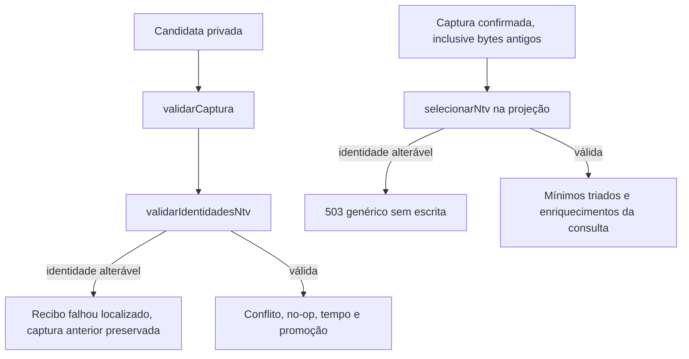

# Triagem compartilhada de dados NTV

Como conferir as etiquetas antes de colocar uma fotografia no álbum, a triagem impede que identidades diferentes virem a mesma etiqueta de conteúdo suprimido. O importador usa essa conferência antes de aceitar a captura; a consulta reutiliza a mesma seleção.

Fonte: [src/triagem.cjs](../../src/triagem.cjs). Estado e evidências na [validação](../../specs/001-consulta-local-producao/validacao.md); demonstração privada e onboarding final concluídos, com limites na validação. O módulo foi extraído da projeção preservando o recorte NTV, os 66 mínimos e as regras de redação existentes.

## Interfaces e dependências

| Export | Responsabilidade |
| --- | --- |
| `chaves` | Ordem interna semanas, producoes, paginas, cenas, arquivos e revisoes, correspondente às seis abas de CAMPOS |
| `redigirTexto(texto)` | Redação conservadora de formatos conhecidos, pedaços HTTP(S) credenciados e strings JSON, conforme o contrato |
| `selecionarNtv(captura, avisos, origens, validadeJson)` | Seleciona registros NTV e seus vínculos, copia somente mínimos triados, localiza avisos por linha física e mantém metadados em WeakMap |
| `validarIdentidadesNtv(captura)` | Executa a mesma seleção em estruturas temporárias; identidade/vínculo alterável pela redação causa erro localizado sem incluir a célula |

Importa `CAMPOS`, `CAMPOS_MESES` e `linhaMensal` de [captura](captura.md). Não conhece mapa do quadro, persistência, rotas, variáveis de ambiente ou rede. Recebe a captura normalizada por `validarCaptura`; não altera a entrada.

## Promoção e consulta

Em [snapshot](snapshot.md), `validarIdentidadesNtv` ocorre sob trava, depois da validação estrutural e antes de conflito/no-op, gravação da candidata ou troca da captura vigente. Se `redigirTexto` alteraria um campo selecionado terminado em `_id`, o erro contém somente aba, linha física, campo e motivo estático. A candidata não é gravada; quando a persistência permite, confirma-se `falhou` mantendo a captura anterior. Reimportar bytes antigos não contorna essa validação pelo no-op.

Na [projeção](projecao.md), `selecionarNtv` mantém a mesma guarda contra bytes antigos ou corrompidos: recusa toda a projeção, sem fundir registros em um marcador. O servidor devolve 503 genérico sem modificar arquivos. Conteúdo sensível em campos comuns continua sendo triado para consulta, com original apenas na captura privada; isso não rejeita automaticamente toda captura.

## Recorte, redação e limites

Semanas e produções usam `marca_id=ntv`. Páginas, cenas e revisões seguem produções NTV; arquivos seguem produção NTV ou, sem produção, semana NTV. Dados de outras marcas fora desse recorte não participam da validação de identidades NTV. Cabeçalhos e valores selecionados continuam os mínimos literais de `CAMPOS`; extras não entram na seleção. Quando capturada, Meses seleciona somente `marca_id==='ntv'` e seus quatro mínimos de `CAMPOS_MESES`, sem vínculo com semanas. `linhaMensal` recupera em WeakMap a posição física registrada pelo parser, inclusive após linhas vazias e marcas excluídas.

Os helpers internos `selecionar`, `sensivel`, `jsonValido`, `redigirPedacoUrl` e `motivoUrl` preservam os limites de redação descritos no [contrato](../../specs/001-consulta-local-producao/contracts/captura-e-consulta.md). Linha física vem da matriz original; `etapa_producao=null` é recuperada antes da triagem, e validade original de `origens_json` fica separada do texto redigido. A triagem é conservadora e não promete detectar todos os segredos possíveis.

Meses gera motivos fixos sem ecoar a célula: **Mês inválido** em mes fora de `AAAA-MM`, **Texto mensal inválido** em objetivo/pautas não textuais e não vazios e **Mês e marca repetidos** para cada linha de mês válido repetido na NTV. São avisos semânticos: a captura estruturalmente íntegra continua aceita, duplicatas permanecem na tabela e o card mostra A confirmar. Textos inválidos são ausentes no card; escalares permitidos continuam consultáveis na Planilha. Regressões locais e limites na [validação da 003](../../specs/003-planejamento-mensal/validacao.md).

Regressões nas suítes existentes de snapshot, importador, projeção e HTTP conferem a ordem da validação, a preservação da captura anterior, ausência da célula sensível nos motivos e defesa da consulta. Resultados ficam somente na validação; não há nova suíte ou dependência de aplicação por consequência da extração.
