# Validação — feature 001 entregue e demonstrada com captura real

Como conferir um álbum antes de entregá-lo: a 001 está implementada, testada e demonstrada com captura real, com T001–T041 concluídas (41/41). A integração é privada e local: captura da Central → importador → CRM; runtime sem Google ou escrita operacional. Próximo passo planejado: 002 — Planilhas, com especificação e emenda da constituição próprias. O registro final abaixo reúne fechamento e limites. As seções anteriores são evidências históricas: estados de PR, contagens e pendências descrevem aquele momento, sem substituir a conferência atual.

## Preparação T001

Em 04/10/2026, feature ativa e branch conferidas; árvore inicial limpa. Pré-requisitos oficiais encontrados. Hooks before/after_analyze de commit são opcionais e não foram executados. A regra project-structure foi gerada do estado real e sincronizada ao final da implementação: **37 linhas**, sem tratar módulos planejados como implementados.

Ambiente: Node 24.19.0 existente via CRM_NODE_PATH; PATH padrão 24.14.0. Playwright existente resolvido por CRM_PLAYWRIGHT_MODULE fora do repositório; Windows PowerShell 5.1.26100.9444. ESLint já preparado em tools/. Configuração do gate preservada: node --test, modo full, Node 24.19.0.

Responsável único de implementação: coordenador Codex, em todos os arquivos de T001–T018. Análise e revisão independentes são somente leitura. Testes também feitos pelo coordenador: a ferramenta de subagentes não oferece os modelos Sonnet/Haiku indicados pelo template; nenhum modelo diferente foi apresentado como se fosse um deles.

## Interfaces e aplicabilidade

| Produz / consome | Conferência |
| --- | --- |
| T002 -> T003 | Envelope sintético e hash canônico do contrato |
| T004 -> T006 -> T008 | Captura validada, estado confirmado e CLI local |
| T010 -> T012/T014 | Mapa validado, nunca exposto como JSON bruto |
| T012/T016 -> T014/T018 | Projeção permitida sem envelope/extras |
| T014 -> T017 | Servidor real e dados TEMP; estáticos só surgem em T018 |

Dados, I/O, CLI, configuração, projeção e HTTP rodam Windows/Linux. Interface usa Playwright local; CI=true registra pulo explícito dos casos antes de carregar a ferramenta. As contagens de cada rodada estão nos respectivos registros abaixo. Não há iniciador neste recorte (T035–T036 posteriores). Aceite local exige todos os casos aplicáveis verdes, sem pulos.

## Registro RED/GREEN

Resultados serão acrescentados após execução real, sem contagens antecipadas.

Análise speckit-analyze anterior ao código: 25 requisitos, 41 tarefas, cobertura documental 100%, 0 CRITICAL e nenhuma inconsistência material. Fases posteriores conservadas.

T002: seis abas/66 mínimos, quatro peças NTV mais outra marca, nove etapas e independência entre fixtures conferidas.
T003 RED: 0 passados, 12 falhos, 0 pulados; comportamento ausente, sem erro de importação. T004 GREEN: 12/0/0. A primeira tentativa no sandbox deu spawn EPERM e não foi contada como RED; runner real autorizado fora do sandbox executou os casos.

T005 RED {'pass': 0, 'fail': 8, 'skipped': 0}; T006 GREEN {'pass': 20, 'fail': 0, 'skipped': 0}.

T007 RED {'pass': 0, 'fail': 3, 'skipped': 0}; T008 GREEN {'pass': 23, 'fail': 0, 'skipped': 0}.

T009 RED {'pass': 0, 'fail': 7, 'skipped': 0}; T010 GREEN {'pass': 30, 'fail': 0, 'skipped': 0}.

T011 RED {'pass': 0, 'fail': 5, 'skipped': 0}; T012 GREEN {'pass': 35, 'fail': 0, 'skipped': 0}.

T013 RED {'pass': 0, 'fail': 7, 'skipped': 0}; T014 GREEN {'pass': 42, 'fail': 0, 'skipped': 0}.

T015 RED {'pass': 5, 'fail': 6, 'skipped': 0}; T016 GREEN {'pass': 48, 'fail': 0, 'skipped': 0}.

T017 RED {'pass': 0, 'fail': 4, 'skipped': 0}; T018 GREEN {'pass': 52, 'fail': 0, 'skipped': 0}.

## Revisão independente e regressões

Revisão somente leitura do HEAD 119b0fd, contra main 4f20f20: 0 Critical, 4 Important e 2 Minor. Os quatro Important foram reproduzidos antes da correção: conjunto afetado RED com 18 passados, 6 falhos e 0 pulados. Depois da correção, suíte completa GREEN com 58 passados, 0 falhos e 0 pulados (3,68 s).

| Achado Important | Correção e evidência |
| --- | --- |
| URL HTTPS confundida com caminho Windows | Prefixo de drive reconhecido sem casar o final do esquema HTTP; título, URL e texto JSON em legenda preservados; token/caminho continuam suprimidos |
| Leitura/JSON inválido não confirmavam tentativa | CLI confirma recibo saneado; ausência de arquivo e JSON quebrado entram no Histórico sem apagar captura; persistência indisponível informa que a falha não foi registrada |
| Peça remarcada fora da semana sumia da Lista | Seleção considera data civil da peça, preserva agrupamento registrado e Sem data; teste de navegador muda outubro/novembro e compara as duas vistas |
| Duas importações sobrescreviam o estado | Trava exclusiva por diretório antes da leitura/até confirmação; teste com dois processos reais e barreira impede perda de recibos/rollback, inclusive tentativa inválida concorrente |

Minor conservados como dívida explícita para as próximas fases: null explícito normalizado para célula vazia (envelope original preservado); número de linha nos avisos deriva da coleção filtrada, não da linha física original. Não houve alteração de tools/, configuração do gate, baseline, workflows ou manifesto.

A lista de comportamentos fora deste PR foi conferida: quatro selos e releitura (US2), gaveta detalhada/acordeões (US3), quadro (US4), tabelas/Histórico na interface (US5), iniciador, escala e captura oficial continuam pendentes. Resistência a queda de energia não foi comprovada por testes de falha do rename.

Correções durante GREEN: o menu recebeu aria-label para separar o nome acessível do ícone CSS, mantendo o teste; a criação de diretório indisponível foi separada da aquisição da trava. Uma nova regressão citava origens_json na aba Produções, onde esse campo não existe; o teste foi corrigido para legenda (campo mínimo real) com JSON como texto. Os critérios de privacidade/preservação não foram reduzidos.

## Gate e conferência visual local

Antes do primeiro push, Node 24.19.0; testes e cobertura executados pelo comando real do gate: exit 0, tests PASS (58), coverage PASS (95,91%), complexity PASS (um aviso, argumentos do CLI com 12), Semgrep SKIP por ferramenta ausente no Windows, audit N/A sem dependências de aplicação. Nenhuma baseline criada ou atualizada. ESLint existente em tools/ não foi alterado. O [primeiro gate Linux do PR #6](https://github.com/Browsher/crm-social/actions/runs/37182000254/job/111376275737) concluiu SUCCESS no head 8359604, com Semgrep 1.179.0 real PASS; o [review inicial](https://github.com/Browsher/crm-social/pull/6#issuecomment-5977215935) foi publicado. A rodada abaixo terá novo aceite remoto.

Aplicação aberta em loopback com armazenamento somente em TEMP. Conferência visual em 1440 e 390 px contra [telas](../../docs/design/telas.md) e [mockup](../../docs/design/mockups/telas-v2.html): identidade Social Studio, sidebar clara/verde discreto, calendário com cartões, objetivo Ainda não definido, filtro/Lista, menu de três itens, +1 no dia e N sem data. Celular inicia em Lista, menu recolhido e sem corte horizontal. Sem dados não há fallback de demonstração.

Screenshots da aplicação em execução, exclusivamente com fixture fictícia (não captura operacional):


[Origem e limites das imagens](../../docs/design/screenshots/LEIA-ME.md). Produção/Planilha são mensagens de próxima entrega; a abertura do dia é básica. Estas imagens não comprovam as histórias futuras nem integração com Google.

## Revisão do PR #6 — Claude e autor

Correções autorizadas em 04/10/2026, na mesma branch da 001. T019–T041 continuam desmarcadas: esta revisão não antecipa US2–US5.

| Item | RED observado | GREEN observado / comportamento |
| --- | --- | --- |
| I1 | Projeção: 12 PASS / 2 FAIL / 0 SKIP | 14 PASS; captura usa captura_local_provisoria e aviso curto de falha posterior. No-op não encerra aviso; nova promoção completa encerra |
| M1 | Snapshot: 8 PASS / 3 FAIL / 0 SKIP | Snapshot + CLI: 18 PASS; close/unlink tentados separadamente, recibo ou erro preservado e aviso transitório em avisos, exibido pelo CLI em stderr |
| M2 | Snapshot: 9 PASS / 2 FAIL / 0 SKIP | 11 PASS; temporário removido após rename falhar, mantendo captura/recibos imutáveis e erro original |
| Tela 1–4 | Interface: 5 PASS / 4 FAIL / 0 SKIP | 9 PASS em Chromium: rótulos conhecidos legíveis, desconhecidos literais/API original; Outubro de 2026; sidebar inteira; outubro com 35 dias e fevereiro/2027 com 28, sem semana inteiramente fora do mês |

M4: assinatura completa projetarVisao(estadoLocal, nowIso, mapaQuadro); relógio e mapa ficam reservados às US2/US4. M5: Mermaid registra o caminho padrão do mapa no servidor e snapshot → node:crypto. M6: nove etapas é conteúdo do JSON versionado, não quantidade fixa do validador. M7: contagem da regra conferida em disco, 37 linhas.

Durante GREEN, uma expectativa nova de M1 usava o termo genérico captura, mas a mensagem real do contrato é Cenas complete: inválido; a expectativa foi corrigida para esse motivo, sem alterar a validação. A medição da sidebar usa arredondamento ao pixel: DOMRect retornou 1239,5 px e scrollHeight 1240; Math.ceil conserva a verificação da cobertura visual e evita comparar um inteiro com um subpixel. O RED original mostrava o fundo limitado à altura da janela, sem chegar ao fim da página.

Suíte completa desta rodada: **67 PASS / 0 FAIL / 0 SKIP**, 7,02 s. Gate local: **exit 0**, testes PASS (67), cobertura PASS **96,06%**, complexidade/ESLint PASS (mesmo aviso CLI 12), Semgrep SKIP ausente no Windows, audit N/A. Baseline não atualizada; tools/, configuração do gate, workflows e manifesto intactos.

Screenshots acima substituídas após executar o código novo: 1440 × 1240 e 390 × 1050 px, só fixture fictícia e armazenamento TEMP. Conferidas a preposição de, Em planejamento, cinco semanas de outubro, fundo lateral até o rodapé e Lista no celular. Aplicação aberta em loopback; +1 no dia mostra as duas peças com rótulos legíveis.

### Pendências mantidas por decisão do autor

- **M3:** avisos usam índice após remoção de vazios/outra marca, podendo diferir da linha física. Resolver junto com os avisos da **US3/US5**, preservando a origem de cada registro; não corrigido nesta revisão.
- **M8:** nenhuma alteração de implementação ou do gate/CI. Playwright está em **SKIP no CI** (nove casos locais) e a UI não entra no LCOV de Node. A hipótese de o CLI também ficar fora do LCOV não se confirmou na verificação posterior abaixo; não foi necessário corrigi-lo.
- Normalização de null explícito para célula vazia permanece como dívida já registrada; envelope privado conserva o original.

Revisão independente somente leitura das alterações contra 8359604: zero Critical, regressão, segurança ou achado novo. Este é o registro pré-push de 04/10/2026: novo gate/review do head corrigido e decisão de merge ainda serão conferidos no GitHub; o merge exige gate verde e ausência de Critical, regressão ou segurança no review novo.

## Aceite remoto e evidência complementar do head ab3b036

Em 04/10/2026, o [gate Linux corrigido](https://github.com/Browsher/crm-social/actions/runs/37195637952/job/111416798742) concluiu **SUCCESS**, no head ab3b036542d6fa9cee5f15b8bd56d3f161129e0c: tests, coverage, complexity e Semgrep **PASS**, audit N/A, exit 0, baseline não atualizada. Semgrep **1.179.0** foi instalado e executado no Linux. O check quality-gate é obrigatório na main, com base atual exigida; nenhuma regra foi alterada.

O [novo review do Claude](https://github.com/Browsher/crm-social/pull/6#issuecomment-5979068911), [execução SUCCESS](https://github.com/Browsher/crm-social/actions/runs/37195637947/job/111416798724), não trouxe Critical. Generate-tests/publish-tests ficaram SKIPPED porque não houve rótulo gerar-testes. Segue a classificação técnica dos achados novos, sem ampliar o recorte:

- **I1 — ID novo com completedAt antigo/igual:** comportamento já presente antes desta correção, confirmado contra 8359604; não é regressão da rodada. O contrato não define rejeição por ordem temporal de IDs novos. Permanece questão de política de importação para decidir com o autor na US2, antes da captura operacional: rejeitar captura anterior/igual à vigente ou admitir consulta histórica explícita? Não foi escolhida uma regra nova nem alterada a persistência. O estado atual é captura_local_provisoria, sem afirmar sincronização concluída hoje.
- **I2 / M8 — cobertura e evidência:** a execução local foi repetida no head exato ab3b036 com o mesmo escopo de cobertura do gate: **67 PASS / 0 FAIL / 0 SKIP**, 7,51 s; os nove casos reais de UI passaram. O LCOV contém **scripts/importar-captura.cjs: 44/44 linhas**, portanto a hipótese de ausência do CLI estava incorreta. A UI continua fora do LCOV de Node e em SKIP no CI. Nenhuma ferramenta, configuração ou mecanismo de cobertura foi modificado.
- **M-a — motivo de erro:** endurecimento preventivo, sem vazamento atual reproduzido. Erros de leitura/JSON da entrada são substituídos por textos fixos; parsing do estado privado é encapsulado; erros de filesystem com code são saneados; validação e conflito usam mensagens próprias, sem interpolar valores de células/caminhos. A mensagem sintética sem code do teste não demonstra um vetor via arquivo JSON. Uma lista fechada de motivos permanece proposta de manutenção, sem alteração nesta rodada.
- **Demais Minor:** teste do entrypoint HTTP/argumentos (M-b), uso futuro de relógio/mapa (M-c), precisão de linha documental e aresta nativa do CLI (M-d/M-e), manter innerHTML do mockup fora da aplicação (M-f), linha física dos avisos já adiada à US3/US5 (M-g) e registrar a escolha segura de Object.fromEntries para cabeçalhos (M-h). Não foram corrigidos por consequência deste review.

Análise independente desses achados: nenhum Critical, regressão desta rodada ou problema de segurança atual identificado. O merge permanece condicionado aos checks verdes e ao review do head final, incluindo esta evidência documental.

Evidências locais sanitizadas, capturadas em ab3b036 e sem dados operacionais ou caminhos pessoais:

- [Saída completa node:test, incluindo os nove casos UI](../../docs/reports/001-pr6-node-test.txt).
- [quality-gate-report.json preservado com outro nome de evidência](../../docs/reports/001-pr6-quality-gate.json): testes 67, cobertura 96,06%, complexidade máxima **12**, nenhum valor ≥21; Semgrep SKIP apenas no Windows.
- [LCOV com caminhos relativos](../../docs/reports/001-pr6-lcov.info): CLI 44/44, captura 120/120, projeção 94/94, quadro-config 31/31, servidor 37/56 e snapshot 124/126. O helper tests/fixtures.cjs também aparece (87/88); a configuração atual não o exclui. Esses percentuais não comprovam cobertura de branches nem da UI.

Só documentação/evidências muda após ab3b036; código/testes/gate permanecem os mesmos. Os links acima são registros dessa execução específica, sem alegar que a captura operacional ou as demais histórias foram aceitas.

### Conferência após anexar as evidências

No head 71fabb524f9b7ed02f2b86165193667f1e193099, o [gate Linux](https://github.com/Browsher/crm-social/actions/runs/37196385842/job/111419036471) passou novamente, inclusive Semgrep real. O [review](https://github.com/Browsher/crm-social/actions/runs/37196385840/job/111419036507) falhou com a mensagem: `Claude reported a successful result after 42 turns, exceeding the configured maximum of 40`. O resultado do modelo não foi publicado; apareceu somente o [aviso fixo de falha](https://github.com/Browsher/crm-social/pull/6#issuecomment-5979165747). Nenhuma ferramenta, permissão ou limite do workflow foi alterado. Este registro documental segue na mesma branch; o merge aguarda um review concluído do novo head, nas condições autorizadas pelo autor.

## US2 — T019–T022, frescor e releitura local

Em 04/10/2026, o recorte da US2 está implementado e testado localmente. O PR #6 foi integrado em `19e222a`; a base desta entrega é `7e17e85`, já com o node-kit 0.4.9. O [PR #7](https://github.com/Browsher/crm-social/pull/7) foi integrado após o [quality-gate verde](https://github.com/Browsher/crm-social/actions/runs/37202478722/job/111436807063) e o [review concluído](https://github.com/Browsher/crm-social/actions/runs/37202478729/job/111436806960), com [comentário publicado](https://github.com/Browsher/crm-social/pull/7#issuecomment-5979972293), no head `ef9ac93`. Merge `7e17e85` com autoria noreply; branch de atualização removida. Review passou a 60 turnos; gerar-testes permanece em 20. Nenhum gate, baseline ou workflow muda no PR da US2.

Como o carimbo de data de um álbum, o selo descreve a captura salva, não a data de uma produção nem o instante do clique. Horário/frescor usam **captura.completedAt**, no fuso **America/Sao_Paulo**. Os valores públicos são os do contrato:

| Precedência | Estado | Selo / cor |
| --- | --- | --- |
| Sem captura válida, mesmo havendo falha no histórico | sem_captura | Sem dados / cinza |
| Captura válida e última tentativa confirmada falhou | falha_atualizacao | Atualização falhou / vermelho |
| Captura válida do mesmo dia civil de São Paulo | atualizada_hoje | Atualizado hoje, HH:MM / verde |
| Captura válida de outro dia civil | anterior_hoje | Dados de DD/MM / âmbar |

### TDD observado e resultado local

| Tarefa / commit | RED real | GREEN real |
| --- | --- | --- |
| T019 / `89f5ae4` → T020 / `8e4454e` | Snapshot + projeção: 25 PASS / 3 FAIL / 0 SKIP; três expectativas de selo encontraram captura_local_provisoria | 28 PASS / 0 FAIL / 0 SKIP; suíte completa 70 PASS |
| T021 / `37565e9` → T022 / `3857816` | Interface: 9 PASS / 5 FAIL / 0 SKIP; faltavam detalhes e botão de releitura | 14 PASS / 0 FAIL / 0 SKIP; suíte completa **75 PASS / 0 FAIL / 0 SKIP** (9,20 s) |

T019 cobre no-op sem recibo novo/fim de falha, ID/horário novos com as mesmas células, captura vigente preservada após falha, ausência cinza, virada de dia UTC→São Paulo e produção futura que não muda o selo. A persistência existente já cumpria os cenários S03/S04; **src/snapshot.cjs não precisou mudar**. O GREEN altera a projeção dos estados e avisos. A primeira execução de T019 teve duas falhas de fixture: o intervalo do envelope foi mudado sem mover os readAt das abas. A fixture foi corrigida para timestamps coerentes, sem relaxar a validação; essa execução não foi usada como RED do produto. A comparação de células conserva values, já que readAt deve mudar com a nova captura.

T021 usa relógio Date congelado no Node/Chromium e servidor real em porta efêmera. Exercita o selo nas três telas, clique para Planilha, fonte/fim/cobertura, aviso de falha, exatamente três GET /api/visao, nenhuma requisição externa e nenhum write no estado pela releitura. Nova captura sintética completa aparece ao reler. Estado local temporariamente ilegível gera HTTP 503, mantém dados/selo anteriores, mostra mensagem fixa e libera o botão. A falha de consulta não é registrada como tentativa de importação.

O I1 inicial do review do PR #6 está fechado neste recorte: saiu o estado provisório; **Atualização falhou** fica visível em todas as telas e Planilha mostra **Última importação falhou; captura anterior preservada**. Clicar **Atualizar dados** conserva esse aviso até uma nova captura completa aceita. A legenda **Reler captura local; não consulta o Google** fica junto ao botão. As abas completas e o Histórico continuam para a US5; Produção continua com a mensagem de próxima entrega.

Gate real local em `3857816`: **exit 0**, tests PASS (75), coverage PASS **96,19%**, drop 0, complexity/ESLint PASS (máximo 12, aviso no CLI existente), Semgrep SKIP por ausência da ferramenta no Windows, audit N/A por ausência de dependências de aplicação. Node **24.19.0**, Playwright existente; nenhuma dependência nova. Baseline não criada/atualizada. Comando: **node tools/quality-gate.mjs**, usando o runtime selecionado no quickstart e CRM_PLAYWRIGHT_MODULE existente. O aceite Linux desta US2 será conferido no novo PR, incluindo Semgrep real.

Revisão independente somente leitura de `7e17e85..3857816`: **zero Critical / Important / Minor verificáveis**, nenhuma regressão ou bloqueante de segurança. Conferidas precedência, completude do horário, conservação da falha/dados, API local e HTTP 503; recebeu a evidência RED/GREEN/gate, sem executar novamente os testes. Documentação e imagens foram conferidas separadamente pelo coordenador.

### Oito screenshots da aplicação real com fixtures sintéticas

Geradas em 04/10/2026 a partir do código `3857816`, com Chromium existente, servidores loopback e estado em TEMP. Desktop **1440 × 1240**, celular **390 × 1050**, sem corte horizontal ou erro de página e sem rede externa. Nenhum dado operacional, arquivo real de data/ ou captura Google foi usado. Mesma agenda fictícia de cinco peças NTV da US1; outra marca permanece excluída. Fim sintético de hoje **04/10/2026 09:46**, anterior **03/10/2026 09:46**, no fuso São Paulo. O cenário vermelho conserva as cinco peças; o cinza não cria demonstração como fallback.

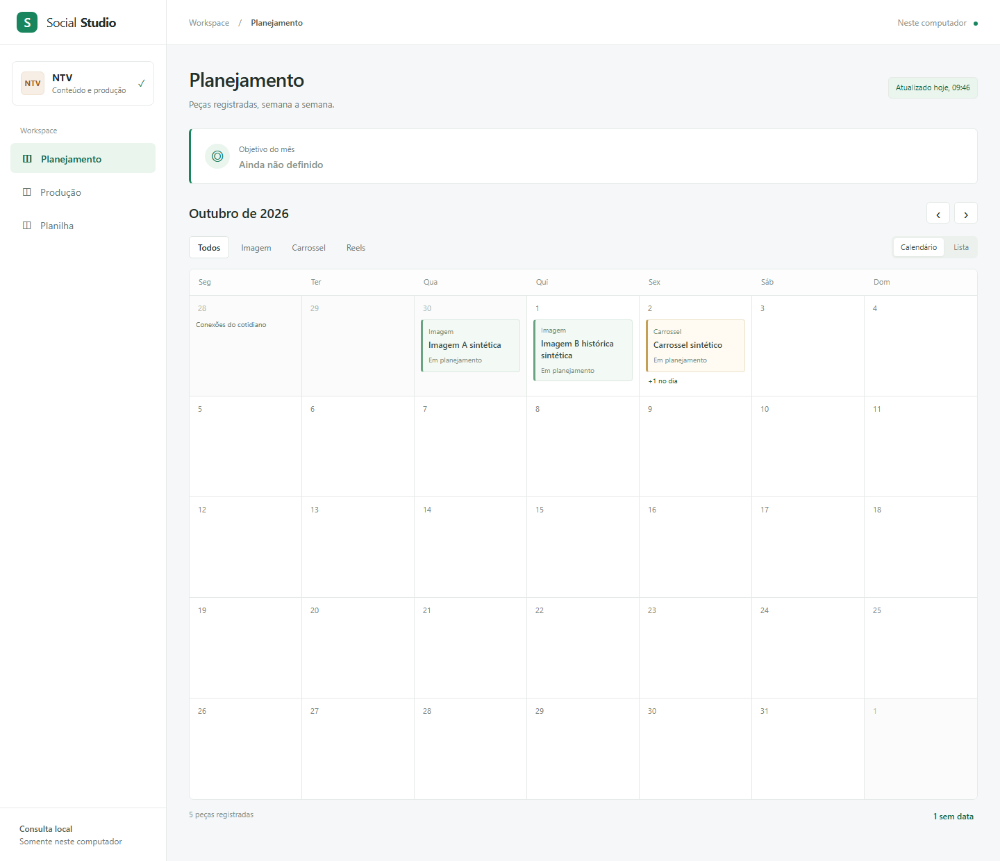

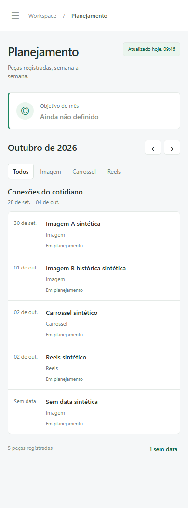

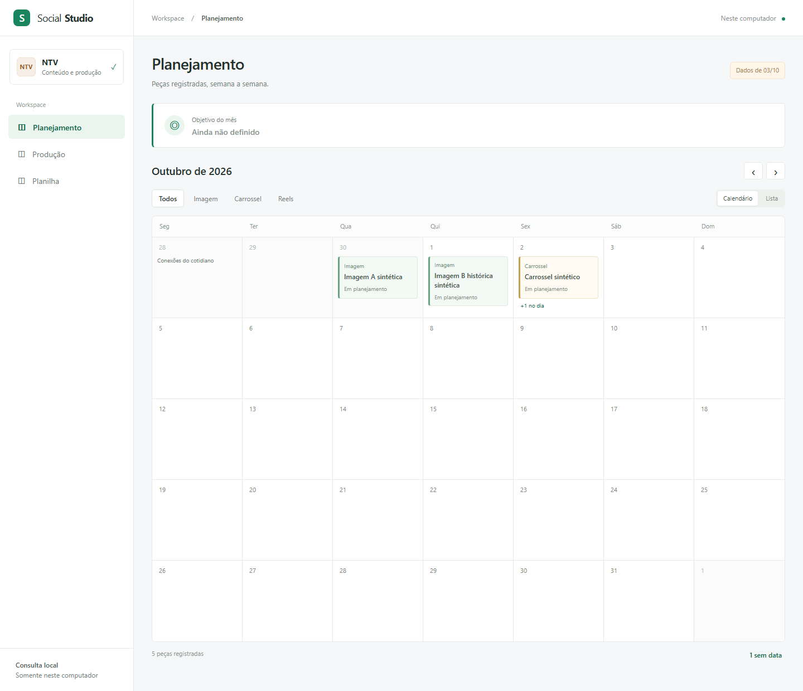

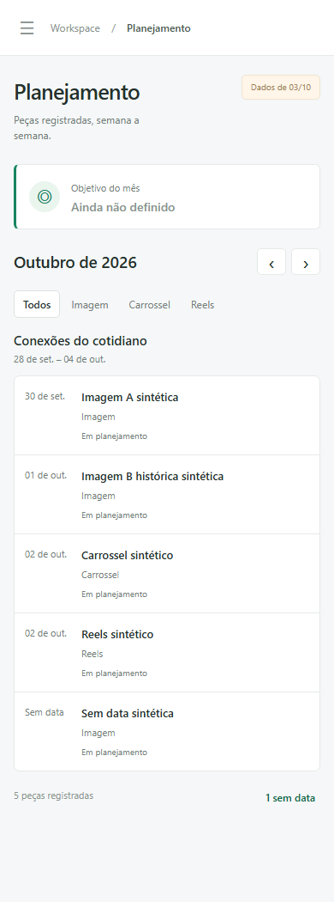

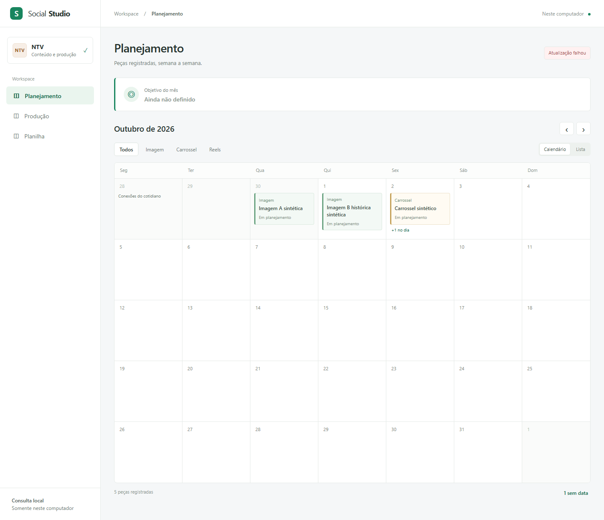

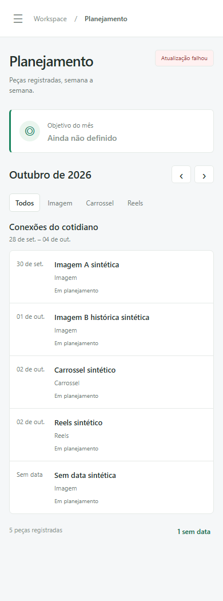

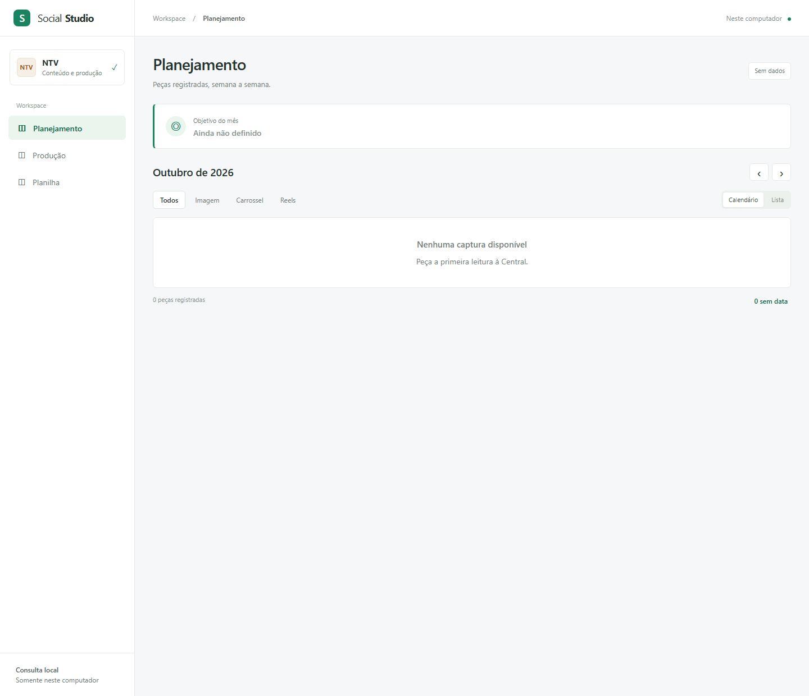

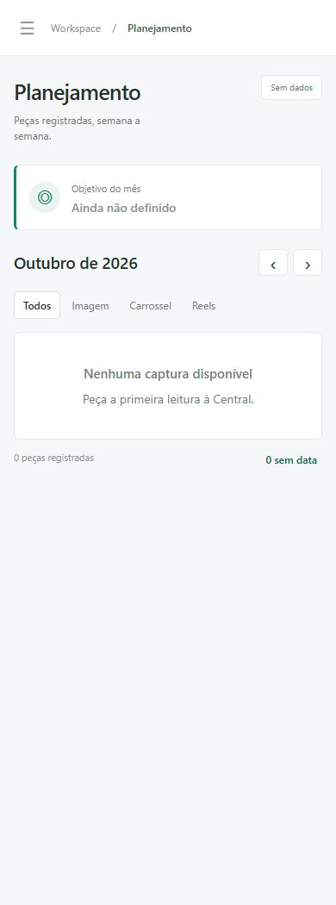

Inspeção das oito imagens: textos/cores coerentes, ausência de corte e cards preservados no vermelho. Aplicação também aberta no navegador: clique no selo vermelho abriu Planilha com fonte, fim 09:46, cobertura 28/09–04/10 e aviso; clique Atualizar dados permaneceu na tela, com o mesmo horário e aviso. [Origem e limites das imagens](../../docs/design/screenshots/LEIA-ME.md). As screenshots não provam integração operacional, todas as interações ou as histórias futuras.

### Pendências preservadas e aceite remoto

**Retrato histórico do primeiro envio da US2.** As políticas antes sem decisão e a instrução de manter o PR aberto foram substituídas pela decisão do autor e pelo aceite/merge registrados nas seções seguintes. Contagens desta seção pertencem àquele envio.

T001–T022 concluídas (**22/41**); T023–T041 pendentes (**19**). A próxima história é US3/gaveta do dia. A política para **ID novo com completedAt anterior/igual à captura vigente** continua sem decisão do autor; esta entrega não inventa rejeição cronológica nem consulta histórica explícita. Só fixtures sintéticas, sem captura operacional. M3/índice de linha permanece para os avisos da US3/US5; null explícito continua normalizado sem apagar o envelope original. M8: os **14 casos de interface** são locais e têm SKIP explícito no CI, fora do LCOV de Node; o CLI permanece incluído no LCOV, conforme a evidência histórica acima.

O registro pré-push acima foi seguido pelo aceite de execução abaixo. **O PR da US2 deve permanecer aberto, sem merge.**

### PR #8 — gate Linux e comentário do Claude

O [PR #8](https://github.com/Browsher/crm-social/pull/8) foi aberto para US2/T019–T022 na mesma branch da 001. Head de código/documentação `7657d9e1c6a83713c202854fede396a743f44b3f`, base `7e17e85`; 34 arquivos no diff. O [quality-gate requerido](https://github.com/Browsher/crm-social/actions/runs/37204282310/job/111442117283) terminou **SUCCESS** em 04/10/2026, com tests, coverage, complexity e **Semgrep PASS**, audit N/A, exit 0 e baseline não atualizada. Semgrep **1.179.0** foi instalado e executado realmente no Linux, sem SKIP. [Resumo sanitizado local/remoto](../../docs/reports/001-us2-gate-resumo.json): máximo local 12; funções novas aplicarFrescor 4, detalhesCaptura 7 e reler 4. O workflow não exporta o JSON Linux como artefato; os estados remotos foram conferidos no log, sem atribuir ao Linux as métricas numéricas locais.

O [review](https://github.com/Browsher/crm-social/actions/runs/37204282276/job/111442117262) terminou **SUCCESS**, em 2m10s, e publicou o [comentário do Claude](https://github.com/Browsher/crm-social/pull/8#issuecomment-5980255578): **“Não encontrei achado Critical nem Important.”** Leu código, contrato, spec, AGENTS, constituição e reviewer; abriu uma screenshot. Generate-tests/publish-tests ficaram SKIPPED, sem rótulo gerar-testes; aviso de falha também pulado corretamente. O comentário não recebeu os checks enquanto rodava; a prova do gate concluído fica nos links acima, como check separado. Nenhuma permissão, ferramenta, configuração de gate ou baseline foi alterada.

| Item do review | Registro / encaminhamento |
| --- | --- |
| Evidência Linux | Job verde com Semgrep real conferido acima. Relatório local resumido anexado com procedência explícita |
| M8 / UI fora de CI e LCOV | Pendência preservada para o aceite completo; 14 casos passaram localmente, não presumir prova remota da interface |
| M-a / completedAt futuro | Política ainda **sem decisão do autor**: o validador atual aceita instante UTC coerente no envelope; data futura recebe Dados de DD/MM, ou Atualizado hoje com hora futura no mesmo dia. Decidir aviso/recusa junto com a política de ID novo com fim anterior/igual, antes da captura operacional. Não foi inventada regra nova |
| M-b / página aberta à meia-noite | Documentado no módulo web: o selo é recalculado no próximo GET/releitura/reload. Não existe atualização automática nesta US2 |
| M-c / restauração do ponteiro no teste | Teste TEMP restaura após asserções; t.after remove o diretório mesmo em falha. Refatoração para finally futura, sem impacto na persistência real; não modificada |
| M-d / índice da projeção | Texto alinhado com os quatro estados reais; bases de quadro/Planilha completos continuam futuras |
| M-e / aviso global sem localização | Aviso de falha ativa tem somente motivo; não inventar aba/linha/campo para uma falha global. Registrar convenção explícita no contrato de avisos ao completar US3/US5/Histórico |

Depois desta conferência só documentação/evidência mudou; código e testes continuam em `3857816`. O novo head documental dispara os checks outra vez, a serem conferidos pelo coordenador antes de encerrar. A **US2 permanece em PR aberto, sem merge**; T023–T041 e captura operacional continuam pendentes.

## Revisão do PR #8 — correções solicitadas pelo autor

Base observada: `4f9bdc461b9fbad883da3a146b349b991cf61957`, com código da US2 em `3857816`.
O head `7657d9e` citado acima foi o primeiro aceite; o último head anterior a esta
rodada foi `4f9bdc4`: [gate SUCCESS](https://github.com/Browsher/crm-social/actions/runs/37204777931/job/111443578355)
e [review SUCCESS](https://github.com/Browsher/crm-social/actions/runs/37204777927/job/111443578262),
[comentário](https://github.com/Browsher/crm-social/pull/8#issuecomment-5980351907).
São evidências históricas; o head corrigido terá seus próprios checks.

- m3: removido o histórico duplicado dos documentos de entrada/módulos/spec/plan/tasks;
  estados curtos apontam para este arquivo. A regra de estrutura tem 37 linhas.
- m4: dados + persistência RED **25 PASS / 3 FAIL / 0 SKIP**, depois GREEN
  com CLI **35 PASS / 0 FAIL / 0 SKIP**. Limite inclusivo de 10 minutos;
  excesso, empate e regressão temporal geram falha confirmada preservando vigente.
  No-op/conflito mantêm precedência; GET não reaplica o relógio da importação.
- m1: primeira carga 503 com Consulta indisponível, erro visível e filtros sem
  pageerror; botão desabilitado durante GET pendente. Ambos já passaram antes de
  mudar código: cobertura de comportamento existente, sem RED artificial.
- Tela: interface RED **16 PASS / 1 FAIL**, link zero visível; corrigido para
  ocultar N sem data quando zero, inclusive sem captura.
- m2: removido state.tela; navegação continua pela UI existente.
- m5: ponteiro corrompido pelo teste restaurado em try/finally.

Os fixtures de retry/promoção/concorrência foram ajustados para fins estritamente
posteriores: preservam o propósito dos testes de I/O diante da política nova.
Uma tentativa GREEN encontrou reativação de MockTimers no mesmo teste, erro do
helper; cenários sem/com captura foram separados em testes independentes.
Sem captura operacional, nova dependência, mudança de gate, CI ou baseline.

### Histórico de aceites do CI instalado, centralizado

O parágrafo a seguir registra o retrato histórico removido dos documentos de entrada;
as rodadas da feature estão descritas acima, sem promover uma prova local a aceite remoto.

CI instalado em 03/10/2026: quality-gate em cada PR; review do Claude por comentário, sem bloquear o merge. O review **0.4.4** foi validado no [PR #2](https://github.com/Browsher/crm-social/pull/2#issuecomment-5974734150), commit `6f88479`, [execução 37162882452](https://github.com/Browsher/crm-social/actions/runs/37162882452). A **0.4.5** foi aceita no [PR #3](https://github.com/Browsher/crm-social/pull/3#issuecomment-5975683038), commit `afd8238` (merge `72efb98`), [execução 37170294491](https://github.com/Browsher/crm-social/actions/runs/37170294491). A **0.4.7** foi aceita no [PR #4](https://github.com/Browsher/crm-social/pull/4#issuecomment-5976055197), commit `c9d1e91` (merge `506d7a7`), [execução 37173190416](https://github.com/Browsher/crm-social/actions/runs/37173190416). A **0.4.8** foi aceita no [PR #5](https://github.com/Browsher/crm-social/pull/5#issuecomment-5976475669), head `bc0b02b` (merge `4f20f20`), [execução 37176292254](https://github.com/Browsher/crm-social/actions/runs/37176292254). Repositório público; ruleset ativo da `main` exige `quality-gate`.

Conferência antes do push desta revisão: **41 arquivos** no diff completo
contra `7e17e85` (inclui os arquivos da US2 anteriores à rodada). A contagem se refere
ao conteúdo, não a linhas da regra: `.claude/rules/project-structure.md` tem **37 linhas**.
Suíte completa corrigida: **83 PASS / 0 FAIL / 0 SKIP**, 11,42 s, **18 casos UI** locais.
Gate local **exit 0**, cobertura **96,25%**, complexidade/ESLint PASS (aviso existente CLI 12),
Semgrep SKIP no Windows, audit N/A; baseline não atualizada. O aceite remoto corrigido
será acrescentado após a execução; nenhum SHA futuro é antecipado.

Revisão independente contra `4f9bdc4`: zero Critical/Important, dois Minor do escopo
solicitado. Link zero na primeira carga 503 reproduzido em RED **17 PASS / 1 FAIL**;
HTML inicia `hidden` e render só exibe para N>0. Contagens antigas da interface
foram retiradas dos documentos de entrada/módulos. A suíte e o gate foram repetidos
após essa correção. Regra de estrutura: 37 linhas, não a contagem histórica anterior.

## PR #8 — aceite das correções e integração da US2

Head corrigido `d98f71958de26a54e8dd2e2b38dad0a5bdf99211`; diff final de **41 arquivos**
contra a base `7e17e85`. Suite local **83 PASS / 0 FAIL / 0 SKIP** (18 de interface),
gate exit 0, cobertura 96,2457%, complexidade PASS (máximo 12), Semgrep SKIP Windows,
audit N/A; baseline inalterada. Documentos de estado apontam para este histórico.

[Gate Linux SUCCESS](https://github.com/Browsher/crm-social/actions/runs/37206544756/job/111448800900):
tests, coverage, complexity e **Semgrep 1.179.0 real PASS**, audit N/A, exit 0.
[Review SUCCESS](https://github.com/Browsher/crm-social/actions/runs/37206544682/job/111448800441)
publicou [novo comentário](https://github.com/Browsher/crm-social/pull/8#issuecomment-5980642217),
sem Critical ou Important; oito Minor. Sem regressão ou achado de segurança bloqueante.

O [PR #8 foi integrado](https://github.com/Browsher/crm-social/pull/8) por merge commit
`869f0bdba61fd9e9a02133ed43ba8cecb3348598`, com pais `7e17e85` e `d98f719`, autoria
`204295625+Browsher@users.noreply.github.com` e committer `noreply@github.com`.
A branch 001 foi mantida e recebeu main localmente antes da US3. O PR #1 permanece aberto.

| Minor do segundo review | Tratamento |
| --- | --- |
| m-1 histórico de política desatualizado | Retrato antigo identificado explicitamente acima; regra vigente é a decisão temporal do autor |
| m-2 contagem antiga de interface no quickstart | Corrigida na sincronização da US3; contagem atual somente como estado local |
| m-3 JSON de resumo antigo | Marcado como evidência histórica; a US3 tem resumo sanitizado próprio |
| m-4 dois testes históricos com Date real/horário fixo | Dívida de determinismo registrada; passaram no relógio atual, sem afirmar que o tempo não importa |
| m-5 números de linha web antigos | Referências atualizadas com o código da US3 |
| m-6 Mermaid sem passo temporal | Fluxo sincronizado na US3 |
| m-7 margem futura atravessando meia-noite | Estado âmbar de outro dia civil é coerente com contrato; não inferir política diferente |
| m-8 require direto/helper no snapshot | Estilo sem regressão funcional; precedência de no-op/conflito preservada |

## US3 — gaveta do dia inteiro (T023–T026)

Base `869f0bd`; head de código observado `98a064b`. **26/41 tarefas concluídas**,
15 pendentes (T027–T041). Quadro/US4, tabelas/Histórico/US5 e iniciador continuam
futuros. Nenhuma captura real, dependência nova, alteração de gate/CI/baseline ou
leitura/escrita de data/ privado. Todas as capturas da entrega são sintéticas em TEMP.

| Tarefa / commit | RED observado | GREEN observado |
| --- | --- | --- |
| T023 `ed6cfb2` → T024 `41b0a7f` | Projeção: 16 PASS / 7 FAIL / 0 SKIP; detalhes/relacionamentos ausentes | 23 PASS / 0 FAIL / 0 SKIP; suíte então 90 PASS |
| T025 `7970b26` → T026 `98a064b` | Interface: 18 PASS / 6 FAIL / 0 SKIP; faltavam acordeões/versões/links/foco | 24 PASS / 0 FAIL / 0 SKIP; suíte completa **96 PASS / 0 FAIL / 0 SKIP** em 14,83 s |

Uma tentativa da suíte no sandbox produziu spawn EPERM antes dos casos; executada
fora desse limite, passou. Isso foi impedimento do runner, sem alterar os testes.
Na verificação inicial de `98a064b`, o gate registrou
exit 0, cobertura **96,9697%**, complexidade/ESLint PASS (dois avisos, nenhum >=21).
Esse número é histórico: o [resumo sanitizado do gate](../../docs/reports/001-us3-gate-resumo.json)
acompanha a revisão corrente e sua métrica está registrada na última seção deste documento.
Naquela verificação:
Semgrep SKIP por ausência no Windows, audit N/A. A interface passou localmente;
CI conserva SKIP explícito para os casos locais, fora do LCOV, como pendência M8.

Relações não inventam mídia, responsável, publicação ou design novo. As versões
ficam separadas e revisões resolvidas/antigas/ambíguas não viram correção atual.
Esc e fechamento por botão restauram o foco; o dia não é recortado pelo filtro.
A linha física dos avisos considera vazios e outra marca; fecha a pendência M3
da projeção. Naquele head a gaveta também apresentava a localização junto ao motivo;
a revisão compacta abaixo conserva a localização na API e apresenta só contagem/link na gaveta.

### Quatro screenshots da aplicação real

Inspecionadas visualmente, sem corte horizontal, pageerror ou requisição externa.
Uma peça em 01/10: imagem. Várias em 02/10: carrossel com páginas e Reels com cenas.
Viewport normal **1440/390 × 1050** para uma peça; altura **4800** para registrar os
dois acordeões abertos integralmente, sem montagem. A abertura padrão mantém só
a primeira peça aberta; a segunda foi expandida por clique para as imagens.
O teste mobile em 390 × 1050 confirmou a gaveta ocupando a tela e rolagem interna.

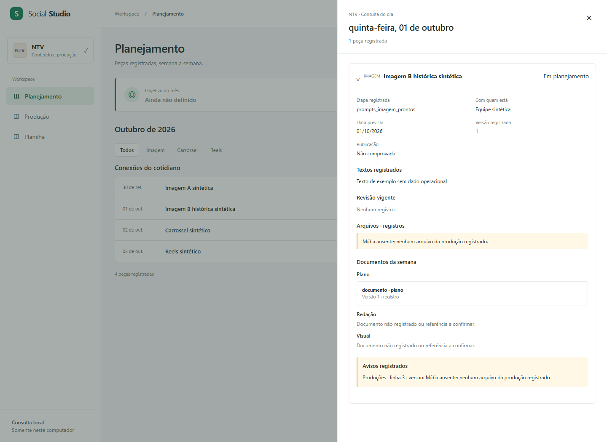

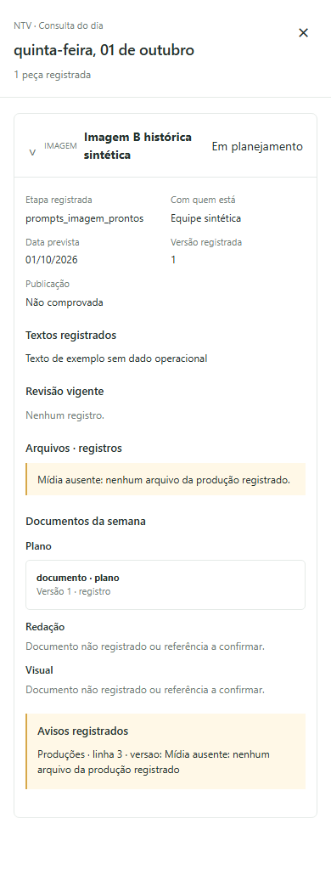

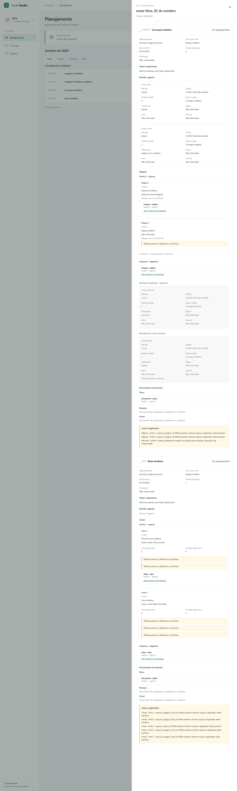

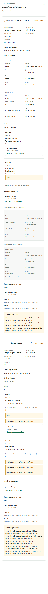

[Procedência e limites](../../docs/design/screenshots/LEIA-ME.md). Fim sintético
da captura visual: 04/10/2026 11:08 em São Paulo. Imagens não provam leitura Google,
disponibilidade remota dos arquivos ou a feature completa.

### Revisão independente e verificação final da US3

Revisão estática somente leitura contra `869f0bd..98a064b`: zero Critical e três
Important de completude/rastreabilidade, nenhum achado de segurança. Sem testes,
scanners ou acesso a data/ por esse agente. Adaptação no Codex: leitura por comandos
locais, pois as ferramentas Read/Grep/Glob não estão expostas nesta execução.

Uma única passagem de correções, commit `450e780`, observou **47 PASS / 3 FAIL**
em projeção/interface antes de implementar: a UI omitia página/cena/arquivo da
revisão e aba/linha/campo dos avisos; publicação inconsistente não gerava aviso.
GREEN completo final: **99 PASS / 0 FAIL / 0 SKIP**, incluindo **26 de interface**,
em **15,97 s**. Registro preenchido de publicação continua visível, mesmo inválido;
aviso cobre formato/fuso inválido, data impossível, tipo inesperado e instante
posterior a completedAt. Não foi antecipada a classificação do quadro US4.

Gate final local exit 0: tests PASS, coverage PASS **97.0109%**, complexity/
ESLint PASS (máximo 13; avisos no CLI e acordeaoPeca), Semgrep SKIP Windows,
audit N/A; baseline inalterada. Comando node tools/quality-gate.mjs, Node 24.19.0 e
Playwright existente. Nenhuma dependência instalada. As quatro screenshots foram
renovadas após as correções e continuam somente sintéticas. Regra de estrutura:
40 linhas; links relativos/cercas balanceadas, varredura de dados privados limpa.
O resumo da US2 foi marcado explicitamente como histórico; o atual está ligado acima.

Head de código validado `450e780420a68d59c3df68715e524f149d52a500`; resultados remotos
da US3 serão registrados depois da execução, sem antecipar SHA ou conclusão.
Diff da US3 contra `869f0bd`: **30 arquivos**, incluindo os quatro PNG e o resumo
sanitizado novo. O head de código acima é a referência testada; o commit documental
seguinte mantém esse código. Todos os T001–T026 estão marcados; T027–T041 continuam
desmarcados. Constituição, skills, gate/CI/baseline e bloco gerenciado intactos.

### PR #9 — gate Linux, comentário publicado e achado pendente

[PR #9](https://github.com/Browsher/crm-social/pull/9) aberto, **sem merge**, com head
`15446201e4030174aa8a1fe4d9a5209315211a8f`, 30 arquivos contra `869f0bd`.
[quality-gate SUCCESS](https://github.com/Browsher/crm-social/actions/runs/37209150138/job/111456574271):
tests, coverage, complexity e **Semgrep PASS**, audit N/A, exit 0 e baseline false.
O log registra instalação e execução real de **Semgrep 1.179.0 no Linux**. As métricas
numéricas do resumo continuam explicitamente locais; não inferir a UI a partir do CI.

[Review SUCCESS](https://github.com/Browsher/crm-social/actions/runs/37209150140/job/111456574276)
publicou [o comentário do Claude](https://github.com/Browsher/crm-social/pull/9#issuecomment-5981043366):
**0 Critical, 2 Important, 8 Minor**. Generate-tests/publish-tests SKIPPED corretamente,
sem rótulo gerar-testes. O coordenador confirmou o gate no log depois do review.

| Item | Resultado / próximo encaminhamento |
| --- | --- |
| I-1 / segurança | URL com userinfo é recusada como link, porém seu texto pode sair na API/gaveta. Nenhuma credencial real foi usada nos testes ou imagens. Achado procede; corrigir com RED de supressão na API/DOM em rodada autorizada. Código preservado, PR aberto sem merge |
| I-2 / evidência Linux | Resolvida documentalmente pelo job/log acima: Semgrep real PASS; o modelo não recebe status de checks no contexto, por desenho do workflow. UI continua comprovada somente localmente |
| m-1 | Avisos de documentos semanais podem se repetir por produção; deduplicação futura |
| m-2 | Campo do aviso de mídia/empate pouco preciso; localizar todos os registros empatados em melhoria futura |
| m-3 | Avaliar escopo cruzado de página/cena e ponteiro semanal em arquivo de produção; comportamento conservado, sem inferir uma decisão nova |
| m-4 | Parâmetro/ramo interactive de cartao não mais usado; limpeza futura |
| m-5 | Fortalecer asserções de links/corte desktop/quantidade de acionamentos; evidências atuais são as registradas acima |
| m-6 | acordeaoPeca complexidade 13, aviso; refatoração sem mudança de comportamento futura |
| m-7 | Índices por produção para escala T037; custo atual filtra por peça |
| m-8 | Limite de processo: adaptação do reviewer para leituras locais no Codex diverge da restrição de shell do template. Foi delimitada pelo coordenador, não uma autorização específica do autor; usar revisão remota com Read/Grep/Glob como evidência independente canônica, sem alegar equivalência de ferramentas |

Somente este registro e o resumo sanitizado recebem as evidências remotas; os demais
documentos mantêm estado com link. Esta atualização documental não altera o código
testado `450e780`, nem corrige os novos achados do PR. O autor decide a próxima rodada.

## PR #9 — supressão de credenciais e gaveta compacta

Revisão autorizada sobre `aa7e8f4d5dbe781e7c273a8f8b42bb3a2147437f`, código
validado em `48edc9a0a46dc385c469bf9da9939474437e374c` e endurecido em
`ba77775d05d6c7b68a9a89b64eb1069a4214a595`, mantendo
T001–T026 concluídas (**26/41**, 15 pendentes). PR #9 permanece aberto, sem merge.
Nenhuma captura operacional, dependência nova ou mudança de gate/CI/baseline.
Dados e servidor de todos os testes/demonstrações ficaram somente em TEMP.

| Correção | RED observado antes do produto | GREEN observado |
| --- | --- | --- |
| I-1, segurança | Projeção + HTTP real + interface: **57 PASS / 3 FAIL / 0 SKIP**, por credencial sintética presente | **60 PASS / 0 FAIL / 0 SKIP**, cobrindo usuário, senha, userinfo percent-encoded, API real e #dia |
| Apresentação compacta, m-1/m-B e T025 | Projeção + interface: **50 PASS / 7 FAIL / 0 SKIP**; faixa/recolhidos/documentos/avisos faltavam | Suíte completa **107 PASS / 0 FAIL / 0 SKIP**, incluindo **31 de interface**, em **18,82 s** |
| URL malformada, achado da revisão estática | Projeção: **26 PASS / 1 FAIL / 0 SKIP**, userinfo de URL recusada pelo parser ainda aparecia | Suíte final **108 PASS / 0 FAIL / 0 SKIP**, incluindo **31 de interface**, em **18,69 s**; API e DOM reais sem credencial |

A URL é analisada por `new URL`: username/password não vazios suprimem
Arquivos.url e Produções.url_video_final, com marcador e aviso fixo localizado
sem valor. A captura privada original fica intacta. A tela nunca mostra URL
recusada como texto bruto, inclusive fora da lista de hosts permitidos.
Se `new URL` recusa uma URL não vazia, ela também é suprimida conservadoramente
com aviso **URL inválida suprimida**: evita devolver userinfo de host/porta
malformados sem heurística de regex. Vazios e espaços continuam preservados.
Fonte da API nativa conferida via Context7: [URL do Node 24](https://nodejs.org/docs/latest-v24.x/api/url.html).

A implementação segue o [mockup da gaveta compacta](../../docs/design/mockups/gaveta-v2.html)
e [telas, seção 2](../../docs/design/telas.md#2-gaveta-do-dia-001): largura 520 px
no desktop, tela inteira no celular; primeira peça aberta, demais com resumo.
Faixa de quatro campos omite vazios, etapa conhecida ganha rótulo legível sem
mudar o valor na API e publicação preenchida fica em uma linha. Revisão vigente
aparece primeiro; adicionais em +N; resolvidas/outras versões no Histórico
recolhido. Textos e unidades antigas também abrem por clique. Lista de unidades
mostra no máximo um aviso de mídia por linha; aba/linha/campo ficam na API,
com somente contagem e link Planilha na peça. Tabelas detalhadas seguem para US5.

Documentos semanais aparecem uma vez no fim do dia, separados por semana quando
necessário. Plano/Redação/Visual ausentes usam travessão, inclusive sem semana
identificada. A projeção resolve cada semana uma vez e registra o aviso global
uma vez, mantendo-o nos detalhes de cada peça relacionada. Demais registros,
versões e vínculos da API permanecem completos. O ramo/parâmetro interactive de
cartao foi removido (m-4); nenhum modo de cartão não interativo era usado.

T025 agora conta eventos reais: abrir o dia exige um acionamento, expandir a
segunda peça totaliza dois; mede scrollWidth/clientWidth da gaveta/corpo em
1440 px. Testes também verificam os recolhidos por clique e o conjunto exato
de URLs sintéticas permitidas, sem asserção fraca de quantidade mínima (m-5).

Dois ajustes de infraestrutura de teste, sem relaxar requisito: o GET por
page.request usa URL absoluta (o contexto não possui baseURL); o seletor do
acordeão usa somente seu summary direto, pois agora existem summaries internos.
Na primeira tentativa de RED compacto, a lista esperada de links omitira o
registro sintético do Reels recolhido; a expectativa foi corrigida antes do
RED confirmado e antes da implementação. Essa falha não foi contada como RED
do produto. A localização técnica antes exigida na gaveta foi substituída
pela apresentação aprovada; a nova asserção continua exigindo a localização na API.

### Gate local e cobertura citada (m-A)

Gate final local exit **0**: tests PASS **108**, coverage PASS **97,0549%**,
complexity/ESLint PASS (máximo **13**, dois avisos), Semgrep **SKIP** por ausência
no Windows, audit **N/A** sem dependências de aplicação. Baseline atualizada:
**false**. Node 24.19.0, Playwright e ESLint já existentes, nenhuma instalação.
Interface continua fora do LCOV e com SKIP explícito no CI (M8); ela passou
integralmente no computador. A citação anterior de 96,9697% é histórica,
97,0109% pertence à revisão 450e780; 97,0430% é o primeiro GREEN compacto,
e o resumo corrente traz **97,0549%** depois do teste/correção de URL malformada.
Aceite Linux e revisão independente canônica foram conferidos após o push e
estão registrados abaixo, sem adaptação do reviewer a shell nem alegação de equivalência de ferramentas.

Revisão estática independente recebeu um pacote de trechos/diff e evidências,
**sem usar ferramentas**, executar código ou ler o disco. Identificou um Important
no catch permissivo do parser; o RED acima confirmou o caso e a segunda análise
lógica o considerou resolvido. Limite: pacote parcial, sem execução independente;
não equivale à leitura integral que o reviewer remoto faz do checkout.
Doc-sync-onboarding atualizou os documentos afetados. Project-structure tem
**43 linhas**, contando vazias; links relativos conferidos, cercas balanceadas,
sem caminhos pessoais e bloco gerenciado/constituição preservados.

### Screenshots atuais, somente fixtures sintéticas

Aplicação real, quatro viewports **1440/390 × 1050**, inspecionados: sem corte
horizontal, erro de página ou requisição externa. Primeira peça aberta e Reels
recolhido conforme o estado inicial aprovado; suas duas cenas são verificadas
pelos testes que expandem o acordeão. A imagem de uma peça é de 01/10; o dia com
carrossel e Reels é 02/10. Captura visual sintética terminada em
04/10/2026 **12:07:13** em São Paulo. As imagens antigas conservam seu caráter histórico.

| Dia | Desktop 1440 | Celular 390 |
| --- | --- | --- |
| Uma peça | [Imagem](../../docs/design/screenshots/001-us3-compacta-uma-peca-1440.png) | [Imagem](../../docs/design/screenshots/001-us3-compacta-uma-peca-390.png) |
| Carrossel + Reels | [Imagem](../../docs/design/screenshots/001-us3-compacta-varias-pecas-1440.png) | [Imagem](../../docs/design/screenshots/001-us3-compacta-varias-pecas-390.png) |

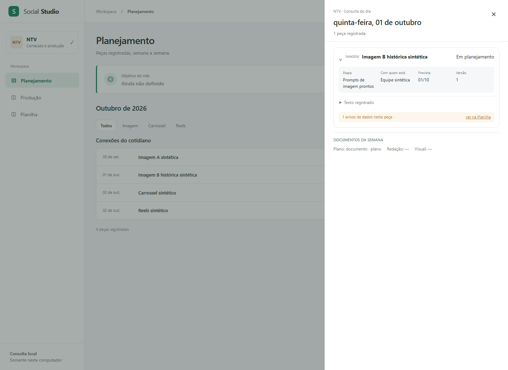


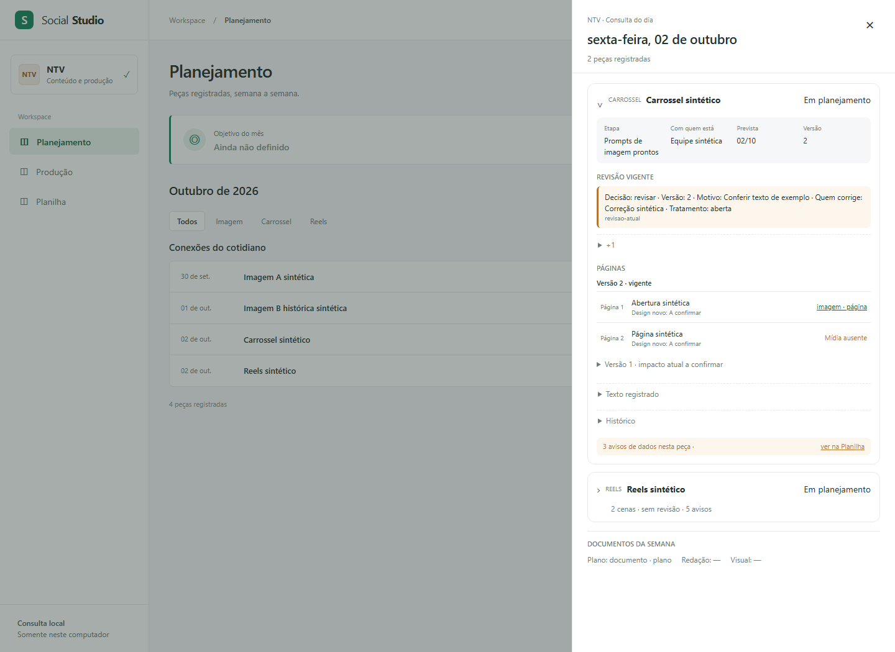

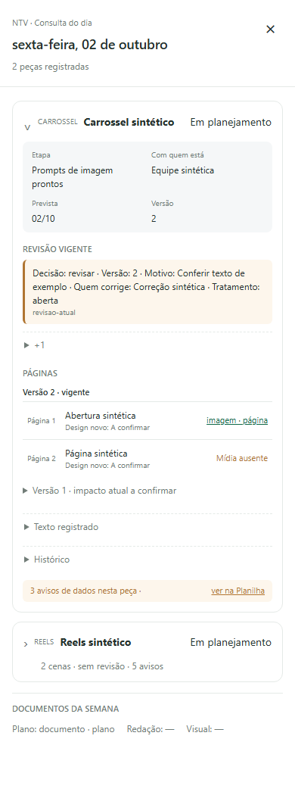

Pendências anteriores m-2/m-3 (precisão/escopo de vínculo), m-6 (complexidade),
m-7/T037 (escala), M8/CI local e captura operacional não são promovidas a
resolvidas. Esta rodada corrige I-1, m-1, m-B, m-4, m-5 e m-A conforme autorizado.

### Aceite remoto da revisão compacta

Head observado no [PR #9](https://github.com/Browsher/crm-social/pull/9):
`e39afd8b3bcbd0e91984da4dd5f80903f591e4e1`, **37 arquivos** contra `869f0bd`.
O PR está **OPEN**, sem merge. Os commits de código são `48edc9a` e `ba77775`;
`e39afd8` reúne documentação e screenshots, sem mudança adicional do código.
Autor/committer dos três: noreply configurado, sem coautoria.

| Check | Conclusão observada | Evidência |
| --- | --- | --- |
| quality-gate | **SUCCESS** | [Job 111466657156](https://github.com/Browsher/crm-social/actions/runs/37212606745/job/111466657156) |
| review | **SUCCESS**, comentário publicado | [Job 111466657198](https://github.com/Browsher/crm-social/actions/runs/37212606805/job/111466657198) |
| generate-tests | **SKIPPED**, sem rótulo gerar-testes | [Job](https://github.com/Browsher/crm-social/actions/runs/37212606805/job/111466657969) |
| publish-tests | **SKIPPED**, sem geração | [Job](https://github.com/Browsher/crm-social/actions/runs/37212606805/job/111466658225) |

Log do gate lido: instalação real de **Semgrep 1.179.0 no Linux**; tabela final
tests/coverage/complexity/**semgrep PASS**, audit N/A, **exit 0** e baseline
atualizada **false**. Isso fecha a pendência de evidência Linux do review neste
head; não equivale a executar a interface no CI. O resumo sanitizado foi atualizado
com os estados observados; métricas numéricas permanecem identificadas como locais.

No head `e39afd8`, comando explícito no computador, com Playwright existente
indicado por `CRM_PLAYWRIGHT_MODULE` e `CI` removido do ambiente:

```powershell
node --test tests/interface.test.cjs
```

Resultado **31 PASS / 0 FAIL / 0 SKIP**, **18,43 s**. Suíte completa anterior,
`node --test`, **108 PASS / 0 FAIL / 0 SKIP**; gate local `node tools/quality-gate.mjs`
exit 0, mesma árvore de código. Apenas documentação foi adicionada depois.

[Comentário integral do Claude](https://github.com/Browsher/crm-social/pull/9#issuecomment-5981545248),
publicado em 04/10/2026 15:23:35 UTC: **0 Critical, 0 Important, 7 Minor**.
O reviewer registra leitura integral de reviewer.md, AGENTS, constituição e diff,
usando o checkout; nenhum teste/scanner, data/ ou dependência lidos por ele.
Trecho: “Não encontrei problema de segurança.” Nenhuma mensagem de falha falsa:
passo Avisar falha do review **SKIPPED** após publicação bem-sucedida.

| Minor desse novo comentário | Registro para próxima rodada, sem correção nova |
| --- | --- |
| m1 | A complexidade 13 atual é de documentosDoDia, app.js:145; a dívida textual ainda cita acordeaoPeca. O relatório numérico está correto; atualizar a referência documental futura |
| m2 | Resumo usa revisão aberta também para estado de tratamento desconhecido; avaliar revisão vigente/a conferir com teste dedicado |
| m3 | Singular das contagens: 1 avisos. Ajuste de apresentação pendente |
| m4 | Precisão do campo do aviso de ausência/ambiguidade/empate; mantém a dívida anterior m-2 |
| m5 | Arquivos apenas semanais não passam pelas mesmas validações numéricas/origens_json dos arquivos de produção; alinhar contrato/validação |
| m6 | Link Planilha atualmente mostra motivos distintos, sem localização técnica e sem separar origem dos motivos; detalhamento continua na US5 |
| m7 | Índices por produção/performance para T037; mantém a dívida anterior m-7 |

Limites do reviewer: não inspecionou PNG, não reproduziu testes/cobertura ou
desempenho. Informou modificação local do project-structure no checkout efêmero
e avaliou o diff do PR; a cópia local do projeto foi verificada limpa após os
commits, com 43 linhas. A evidência visual foi conferida pelo coordenador.
Nenhum desses Minor foi convertido em nova implementação nesta rodada.

## Revisão final da US3 — PR #9

04/10/2026. O comentário [5981622657](https://github.com/Browsher/crm-social/pull/9#issuecomment-5981622657)
no head `75bdc51` trouxe **1 Important (I-1)** e cinco Minor novos; esta rodada
aplica a decisão do autor, mantendo T001–T026 concluídas e US4 ainda pendente.

| Item | Correção e evidência local |
| --- | --- |
| I-1 | Resumo fechado distingue vigente, vínculo/versão a confirmar e ausência/só resolvidas. Teste de interface observado RED: casos ambíguo e versão anterior exibiam sem revisão; GREEN cobre os cinco cenários |
| Apresentação | Revisão em duas linhas, sem rótulos Decisão/Versão/Motivo nem IDs técnicos; JSON conserva IDs e vínculos. +N com singular/plural; aviso de dados sem separador solto |
| m-d | Helper de plural para página/cena/aviso/revisão; teste com uma unidade/um aviso e adicionais singular/plural |
| m-a | Cenas conservam três slots; avisoMidia qualifica imagem inicial/final/ambas e vídeo ausentes. Um aviso de mídia por cena agrega causas e aponta primeiro ponteiro falho; números/tempos são avisos independentes. RED antes, GREEN na projeção e interface |
| m-b | Testes de arquivo da unidade errada (mesma produção/versão), documento de outra semana e versão inválida em Revisoes/Arquivos. São caracterizações: já passaram antes; não foi fabricado RED |
| m-c | Aviso de revisão ambígua aponta primeiro pagina_id/cena_id/arquivo_id inválido; versao quando versão é inválida. RED observado antes de corrigir |
| m-e | LEIA-ME dos mockups registra prevalência da spec/contrato nas divergências ilustrativas |

Comandos com Node 24.19.0 existente, PATH local selecionado, Playwright existente
por CRM_PLAYWRIGHT_MODULE e CI removido do ambiente; somente fixtures sintéticas
e estado em TEMP, sem acesso a dados privados:

```powershell
node --test tests/interface.test.cjs
node --test tests/projecao.test.cjs
node --test
node tools/quality-gate.mjs
```

Interface **40 PASS / 0 FAIL / 0 SKIP**, 23,39 s; projeção **34/0/0**.
Suíte completa **124 PASS / 0 FAIL / 0 SKIP**, 23,69 s.
Gate local **exit 0**, 25,52 s: tests/coverage/complexity PASS; cobertura
**97,1317%**, complexidade máxima **13** (`documentosDoDia`, app.js:149).
Avisos 11 em arquivosDaUnidade/unidadeDetalhe e 12 no CLI são dívidas de
refatoração; nenhum valor >=21. Semgrep **SKIP** no Windows por ausência da
ferramenta; audit **N/A** por ausência de dependências de aplicação.
Baseline não atualizada; ferramentas, CI e constituição intactos.
O [resumo sanitizado](../../docs/reports/001-us3-gate-resumo.json) guarda métricas;
aceite Linux e merge ainda dependem do novo review, sem inferência pelo Windows.

Screenshots da aplicação real, com carrossel e reels sintéticos. Primeira peça abre
automaticamente; segunda foi aberta por um clique para conferir ambos. Texto,
Histórico e versões anteriores continuam recolhidos. Sem corte horizontal, erro
de página ou requisição externa; desktop 1440×1440 e celular 390×1600:

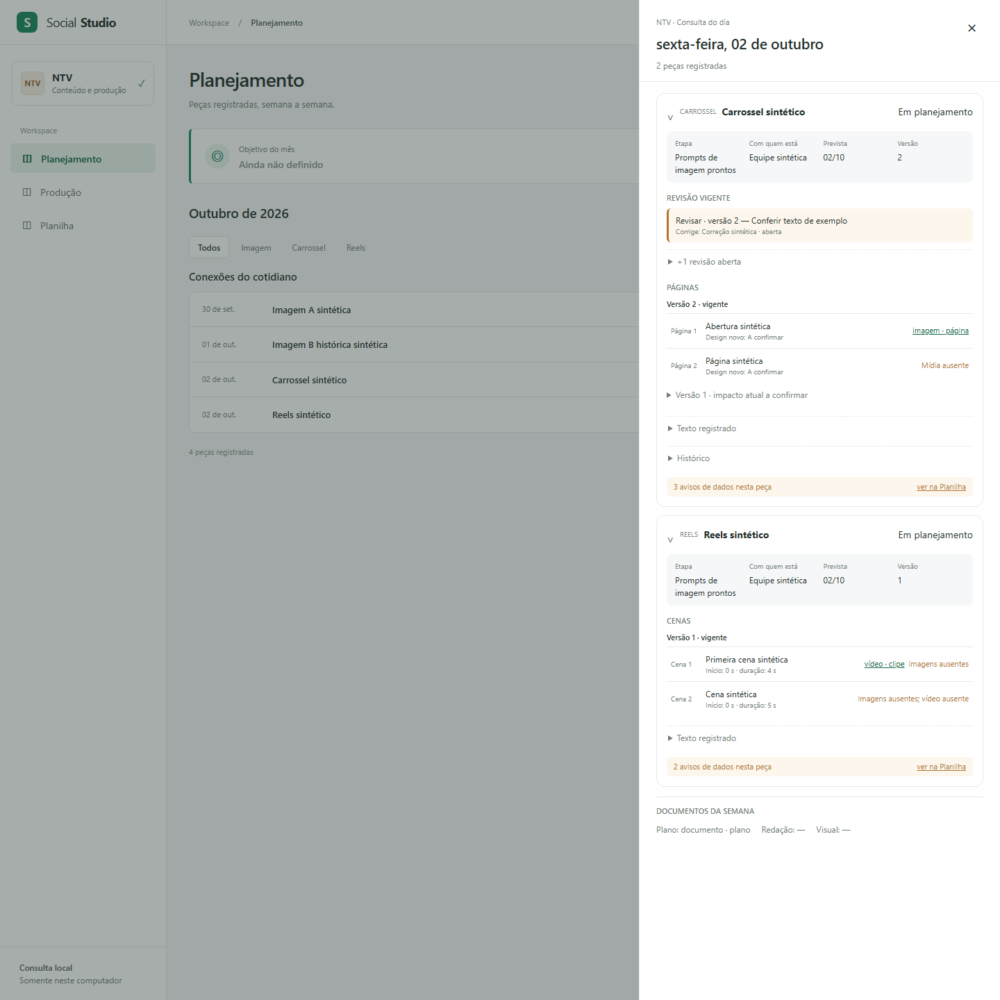


Continuam pendentes as dívidas fora deste recorte: detalhes da Planilha na US5,
validações adicionais de arquivos apenas semanais, precisão de avisos de empate/
ausência sem vínculo, índices/desempenho em T037, CLI fora do LCOV e UI com SKIP
explícito no CI (M8). Não se declara aceite completo da feature ou captura real.

## Pendências para a revisão final (Fase 8)

Do [review de 74e60a1](https://github.com/Browsher/crm-social/pull/9#issuecomment-5982689184), sem bloqueio de código:

- **m-1:** campo dedicado de URL com dois pedaços pode conservar texto redigido e formar link estranho; não vaza userinfo. Rever a política específica de campos de URL com teste antes de qualquer ajuste.
- **m-2:** delimitadores adicionais/variantes de barra no texto livre estão fora da regra de pedaços HTTP(S) aprovada pelo autor; extensão opcional, mantendo as quatro regressões como guarda.
- **m-3:** avisos de ausência/empate usam `versao`/`origens_json` em vez da coluna causadora; avaliar junto às tabelas de avisos da US5.
- **m-4:** resumos históricos de gate não têm SHA medido e nome ambíguo; consolidar procedência/ordem na revisão final. Medições anteriores permanecem históricas, sem substituir o aceite remoto corrente.

O comentário reiterou os estados de revisão desconhecidos, as localizações desatualizadas das dívidas na arquitetura e a indentação do teste HTTP, já registrados abaixo. Não representam regressão desta correção; ficam para a Fase 8.

Decisão do autor na última rodada da US3: Critical, segurança e regressão bloqueiam;
Important/Minor novos fora dessas categorias são corrigidos se triviais ou registrados
aqui para a Fase 8. O review continua sendo comentário, separado do quality-gate.
O [review 5981923824](https://github.com/Browsher/crm-social/pull/9#issuecomment-5981923824)
no PR #9 originou os itens abaixo. Eles não recebem correção nesta rodada:

| Origem | Pendência / impacto / verificação futura |
| --- | --- |
| PR #9, m-2 | Revisão com tratamento desconhecido fica no grupo vigente e recebe aviso, mas resumo/+N usam revisão aberta. Definir rótulo neutro ou decisão explícita na revisão final; manter estados originais na API |
| PR #9, m-5 | A dívida textual de complexidade em architecture.md ainda aponta acordeaoPeca/localização desatualizada. Conferir nomes/linhas contra o relatório atual na Fase 8; não alterar limites, baseline ou código para ocultar avisos |
| PR #9, m-6 | A seção histórica Revisão final da US3 não informa o SHA exato do código medido; seu resumo Linux estava pendente naquele momento. Reconciliar rastreabilidade dos recibos na Fase 8 sem reescrever medições históricas como novas |
| PR #6, M8 | CLI fora do LCOV e Playwright com SKIP explícito no CI; interface precisa de aceite local. Preservar distinção entre as cinco camadas |
| Revisões anteriores da US3 | Validações adicionais dos arquivos apenas semanais, precisão de aviso de empate/ausência sem vínculo e índices/escala pertencem às tarefas finais; tabelas detalhadas de avisos pertencem à US5 |
| PR #9, review 5982320198, m-1 | Custo da triagem de texto por requisição; avaliar atalho seguro para texto sem @ e índices/escala em T037, incluindo JSON decodificado. Não confundir otimização com relaxamento de supressão |
| PR #9, review 5982320198, m-2 | Referência da classificação pendente em architecture.md aponta projecao.cjs:253, enquanto projetarVisao passou a :313; reconciliar com a implementação do quadro. A parte da dívida de complexidade já está no m-5 anterior |
| PR #9, review 5982320198, m-3 | Reitera tratamento de revisão desconhecido chamado aberto; mesma pendência m-2 anterior, sem novo comportamento nesta rodada |
| PR #9, review 5982320198, m-4 | Indentação do loop HTTP e consolidação dos imports de fixtures; estilo sem efeito funcional. Adiado porque a regressão I-1 interrompeu a rodada antes de novas alterações de código |
| PR #10, review 5983077547, m-1 | Localizar a pendência resumida do cartão com Página/Cena e número. A API já conserva unidade/unidadeId e a gaveta localiza; definir a representação e cobrir a projeção na Fase 8, sem inferir mídia concluída |
| PR #10, review 5983077547, m-2 | Consolidar a abertura do dia no cartão de Planejamento e no quadro em abrirDiaDaPeca; ambos os caminhos já têm teste real de interface. Refatoração de manutenção agrupada na revisão final |
| PR #10, review 5983077547, m-3 | Acrescentar teste HTTP dedicado de quadro.semanas/producoes[].quadro e ausência do mapa bruto em /api/visao. Projeção cobre o contrato e interface real cobre a rota local; ampliar a camada HTTP no CI na Fase 8 |
| PR #10, review 5983077547, m-4 | Explicitamente decidir igualdade de rótulos não-string e contagem após triagem. Contador atual usa valor já saneado, preservando privacidade; rótulos distintos suprimidos podem formar uma única chave. Cobrir a regra na revisão final |
| PR #10, review 5983077547, m-6 | Calcular o índice de etapa_producao uma vez por tabela e documentar a dependência de IDs únicos/não vazios validados por registros. A recuperação ocorre antes da triagem e os testes P10 protegem essa fronteira; otimização segue com T037 |
| PR #10, review 5983143402, m-1 | Versão inválida não permite constatar ausência de mídia na versão vigente; não atribuir automaticamente Mídia ausente nesse caso. Definir mensagem/ausência de pendência com teste RED de projeção na Fase 8; a validação já conserva aviso de versão inválida |
| PR #10, review 5983143402, m-2 | Manter a definição normativa de quadro só no contrato e substituir as repetições em data-model/plan por links. Conferir a fronteira entre modelo, plano e contrato na revisão documental final |
| PR #10, review 5983143402, m-3 | Acrescentar rótulo acessível contextual ao contador de cartões da coluna, como 3 peças, com assert de interface. Teclado, Esc e abertura continuam cobertos; melhoria de acessibilidade fica na Fase 8 |
| PR #10, review 5983186287, m-1 | Distinguir Imagem ausente de Imagem a confirmar no cartão quando o ponteiro de página está preenchido mas o arquivo não resolve ou pertence a outro escopo/versão. A gaveta já conserva o aviso localizado; acrescentar RED de projeção junto ao caso de versão inválida da peça |
| PR #10, review 5983186287, m-2 | Decisão de produto: eventual sinal neutro Revisão a confirmar no cartão para revisão ambígua, sem atribuir correção. Hoje só revisões vigentes literais geram pendência, conforme o contrato; não é defeito nem regressão |
| PR #10, review 5983234638, m-1 | Decisão do autor aplicada nesta revisão: somente o cartão omite mídia em Planejamento/Redação/Visual e mostra Mídia ausente em Mídia/Revisão/Pronta/Publicada/Outras. API conserva pendências completas. Localização por unidade e distinção de versão/vínculo inválidos continuam nos itens anteriores da Fase 8 |
| PR #10, review 5983234638, m-2 | Índices fixos agora consultam cabeçalhos e caso sem captura usa prefixo U07-vazio. Resta reduzir os oito parâmetros posicionais do helper de interface para opções nomeadas na revisão dos testes; refatoração mais ampla segue na Fase 8 |
| PR #10, review 5983234638, m-3 | Comentário corrigido: recuperação da célula de etapa ocorre em todas as linhas antes da triagem e depende da normalização por registros. Sem mudança de comportamento; otimização/índice de cabeçalho do m-6 continua pendente |
| PR #10, review 5983509175, m-1 | Resumo novo do ajuste em docs/reports/001-us4-ajuste-local.json, com hashes das fontes web e 174/62 testes. Resumo anterior continua histórico, com identificação no índice |
| PR #10, review 5983509175, m-2 | Lista de colunas de apresentação repetida no browser. Considerar indicador derivado sem duplicação na revisão final, conservando a regra do cartão e as oito colunas canônicas |
| PR #10, review 5983509175, m-3/m-4 | Corrigidos na US5: referências normativas a pendenciaQuadro usam o nome da função, e semanaId está declarada no estado inicial. Ajustes triviais de documentação/clareza, sem mudar a regra do cartão |
| PR #11, review 5983965195, m-1 | Conferir chave própria ao traduzir resultado do Histórico; o recibo confirmado já valida o resultado e a saída usa textContent. Ajuste defensivo sem criar estados de captura |
| PR #11, review 5983965195, m-2 | Evitar duas paradas consecutivas de Tab no painel e na região de rolagem, preservando foco no estado vazio; cobrir navegação por teclado na revisão final |
| PR #11, review 5983965195, m-3 | Cobrir releitura com avisos filtrados e remoção da peça da captura nova; a documentação descreve o comportamento atual, mas esses dois casos ainda não têm assert dedicado |
| PR #11, review 5983965195, m-4 | Corrigida a linha Entrada de tasks.md: US4 integrada, US5 implementada localmente e aceite corrente pendente |
| PR #11, review 5983965195, m-5 | Consolidar foco do link da gaveta e do evento close assíncrono para evitar um segundo ajuste cosmético de rolagem |
| PR #11, review 5983965195, m-6 | Incluir troca de abas e recomposição do painel de avisos na medição sintética de escala T037 |
| PR #11, review 5984151670, m-1 | Corrigida a leitura histórica das medições: primeiro resumo tinha cinco hashes; atual tem seis, incluindo fixture. A afirmação de fontes inalteradas aplica-se somente até a9cb8ef; a refatoração posterior e a nova medição são explícitas |
| PR #11, review 5984151670, m-2 | Completar os asserts de restauração de avisos gerais via menu e selo, junto aos casos de releitura/peça removida já registrados no m-3 anterior |
| PR #11, review 5984151670, m-3 | Separar erro HTTP de erro de renderização e preservar uma visão consistente caso chegue resposta com forma inesperada; testar a fronteira de erro na Fase 8, sem alterar a rota/contrato válido desta entrega |
| PR #11, review 5984151670, m-4 | Consolidar a associação posicional entre CAMPOS e chaves numa lista reutilizada; P11 já protege a ordem atual, mas a manutenção futura deve evitar duplicação |
| PR #11, review 5984151670, m-5 | Reitera lookup de rótulo e duas paradas de Tab; permanecem rastreados como m-1/m-2 do primeiro review, sem nova correção nesta rodada |

## Última rodada da US3 — avisos e textos projetados

Em 04/10/2026, alterações conferidas sobre o pai `244d9e7cc140be850434440bc5059f318ec288c5`.
I-1 agrega aos avisos locais os da linha da produção e dos registros relacionados,
com aba/linha físicas, sem duplicar os globais. As regressões cobrem sem data,
semana desconhecida e URL suprimida; a gaveta mostra a contagem real.
m-1 distingue registro ligado sem link permitido de mídia ausente, em um aviso por
unidade; m-3 usa Página/Cena, número e versão no Texto registrado, sem IDs técnicos.
m-4 aplica a triagem por `new URL` a todos os textos mínimos e recibos, inclusive
userinfo dentro de JSON, chaves e strings aninhadas. JSON é dado, nunca código;
validade original privada evita chamar o marcador de supressão de JSON inválido.
Sem alterações em m-2/m-5/m-6, ferramentas, CI, baseline ou constituição.

RED observado: projeção **35 PASS / 5 FAIL**, interface/HTTP **0/11**;
cena com ausência e link recusado **0/1**. Proveniência de JSON **0/2** antes da
correção. GREEN da projeção **41/0/0**; suíte completa **143/0/0**, incluindo
**51 testes de interface**, em 30,06 s. Gate local **exit 0**, 32,91 s:
tests/coverage/complexity PASS, cobertura **97,3398%**, complexidade máxima **13**;
Semgrep SKIP no Windows e audit N/A. Nenhuma baseline atualizada.
[Resumo sanitizado](../../docs/reports/001-us3-ultima-local.json).

As imagens sintéticas novas preservam as anteriores, sem pageerror, requisição
externa ou corte horizontal. Segundo acordeão aberto por clique; os recolhidos
continuam fechados. Aceite Linux e decisão de merge serão registrados após o push.


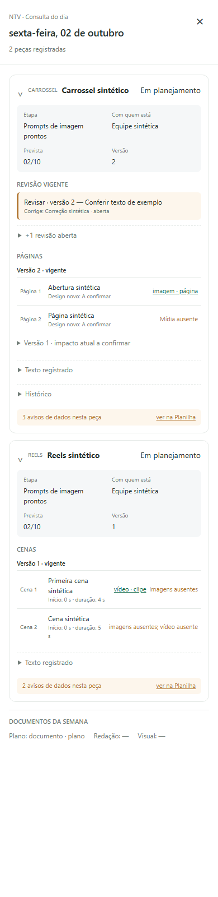

### Aceite remoto e parada por regressão

Código publicado e verificado: `bdf20815b097049dfba01c467d15c25f3c18f361`,
autor/committer Alexandre Melo com noreply. O [quality-gate Linux](https://github.com/Browsher/crm-social/actions/runs/37218435501/job/111483652027)
concluiu SUCCESS, com tests/coverage/complexity/Semgrep PASS, audit N/A,
exit 0 e baseline não atualizada. O [review](https://github.com/Browsher/crm-social/actions/runs/37218435489/job/111483652087)
concluiu SUCCESS e publicou o [comentário 5982320198](https://github.com/Browsher/crm-social/pull/9#issuecomment-5982320198),
com um Important e quatro Minor, sem Critical. generate-tests/publish-tests ficaram
SKIPPED, sem rótulo gerar-testes; isso não é SKIP do Semgrep.

**I-1 do novo review é regressão confirmada e bloqueia o merge.** A triagem tenta
interpretar texto depois dos delimitadores como uma URL inteira: um @ legítimo
posterior ao domínio vira userinfo para o parser. Reprodutor somente leitura,
sem persistência ou dados reais, comparou `244d9e7` com `bdf2081` usando a mesma
captura sintética em memória e confirmou os quatro casos:

| Texto legítimo sintético | 244d9e7 | bdf2081 |
| --- | --- | --- |
| Saiba mais em https://exemplo.invalid e siga @perfil | Preservado | [conteúdo suprimido] |
| Visite https://site.invalid. Dúvidas: contato@site.invalid | Preservado | [conteúdo suprimido] |
| Texto // siga @perfil | Preservado | [conteúdo suprimido] |
| JSON com url https://exemplo.invalid e contato contato@site.invalid | Preservado | [conteúdo suprimido] |

Não houve tentativa de merge, nova correção ou implementação da US4 após confirmar
o bloqueio. O PR #9 continua aberto; T027–T030 continuam desmarcadas. A definição
dos limites de candidatos em texto livre precisa resolver esse falso positivo
preservando a proteção de credenciais, inclusive as URLs e JSON já testados.

### Correção da regressão — decisão do autor

Em 04/10/2026, o autor definiu os limites da triagem de **texto livre**: pedaços
separados por espaços em branco, com início HTTP(S), ignorando aspas/parênteses
externos e pontuação final comum apenas durante a análise por `new URL`.
Somente o pedaço com usuário/senha é substituído pelo marcador; o restante,
whitespace e pontuação são preservados. E-mail, @menção e os quatro exemplos da
tabela anterior permanecem exatamente como foram registrados.

JSON válido é percorrido como dados: somente tokens de string alterados são
reserializados; demais bytes, inclusive ordem, espaços e notação de números,
permanecem intactos. Não há execução nem expansão dos campos HTTP. A defesa
anterior de campos URL dedicados continua recusando userinfo/valor malformado;
uma frase com pedaço redigido conserva seu restante. Triagem de formatos conhecidos
de segredo/caminho pessoal permanece integral. Texto livre não promete reconhecer
outros esquemas, URL relativa, userinfo com espaços ou formas fora do delimitador
aprovado: os testes antigos dessa ampliação foram ajustados somente ao requisito
substituído, preservando defesa dedicada, conteúdo HTML e formatos sensíveis.

Base local antes da alteração: `fd4ce502356051aedad87ea4ff280e8a3503d2c0`,
que registra a parada anterior e será incluído no push. RED de projeção
**37 PASS / 11 FAIL / 0 SKIP**, incluindo os quatro exemplos; RED HTTP/interface
**0 PASS / 4 FAIL / 0 SKIP**, por supressão integral indevida. GREEN da projeção
**48/0/0**; suíte completa **153/0/0**, incluindo **53 testes de interface**,
em 34,03 s. O HTTP e #dia não recebem pessoa/senha sintéticas e mantêm o texto
ao redor do marcador. Nenhuma dependência, dado real, gate, CI ou baseline alterada.

O primeiro gate terminou exit 0 após 361,72 s, com demora no encerramento do
Chromium: o navegador exclusivo daquela execução foi encerrado, liberando o runner
sem falhas de assert. Houve tentativa protegida de encerrar o runner depois disso,
mas o processo já havia saído e a conferência recusou a operação. Nenhum navegador
do usuário foi encerrado. Repetição autônoma com diagnóstico apenas em TEMP:
**exit 0 em 32,84 s**, tests/coverage/complexity PASS, cobertura **97,3039%**,
máximo **13**, Semgrep SKIP no Windows e audit N/A; baseline não atualizada.
[Resumo sanitizado](../../docs/reports/001-us3-regressao-local.json).
Aceite Linux e novo review dependem do push desta correção.

### Aceite remoto da correção e merge da US3

Head corrigido: `74e60a117df3d538401e00070cd3678f87f15acf`, incluindo o commit `fd4ce50`.
[Gate Linux 37221300623](https://github.com/Browsher/crm-social/actions/runs/37221300623/job/111492027672): SUCCESS, tests/coverage/complexity e Semgrep real PASS, saída 0, baseline inalterada. Interface continua sendo aceite Windows local, não uma prova do Linux.
[Review 37221300608](https://github.com/Browsher/crm-social/actions/runs/37221300608/job/111492027614): SUCCESS; [comentário](https://github.com/Browsher/crm-social/pull/9#issuecomment-5982689184) confirma os quatro exemplos legítimos preservados e não aponta Critical nem Important novo de código. A pendência P-1 de evidência foi suprida pelo gate acima. Minor novos e reiterados estão na seção da Fase 8.

[Merge do PR #9](https://github.com/Browsher/crm-social/commit/b24b25ed64d614925b638c804c62e6bc81ae2960): `b24b25ed64d614925b638c804c62e6bc81ae2960`, pais `869f0bd` e `74e60a1`, nessa ordem. Autor noreply do autor; committer noreply do GitHub. A branch 001 foi preservada e recebeu main por fast-forward. T027–T030 começam a partir desse merge, sem avançar US5 nem coletar captura real.


## US4 — Produção por etapa (T027–T030)

Base integrada: `b24b25e` (merge da US3 acima). As quatro tarefas foram executadas em ordem e marcadas concluídas; total 30/41, com 11 pendentes (US5 e Fase 8). Não houve captura operacional nem instalação de dependência.

| Etapa | Evidência observada |
| --- | --- |
| T027 RED | 12 P08–P10 novos falharam no quadro ausente, exit 1; recorte 0 PASS/12 FAIL/0 SKIP. Projeção completa antiga: 48 PASS/12 FAIL, total 60 |
| T028 GREEN | Projeção completa 60 PASS/0 FAIL/0 SKIP, exit 0, 4,91 s |
| T029 RED | U07–U08: sete testes/subtestes falharam pela ausência de colunas/controles na tela ainda placeholder; 0 PASS/7 FAIL/0 SKIP, exit 1, 12,50 s |
| T030 GREEN | U07–U08 completos 7 PASS/0 FAIL/0 SKIP, exit 0, 3,59 s |
| Suíte completa | 172 PASS/0 FAIL/0 SKIP, inclusive 60 de interface, 40,25 s |
| Gate local | exit 0, 41,97 s; tests/coverage/complexity PASS, cobertura 97,5364%, complexidade máxima 13, baselineAtualizada=false |

A primeira execução completa teve 171 PASS/1 FAIL: o novo aviso sem dados repetia exatamente a orientação do Planejamento e tornava um seletor estrito ambíguo. Corrigido **o texto da nova tela**, sem alterar esse teste; a repetição completa acima é verde. O fechamento do Chromium ocorreu normalmente nesta execução.

No Windows, Semgrep é SKIP por ausência da ferramenta e audit é N/A por ausência de dependências da aplicação. O Linux deve rodar Semgrep real e gate estrito. O [resumo local](../../docs/reports/001-us4-local.json) inclui SHA-256 dos quatro arquivos de produção medidos; a base da execução fica somente neste histórico; não atribui a medição a um commit futuro. Cinco avisos de complexidade 11–20, sem função >=21: CLI (12), arquivosDaUnidade (11), unidadeDetalhe (11), documentosDoDia (13) e renderProducao (11). Nenhuma baseline/configuração/workflow/ferramenta mudou.

### Comportamento e limites comprovados

- API: `quadro.colunas` conserva os oito nomes canônicos; `quadro.semanas` agrupa os IDs em colunas por `semanaId`; `p.quadro` contém coluna e pendências registradas, sem duplicar revisões integrais ou avisos globais.
- Prioridade: publicação preenchida > liberação/prontidão > revisão em andamento > etapa do JSON. Retirar cada condição superior exercita a seguinte. Status não decide coluna; registro explícito inconsistente de publicação conserva Publicada com aviso. As listas de liberação/revisão do mapa versionado continuam vazias.
- Outras conta somente distintos dos seus cartões NTV na semana, com vazio uma chave; null original é recuperado da célula validada antes da triagem, sem reintroduzir texto cru depois dela. Omitido continua vazio. Rótulo repetido não incrementa N; outra semana/marca/prioridade superior não entram no contador. Estender só o JSON TEMP muda classificação e contador, sem código.
- Pendências de revisão usam decisões atuais conhecidas revisar/refazer/reprovado/rejeitado, mantendo motivo, versão e quem corrige separados do responsável da peça. Aprovação, decisão desconhecida ou histórico não inventam correção. Tratamento desconhecido continua a dívida de classificação da US3 registrada na Fase 8.
- Ausência de mídia usa unidades da versão vigente e seus ponteiros; registro da versão vigente com URL vazia/recusada continua sendo registro, sem confundir link não permitido com mídia ausente. Cartão mostra primeiro resumo e +N, enquanto a API/gaveta conserva as demais pendências.
- Semana com setas/tema, oito colunas, cartões com formato/data/título/status/responsável e pendência; sem arrastar/editar. Enter abre dia inteiro com primeira peça aberta; Esc retorna foco; peça sem data abre Sem data da semana. Trocar semana atualiza o contador e preserva todos os cartões.

### Screenshots US4 — aplicação real, dados sintéticos

Servidor real em loopback/porta efêmera, persistência e mapa JSON dentro de TEMP; Playwright existente. `capturaQuadro` tem 11 peças NTV em duas semanas e um registro de outra marca excluído. A primeira semana contém dez cartões: um nas sete primeiras colunas e três em Outras (rótulo repetido + vazio = dois valores). **Mapa de prontidão/revisão e etapas de Planejamento/Redação exclusivamente sintético** para demonstrar todas as colunas; não representa rótulos operacionais nem alteração do config versionado.

| Captura | Dimensões reais | Verificação |
| --- | --- | --- |
| [Produção desktop](../../docs/design/screenshots/001-us4-producao-1440.png) | 1440 × 1200 | 8 colunas, 10 cartões, scrollWidth=1440, zero pageerror/requisição externa |
| [Produção celular](../../docs/design/screenshots/001-us4-producao-390.png) | 390 × 2488, página completa | mesmas 8 colunas/10 cartões em lista vertical, scrollWidth=390, zero pageerror/requisição externa |

Imagens conferidas visualmente: identidade Social Studio do protótipo, grade de quatro colunas no desktop e uma no celular, selo comum, tema/período e contagem de Outras. Usam somente registros fictícios, sem prévias/entregas reais. Gate Linux e review do novo PR dependem da publicação desta entrega; nenhuma evidência anterior é declarada aceite do novo head.

### Aceite remoto inicial da US4 e revisão

Código publicado: `cc35ff15589612a5aa47f5de149e302bb4a59515`, autor e committer Alexandre Melo com o noreply configurado. [PR #10](https://github.com/Browsher/crm-social/pull/10) aberto para a US4; sem autorização de merge nesta rodada. O push também preserva o merge da US3 e o commit local `fd4ce50` incluído no push anterior.

[Quality-gate Linux 37224502513](https://github.com/Browsher/crm-social/actions/runs/37224502513/job/111501249215): **SUCCESS** sobre esse head. Tabela real do gate estrito: tests/coverage/complexity/**Semgrep PASS**, audit N/A por ausência de dependências, **exit code 0**, **baseline atualizada false**. O job instalou Semgrep CE **1.179.0** e o executou; não é SKIP local. Os cinco avisos de complexidade não foram ocultados.

[Review 37224502480](https://github.com/Browsher/crm-social/actions/runs/37224502480/job/111501248992): **SUCCESS**, [comentário 5983077547](https://github.com/Browsher/crm-social/pull/10#issuecomment-5983077547). Leu o diff completo de 28 arquivos, o reviewer, AGENTS, constituição e contrato. Não aponta Critical, segurança ou regressão. I-1 é pendência de evidência, suprida pelo job Linux acima e pela repetição local abaixo. generate-tests/publish-tests ficaram **SKIPPED**, sem rótulo gerar-testes; isso não é ausência do Semgrep.

Para vincular a interface ao commit, executei novamente **tests/interface.test.cjs** com HEAD `cc35ff1`: **60 PASS / 0 FAIL / 0 SKIP**, **exit 0**, **34,55 s**, incluindo U07/U08 em 1440/390 e regressões de URL. O diff do código e desse teste contra `cc35ff1` estava vazio, e os quatro SHA-256 do resumo local coincidem com os arquivos medidos. A suíte completa e o gate local anteriores mediram esse mesmo código. Não se atribui o aceite local ao Linux: Playwright permanece SKIP no CI, dívida M8 da Fase 8. `.claude/rules/project-structure.md` está versionado no head publicado; a árvore local estava limpa ao iniciar esta repetição.

m-5 textual foi corrigido: Produção consta da tabela web e do fluxo Mermaid da arquitetura; o documento de projeção volta a enumerar as funções anteriores com linhas atuais; a duplicação de "versionado" no contrato foi removida. Nenhum comportamento, mapa, teste, CI ou baseline mudou após `cc35ff1`. m-1/m-2/m-3/m-4/m-6 estão nas pendências da Fase 8, conforme a regra do autor. O PR continua aberto, com 30/41 tarefas concluídas; US5 e a revisão final não começaram.

### Conferência do commit documental e segundo review

Head `2fbae73f31d9c810d1b555d9e82b49ba950a55f1`: [gate Linux 37225035503](https://github.com/Browsher/crm-social/actions/runs/37225035503/job/111502833655) **SUCCESS**, tests/coverage/complexity/**Semgrep PASS**, audit N/A, saída **0**, **baseline atualizada false**. O diff `cc35ff1..2fbae73 -- src tests` é vazio; só quatro Markdown mudaram. A ressalva de evidência I-1 do [segundo review](https://github.com/Browsher/crm-social/pull/10#issuecomment-5983143402) é respondida por este job do head correto e pela comparação de fontes, sem inferência a partir do Windows.

[Review 37225035483](https://github.com/Browsher/crm-social/actions/runs/37225035483/job/111502833626) **SUCCESS**, sem Critical, segurança ou regressão. Os três Minor novos estão registrados na Fase 8, sem correção de comportamento nesta rodada. generate-tests/publish-tests SKIPPED por ausência do rótulo. PR #10 permanece **OPEN**; a condição CLEAN consultada não foi usada para tentar merge. O registro posterior desta evidência altera somente este documento, mantendo o código medido e as screenshots.

### Aceite do registro de pendências

Head `811a82f3e5d71bb70233baad5036bfea96a17033`: [quality-gate Linux 37225347484](https://github.com/Browsher/crm-social/actions/runs/37225347484/job/111503740817) **SUCCESS**, tests/coverage/complexity/**Semgrep PASS**, audit N/A, **exit 0**, **baseline atualizada false**. O diff de src/tests contra `cc35ff1` continua vazio. [Review 37225347444](https://github.com/Browsher/crm-social/actions/runs/37225347444/job/111503740793) **SUCCESS**, [comentário 5983186287](https://github.com/Browsher/crm-social/pull/10#issuecomment-5983186287): nenhum Critical ou Important de código, segurança ou regressão. Sua pendência de evidência é suprida pelo job deste head; M8 permanece registrada.

Minor m-1 e a decisão m-2 estão na Fase 8; m-3 textual troca a referência frágil à linha da normalização por registros em captura.cjs. A API, interface, testes e screenshots permanecem os de `cc35ff1`. generate-tests/publish-tests SKIPPED sem rótulo; PR #10 aberto, sem merge nem exclusão da branch. Nenhuma tarefa da US5 ou da Fase 8 foi marcada concluída.

### Parada da US4 — head publicado e relatório local

Head final publicado do [PR #10](https://github.com/Browsher/crm-social/pull/10): `14c9f8e8bd167f7c65f6d7aa7d4b674cfc4c1bf2`. [Quality-gate Linux 37225695657](https://github.com/Browsher/crm-social/actions/runs/37225695657/job/111504761910) **SUCCESS**: tests/coverage/complexity/**Semgrep PASS**, audit N/A, **exit 0**, **baseline atualizada false**. O diff `cc35ff1..14c9f8e -- src tests` é vazio; só documentação mudou após a implementação testada. Isso supre P-1 do comentário final, sem atribuir a medição a um head futuro.

[Review 37225695662](https://github.com/Browsher/crm-social/actions/runs/37225695662/job/111504761822) **SUCCESS**; [comentário final 5983234638](https://github.com/Browsher/crm-social/pull/10#issuecomment-5983234638) leu as duas screenshots e não aponta Critical, Important de código, segurança ou regressão. Seus três Minor estão nas pendências acima. generate-tests/publish-tests **SKIPPED**, pois não foi adicionado gerar-testes. PR **OPEN**, mergeStateStatus consultado **CLEAN**; não houve tentativa de merge.

Esta anotação do comentário recebido após a publicação fica em commit **local de documentação**, para acompanhar a próxima rodada. O PR permanece no head `14c9f8e`, já verificado; não se declara CI para este registro posterior. Código, testes, configuração e screenshots são idênticos aos publicados. T027–T030 concluídas; total **30/41**, US5/Fase 8 pendentes. PR #9 integrado por merge commit noreply; main recebida na 001; a branch foi preservada e `fd4ce50` incluído no histórico enviado.

## Ajuste autorizado do cartão da US4

Base local `d8d79c1`, incluída no próximo push do PR #10. O autor definiu que a pendência de mídia é filtrada **somente no cartão**: aparece em Mídia, Revisão, Pronta, Publicada e Outras; fica oculta em Planejamento, Redação e Visual. Texto humano **Mídia ausente**. Revisão continua visível em qualquer coluna; +N conta apenas pendências apresentadas. A API/gaveta mantém a informação e os textos completos, sem alterar estado operacional.

RED observado de interface: **0 PASS / 2 FAIL / 0 SKIP**, exit 1, **2,45 s**, por mídia exibida em Planejamento e +1 contando uma pendência oculta. GREEN: **2/0/0**, exit 0, **2,25 s**. Os testes exercitam as oito colunas, API real preservada e revisão/mídia juntas, com Playwright existente e fixtures em TEMP. Suíte completa **174 PASS / 0 FAIL / 0 SKIP**, incluindo **62 de interface**, **43,34 s**. Índices/prefixo de teste e comentário foram corrigidos sem alterar a projeção de mídia.

Gate local **exit 0**, **44,48 s**: tests/coverage/complexity PASS, cinco avisos, Semgrep SKIP no Windows (ferramenta ausente), audit N/A (sem dependências de aplicação), **baseline atualizada false**. Gate Linux e novo review serão conferidos após publicar este ajuste. Nenhuma ferramenta/CI/configuração/baseline/constituição ou captura operacional mudou.

Screenshots novas, servidor real e captura/mapa exclusivamente sintéticos em TEMP: 8 colunas, 10 cartões, scrollWidth igual à largura, zero pageerror ou requisição externa. Conferidas visualmente; preservam as capturas anteriores e a informação de revisão nas etapas iniciais.

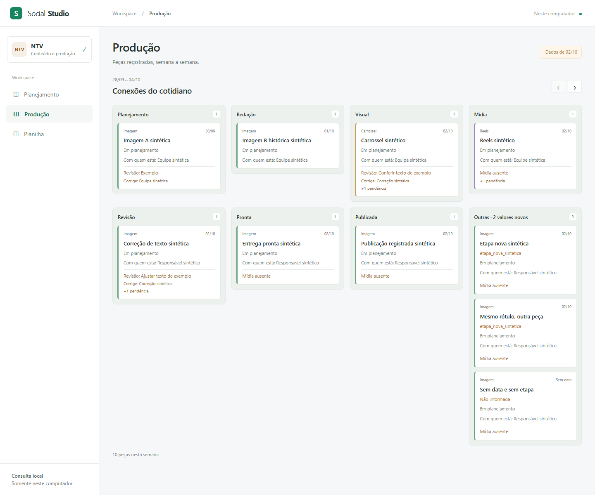
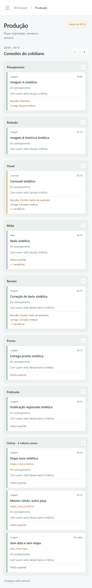

### Aceite do ajuste e integração da US4

Head `764cb25fcdfa508af18d13f04515d20a8b2368dd`, incluindo `d8d79c1` no push. [Gate Linux 37227704196](https://github.com/Browsher/crm-social/actions/runs/37227704196/job/111510676514) **SUCCESS**: tests/coverage/complexity/**Semgrep PASS**, audit N/A, exit 0, baseline atualizada false. O Semgrep CE 1.179.0 foi instalado e executado no Linux. [Review 37227704200](https://github.com/Browsher/crm-social/actions/runs/37227704200/job/111510676631) **SUCCESS**, [comentário 5983509175](https://github.com/Browsher/crm-social/pull/10#issuecomment-5983509175): sem Critical, segurança ou regressão. P-1 é respondido pelo job desse head; interface local 174/62 registrada acima, com [resumo sanitizado do ajuste](../../docs/reports/001-us4-ajuste-local.json). Minor restantes estão na Fase 8, sem prometer resolução ampla.

[Merge do PR #10](https://github.com/Browsher/crm-social/commit/bc835e440b7834ad6f21dd8f56d01b6cef5f7197), dois pais `b24b25e` e `764cb25`, autoria `204295625+Browsher@users.noreply.github.com`, committer `noreply@github.com`. Sem squash ou exclusão da branch 001; main recebida localmente nela por fast-forward. generate-tests/publish-tests SKIPPED sem rótulo. US5 começa somente depois desta integração; captura operacional e Fase 8 continuam pendentes.

## US5 — Planilha e Histórico (T031–T034)

Implementação local com fixtures sintéticas em TEMP. Sem coleta operacional, dependência nova, nova rota ou mudança em CI/gate/baseline/constituição. As seis abas apresentam os 66 mínimos já selecionados e triados, na ordem canônica; o Histórico aproveita os recibos confirmados existentes. Cabeçalho mostra completedAt e cobertura; Atualizar dados continua sendo somente GET/releitura local. Link da gaveta filtra o painel de avisos pela peça, mantendo as seis tabelas NTV completas; menu/selo e Todos os avisos permitem a consulta geral.

### RED/GREEN observado e limites

| Etapa | Resultado observado |
| --- | --- |
| T031, P11/P12/H05 RED | 2 PASS / 4 FAIL / 0 SKIP, exit 1, 0,81 s. Falhas por planilha vazia (0 em vez de 6); ausência e Histórico já implementados passaram desde o início |
| T032 GREEN | 6 PASS / 0 FAIL / 0 SKIP, exit 0, 0,83 s; seis suítes backend completas 118/0/0, 5,66 s |
| T033, U09/U10 RED | 0 PASS / 11 FAIL / 0 SKIP, exit 1, 5,98 s, por falta de abas/painéis/estado vazio |
| T034 GREEN | 12 PASS / 0 FAIL / 0 SKIP, exit 0, 8,55 s. Inclui caracterização da releitura de uma captura nova, sem RED artificial para integração existente |
| Revisão local RED | 0 PASS / 3 FAIL / 0 SKIP, exit 1, 2,19 s: marcação fictícia sem captura, título longo em 390 e URL dedicada recusada como texto bruto |
| Revisão local GREEN | 15 PASS / 0 FAIL / 0 SKIP, exit 0, 10,30 s; U02 anterior e U09/U10 incluindo as duas regressões novas |
| Suíte completa final | **194 PASS / 0 FAIL / 0 SKIP**, exit 0, **47,84 s**, sete suítes e **76 casos de interface** |

Uma primeira tentativa GREEN da interface tinha 10 PASS/1 FAIL por expectativa incorreta do teste novo: o recibo existente resume a flag inválida como Cenas complete: inválido, não como leitura incompleta. A asserção passou a comparar o motivo real selecionado do recibo, sem alterar importador/produção. A primeira suíte completa teve 191 PASS/1 FAIL: o painel sem captura adicionava data-producao-id vazio; a correção remove essa marcação sem inventar peça, preservando U02. Um gate iniciado antes dos ajustes ficou preso nos testes e foi encerrado graciosamente, sem resultado de aceite; somente a execução final é usada como prova.

A revisão independente do diff conferiu o checklist Node, imports/arquitetura, seleção explícita, triagem e ausência de execução/carga automática de células. O corte de título longo e o alcance de URL dedicada foram reproduzidos e corrigidos; segunda leitura não encontrou Critical, segurança ou regressão. URLs dedicadas recusadas mostram link não permitido na tabela; marcador de conteúdo suprimido permanece visível. Texto livre com URL legítima seguido de @perfil continua literal. API mantém a seleção completa triada. Não há edição/importação pelo navegador.

A conferência textual de caminhos encontrou um exemplo deliberadamente fictício no teste negativo P12 (tests/projecao.test.cjs), que verifica a supressão de caminho antes do HTTP. Essa ocorrência é dado sintético do teste, não um caminho pessoal real; não é copiada para os documentos ou telas. Nenhum arquivo de data/ foi lido, alterado ou versionado.

As contagens da fixture Planilha são **2/5/3/2/5/5**; inclui cabeçalhos invertidos, linha física vazia, outra marca, zero/false/espaços, IDs/Drive/hash/origens apenas fictícios. Nulos fora de etapa_producao conservam a normalização preexistente para string vazia, dívida já registrada; não se declara fidelidade literal de null para todos os campos. H05 caracteriza 14 tentativas confirmadas recentes primeiro, no-op sem duplicação, recibos imutáveis, falha preservando vigente e órfãos excluídos. Os avisos mantêm aba/linha física/campo/motivo sem o valor sensível; o filtro da UI não recalcula origem física.

### Conferência visual da US5

Seis screenshots produzidos pelo servidor HTTP real em porta efêmera com captura/mapa sintéticos, incluindo uma tentativa falha deliberada. **Sete abas, cinco produções NTV, oito avisos gerais ou três da peça selecionada e duas tentativas confirmadas**. Em todas, scrollWidth igual à largura, zero pageerror e zero requisição externa. Conferidas visualmente: identidade Social Studio preservada, tabelas rolam na própria região e o Histórico final conserva falha/sucesso sem apagar dados. As imagens não demonstram captura operacional.

| Cenário | Desktop | Celular |
| --- | --- | --- |
| Aba Produções | [1440](../../docs/design/screenshots/001-us5-dados-1440.png) | [390](../../docs/design/screenshots/001-us5-dados-390.png) |
| Avisos filtrados pela gaveta | [1440](../../docs/design/screenshots/001-us5-avisos-1440.png) | [390](../../docs/design/screenshots/001-us5-avisos-390.png) |
| Histórico completa/falhou | [1440](../../docs/design/screenshots/001-us5-historico-1440.png) | [390](../../docs/design/screenshots/001-us5-historico-390.png) |

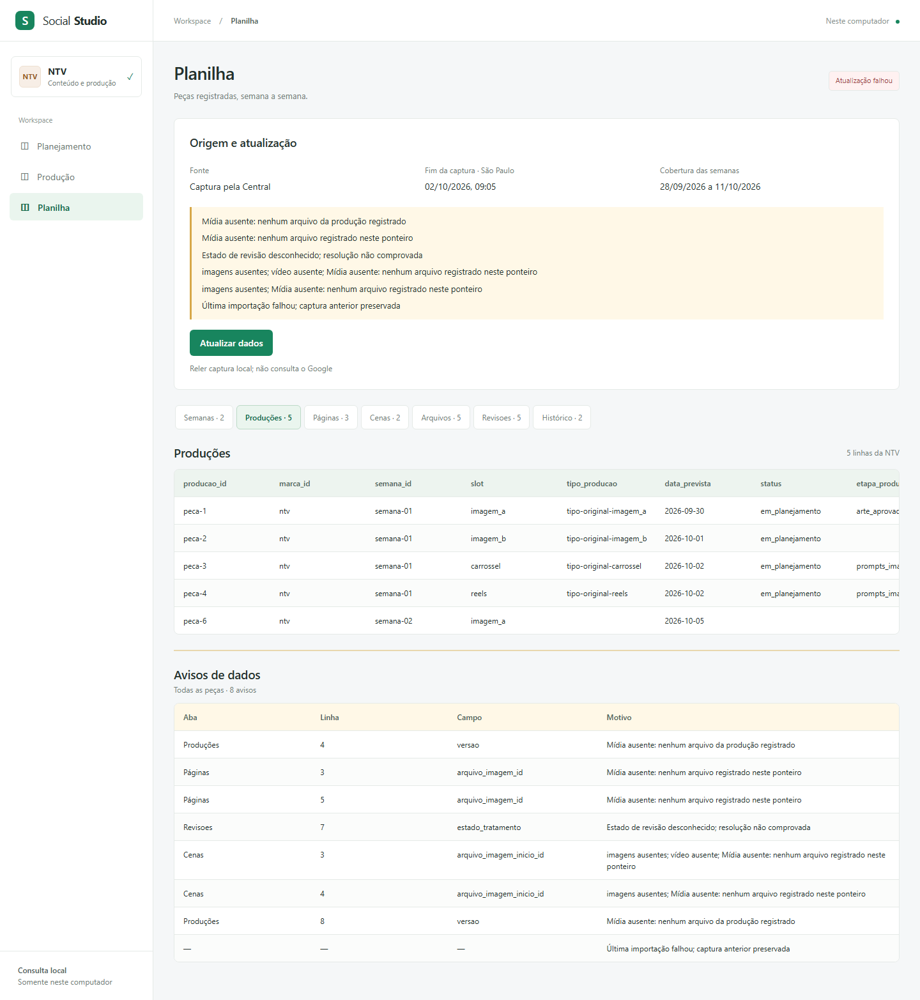
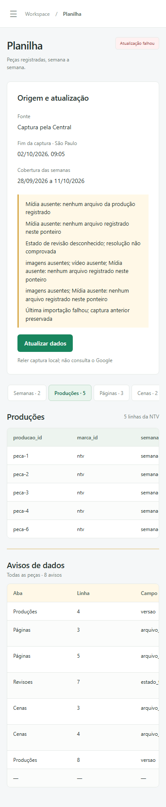
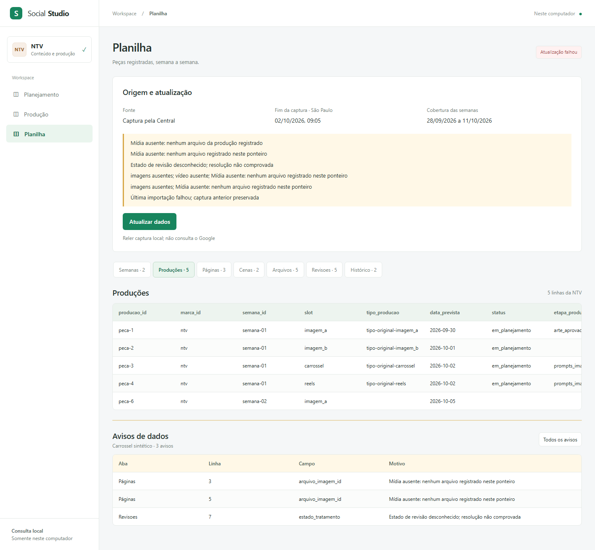
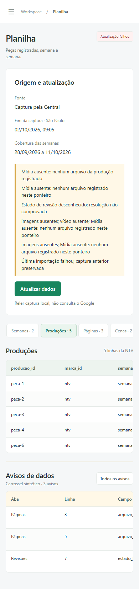
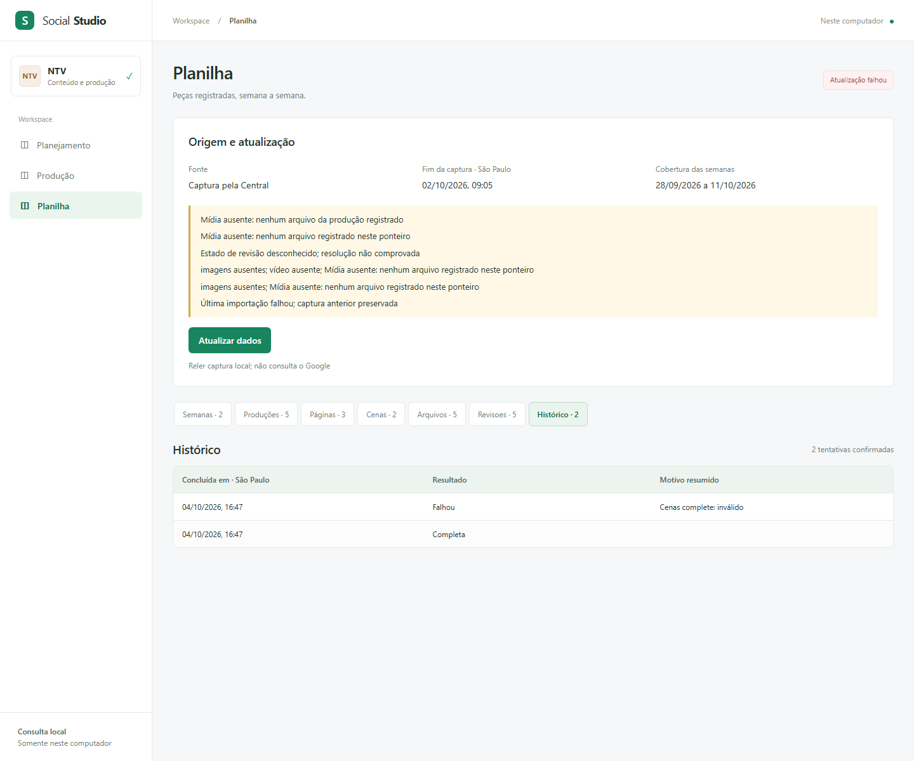
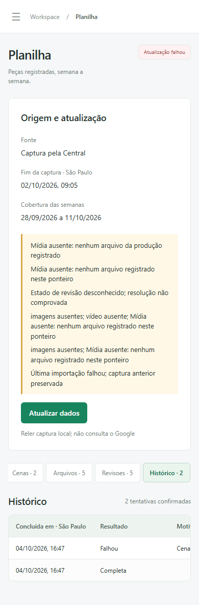

Gate local do primeiro head **exit 0**, **49,23 s**: tests/coverage/complexity PASS, cobertura **97,62%**, complexidade máxima **13**, cinco avisos (11–13), Semgrep SKIP no Windows por ferramenta ausente, audit N/A por ausência de dependências da aplicação, **baseline atualizada false**. O resumo daquele estágio registrava cinco hashes das fontes medidas; o [resumo sanitizado atual](../../docs/reports/001-us5-local.json) foi atualizado após a refatoração da fixture e registra seis. Configuração, ferramentas e CI permanecem intactos. Essa execução precedeu a sincronização documental do primeiro head; a medição posterior está na seção do diagnóstico.

Código registrado em `768ba90` (T031/T032) e `7c563c9` (T033/T034 e screenshots), com autor/committer noreply. Entre essa medição e a publicação de `a9cb8ef`, src/tests ficaram inalterados; a sincronização desse estágio modificou somente documentação e resumos sanitizados. A mudança posterior em tests/fixtures.cjs e suas novas execuções estão registradas abaixo. Não se atribui aceite Linux a essas execuções Windows.

A regra `.claude/rules/project-structure.md` tem **50 linhas** nesta entrega, dentro do limite de 60. Conferência documental: links relativos existentes, cercas balanceadas e nenhum caminho pessoal real nos arquivos alterados. As contagens de linhas das seções anteriores pertencem às entregas históricas que elas descrevem.

T031–T034 concluídas; total **34/41**, sete tarefas da Fase 8 pendentes. Aceite Linux/review do novo PR será registrado somente depois de observado. A US5 não será integrada nesta rodada.

### Primeiro head remoto da US5 e diagnóstico do Semgrep

[PR #11](https://github.com/Browsher/crm-social/pull/11), head `a9cb8ef9d8730a8d80d460f4e8291d126897666f`. [Review 37231201986](https://github.com/Browsher/crm-social/actions/runs/37231201986/job/111521015076) **SUCCESS**, [comentário 5983965195](https://github.com/Browsher/crm-social/pull/11#issuecomment-5983965195): sem Critical ou Important; seis Minor registrados na seção da Fase 8. O texto desatualizado da linha Entrada de tasks.md foi corrigido. generate-tests/publish-tests SKIPPED sem rótulo.

[Gate Linux 37231201975](https://github.com/Browsher/crm-social/actions/runs/37231201975/job/111521014579) **FAILURE**, exit 1: tests/coverage/complexity PASS, Semgrep FAIL com motivo **achado de seguranca media ou superior**, audit N/A, baseline atualizada false. O job não conserva o JSON detalhado em artefato; não se declara aceite Linux a partir do gate Windows.

O autor autorizou instalar Semgrep CE 1.179.0 somente numa subpasta de TEMP, usando o Ubuntu já existente, sem Docker, instalação global ou mudança do PATH. A reprodução mantém configurações, logs, cache e instalação na pasta temporária; nenhuma dependência da aplicação, regra, exclusão ou workflow é alterada para obter verde. A pasta da ferramenta será apagada depois da conferência final.

### Reprodução RED e correção do falso positivo da fixture

Semgrep CE **1.179.0**, mesmos packs `p/javascript`, `p/security-audit` e `p/secrets`, métricas/version check desligados. Foram analisados os **nove arquivos do escopo**, inclusive tests/fixtures.cjs e o verificador histórico do protótipo. RED: um WARNING, regra `javascript.lang.security.audit.unknown-value-with-script-tag.unknown-value-with-script-tag`, tests/fixtures.cjs:148 no head inicial; zero erros de análise. O CLI scan retorna 0 sem --error, mas esse WARNING é medium para o gate e explica seu exit 1.

A [regra oficial](https://github.com/semgrep/semgrep-rules/blob/develop/javascript/lang/security/audit/unknown-value-with-script-tag.yaml) é de auditoria com confiança LOW: associa uma variável retornada por função a uma chamada posterior contendo um literal script. Aqui raw é a captura sintética e mudarCelula só preenche a matriz de teste; a interface usa textContent. É falso positivo desse payload, sem entrada externa ou execução de HTML.

A fixture agora serializa o objeto de origens por `JSON.stringify` antes de preencher a célula. O literal script continua presente e todos os asserts P11/H05/U09 permanecem intactos. Comparação antes/depois da capturaPlanilha serializada: **bytes idênticos**, SHA-256 `fed514c2f64c23c9694abf73e1baec7028e9926a8b0880b3b9a9cec613a11c45`, inclusive hashes da captura. Não houve nosemgrep, exclusão, mudança de limite, regra ou configuração para silenciar o achado.

GREEN Semgrep: **zero achados, zero erros, nove paths.scanned**, 27,61 s de scan. Suíte completa repetida **194 PASS / 0 FAIL / 0 SKIP**, **76 de interface**, exit 0, **65,06 s**. Gate local repetido **exit 0**, **58,92 s**, cobertura **97,63%**, complexidade máxima **13**, cinco avisos, Semgrep SKIP no processo Windows, audit N/A, **baseline atualizada false**. A reprodução separada no Ubuntu não é apresentada como execução do scanner pelo processo Windows nem como aceite remoto.

Screenshots permanecem válidos: aplicação e captura sintética têm os mesmos bytes. O resumo local foi atualizado com a medição posterior e o hash da fixture. Doc-sync final conferiu que o módulo web já descreve o payload como dado sem execução; não exigiu nova edição de arquitetura ou contrato. Aceite do novo head Linux/review permanece a conferir, sem merge da US5.

### Aceite remoto da US5 — parada sem merge

Head publicado e conferido `86d2fb4f79a3d655214990ad913727dec5a6f156`. [Quality-gate Linux 37232628807](https://github.com/Browsher/crm-social/actions/runs/37232628807/job/111525364067) **SUCCESS**: tests/coverage/complexity/**Semgrep PASS**, audit N/A, **exit 0**, **baseline atualizada false**. O log confirma a instalação de **Semgrep CE 1.179.0** e a execução da checagem; não houve SKIP da ferramenta no Linux. Interface conserva seu SKIP explícito de CI/M8, com os **194/0/0 e 76 casos de interface locais** registrados na repetição posterior da fixture.

[Review 37232628888](https://github.com/Browsher/crm-social/actions/runs/37232628888/job/111525364506) **SUCCESS**, [novo comentário 5984151670](https://github.com/Browsher/crm-social/pull/11#issuecomment-5984151670). Não há Critical ou achado de segurança/regressão. I-1 é uma pendência de evidência: o reviewer não consulta Actions, e a prova é o job do mesmo head ligado acima. Os cinco Minor estão rastreados na Fase 8; m-1 documental foi corrigido distinguindo a medição histórica da atual, sem reescrever resultados. Nenhum código da aplicação mudou depois de 7c563c9; somente a fixture byte a byte equivalente foi refatorada e verificada novamente.

generate-tests/publish-tests **SKIPPED**, sem rótulo gerar-testes. [PR #11](https://github.com/Browsher/crm-social/pull/11) **OPEN**, mergeStateStatus consultado CLEAN; esse estado não foi usado para tentar merge. T031–T034 concluídas, **34/41**, sete tarefas da Fase 8 e captura operacional pendentes. A branch 001 continua preservada.

Ferramenta temporária removida por operação nativa, após verificar o caminho dentro de TEMP: **Pasta Semgrep existe: False**. Instalação, cache, configurações e logs próprios da ferramenta foram apagados; sem instalação global, Docker ou mudança do PATH. Evidências sanitizadas permanecem neste registro e no resumo local.

Este recibo do comentário recebido depois do push fica em commit **local de documentação**, para acompanhar a próxima rodada. O PR permanece no head `86d2fb4`, já verificado; não se declara CI para o registro posterior. Nada foi integrado da US5, e nenhum código, teste ou screenshot mudou após esse head publicado.

### Ajustes de apresentação da US5 — PR #11

RED observado: seis falhas nas expectativas de Histórico legível, origem sem lista,
motivo consolidado e subtítulo próprio. GREEN e regressões: **197 PASS / 0 FAIL /
0 SKIP**, **79 testes de interface**, **59,12 s**, Node 24.19.0. Gate local **exit 0**,
**62,17 s**, cobertura **97,63%**, complexidade máxima **13**, cinco avisos;
Semgrep **SKIP** no Windows, audit **N/A**, baseline inalterada. O
[resumo sanitizado](../../docs/reports/001-us5-ajuste-local.json) guarda os hashes.

Origem exibe somente falha ativa e contador com link para a tabela única. O link
restaura os avisos gerais e sai de Histórico para localizar a tabela. Motivos de
mídia são consolidados na apresentação; API e recibos conservam os textos originais.
O Histórico traduz `Cenas complete: inválido` para **Aba Cenas incompleta**, sem
reescrever evidência armazenada. A Planilha tem subtítulo próprio.

| Cena sintética | 1440 | 390 |
| --- | --- | --- |
| Aba Produções e origem compacta | [Desktop](../../docs/design/screenshots/001-us5-ajuste-dados-1440.png) | [Celular](../../docs/design/screenshots/001-us5-ajuste-dados-390.png) |
| Avisos filtrados da peça | [Desktop](../../docs/design/screenshots/001-us5-ajuste-avisos-1440.png) | [Celular](../../docs/design/screenshots/001-us5-ajuste-avisos-390.png) |
| Histórico legível | [Desktop](../../docs/design/screenshots/001-us5-ajuste-historico-1440.png) | [Celular](../../docs/design/screenshots/001-us5-ajuste-historico-390.png) |

Seis screenshots conferidos: zero pageerror/requisição externa/rolagem lateral da
página; tabelas têm rolagem própria. Fixture sintética e falha intencional, sem
leitura operacional. Commit local `725cb55` acompanha o próximo push. Aceite Linux,
review e merge autorizado serão registrados após conferir o head novo.

Regressão adicional: primeira importação falha mostrou RED pela ausência da linha
em Origem; GREEN completo **197/0/0**, **97,95 s**. Durante a repetição do gate,
o cleanup da fixture aguardou conexão do navegador depois de fechar a escuta.
Foi liberado somente o navegador com PID/parent e perfil TEMP confirmados. Essa
execução destravada (389,44 s) **não é usada como aceite**. Cleanup agora fecha o
navegador antes do servidor, em try/finally; gate repetido sem intervenção abaixo.

Repetição final sem intervenção: **gate exit 0, 49,23 s**, **197 testes PASS**,
cobertura **97,63%**, complexidade máxima **13** e **seis avisos 11–13**. Semgrep
SKIP Windows, audit N/A, baseline atualizada false. Este resultado e os hashes
finais substituem a tentativa interrompida para o aceite deste código; a suíte
completa anterior preserva seu resultado observado de 197/0/0 e 79 de interface.

### Aceite e integração final da US5

Head `02d06f431fdb7d924fa1a3fbee6a9b1fb4d2fefb`: [gate Linux SUCCESS](https://github.com/Browsher/crm-social/actions/runs/37235206951/job/111532819722),
tests/coverage/complexity/Semgrep PASS (CE 1.179.0), audit N/A, exit 0, baseline
atualizada false. [Review SUCCESS](https://github.com/Browsher/crm-social/actions/runs/37235206910/job/111532819478),
[comentário 5984460226](https://github.com/Browsher/crm-social/pull/11#issuecomment-5984460226),
sem Critical, segurança ou regressão. I-1 de evidência Linux fechado pela leitura
do log desse mesmo head. Minor: referências/frase na arquitetura, tradução por
texto, complexidade 11 de detalhesCaptura e link na live region serão avaliados
em T038 com as pendências anteriores.

[PR #11 integrado](https://github.com/Browsher/crm-social/pull/11) por merge commit
`88082c42fe53be20d92e4e16d955201fc463aeef`, pais `bc835e4` e `02d06f4`, autoria
`204295625+Browsher@users.noreply.github.com`, committer `noreply@github.com`.
Branch 001 preservada e recebeu main por fast-forward local. A partir daqui,
executar somente T035–T038; T039 continua aguardando captura e autorização.

## Fase 8 — iniciador e verificação sintética (T035–T037)

Base: merge `88082c4` da US5. Nenhuma captura operacional foi lida ou preparada.
Windows PowerShell 5.1, Node 24.19.0 e Playwright existentes; sem nova dependência.

**T035 RED observado:** seis testes reais falharam porque `Iniciar CRM.ps1`
ainda não existia: **0 PASS / 6 FAIL / 0 SKIP**, exit 1. **T036 GREEN:**
**6 PASS / 0 FAIL / 0 SKIP**, 12,22 s, incluindo processo oculto, escuta só em
127.0.0.1, ausência de Node/NodePath, faixa da porta e ocupante HTTP preservado.
Os caminhos de teste têm espaços; cleanup confere executável, entrypoint, TEMP e
instante de criação antes de encerrar somente o PID criado. `.ps1` em ASCII.

A primeira implementação encontrou compartilhamento exclusivo do stdout; o
leitor passou a usar FileShare.ReadWrite. A tentativa seguinte ficou aguardando
pipes herdados pelo Node após o PowerShell terminar: 4 passaram, 2 foram
cancelados. Foram encerrados somente os dois filhos com proprietário confirmado;
essa execução não é aceite. O helper espera `exit`, recolhe saída já emitida e
fecha seus próprios pipes. Os asserts de comportamento foram preservados, e o
GREEN final ocorreu sem intervenção. Logs do iniciador ficam privados no
DataDir/runtime; a saída informa URL, PID e encerramento dessa instância.

**T037:** oito arquivos de suíte, cinco camadas, Windows local sem CI=true:
**206 PASS / 0 FAIL / 0 SKIP**, exit 0, **59,47 s**. Inclui **81 testes de
interface** e seis do iniciador. A fixture contém 500 peças NTV fictícias,
46 sem data, 14 em semana não identificada, todas as oito colunas, versões
anteriores, páginas/cenas e 562 avisos. Todos os IDs aparecem exatamente uma vez
na lista, nos grupos de dias e no quadro; as seis abas conservam os 66 mínimos.
Releitura após tentativa incompleta mantém as 500 peças, a captura e seu horário,
além de registrar a falha no Histórico. Requisições externas e pageerror: zero.

Os metadados/range da fixture foram ajustados à sua matriz de 502 linhas antes
de usar o cenário como evidência. As primeiras caracterizações também corrigiram
expectativas para as estruturas já contratadas: dias/lista incluem Sem data,
paginas inclui histórico e atual.json confirma o recibo da tentativa recusada.
Não houve alteração de produção para legitimar esses resultados; não se declara
esse acerto do ensaio como RED/GREEN de uma funcionalidade nova.

Ensaio dedicado, sem limite artificial de tempo; milissegundos observados:

| Medição | 1440 | 390 |
| --- | ---: | ---: |
| Carga, incluindo abertura de navegador | 854 | 521 |
| GET local /api/visao | 495 | 489 |
| Filtro, gaveta e quadro | 357 | 453 |
| Troca das seis abas | 567 | 551 |
| Recomposição dos 562 avisos | 181 | 155 |
| Releitura local após falha | 334 | 361 |

Importação/projeção isoladas: **38/122 ms**. Tempos variam com a máquina e a
instrumentação; não são promessa de latência nem prova de sincronização Google.
Gate pré-revisão: **exit 0, 71,28 s**, tests/coverage/complexity PASS, sete avisos
de complexidade 11–13, Semgrep SKIP local por ausência no Windows, npm audit N/A,
baseline atualizada false. Gate final será repetido depois das correções de T038.
Linux aceita regras/I/O/serviços/HTTP, mas tem SKIP explícito de Playwright e
PowerShell; o CI não substitui o aceite local dessas duas ferramentas.

## T038 — revisão independente e correções

Revisor da execução atual, somente leitura, distinto dos implementadores; fontes
de produção do merge `88082c4`, contrato/constituição/plano, pendências completas
acima, diff local do iniciador/testes e evidência do gate. Sem ler `data/`, rodar
scanners, fazer alterações ou delegar a revisão. Os cinco riscos do plano foram
conferidos; nenhum Critical foi encontrado. Três Important exigiram correção:

| ID | Achado / reprodução sintética | RED observado | GREEN / correção |
| --- | --- | --- | --- |
| I-01, segurança | Um campo não escalar de recibo confirmado podia atravessar o Histórico sem triagem; identidade/resultado/data também não eram conferidos | 11 FAIL, 1 PASS de caracterização válida, exit 1 | Persistência + HTTP: 38/0/0. lerRecibo valida objeto, identidade confirmada, captura, resultado, motivo textual e instante ISO real com fuso; inválido causa 503 genérico sem valor ou escrita |
| I-02, inferência | Versão vigente inválida/ausente fazia a API/cartão afirmar ausência de mídia nesta versão | Quatro casos de projeção e um de interface FAIL | Omitir só a pendência categórica quando a versão não é inteiro positivo; conservar arquivos e aviso localizado, inclusive versão vazia |
| I-03, segurança/identidade | IDs sensíveis distintos viravam o mesmo marcador; relações e cartões podiam unir peças diferentes | Dois casos de projeção e um HTTP FAIL | Se a triagem alterar qualquer identidade/vínculo interno terminado em _id, recusar a projeção antes de construir relações; API 503 genérica, captura privada intacta |

I-02/I-03 juntos: **0 PASS / 8 FAIL / 0 SKIP** antes da produção; depois
**8 PASS / 0 FAIL / 0 SKIP**, 1,14 s. O primeiro ensaio HTTP tinha import do
helper ausente; isso foi acertado e o RED foi repetido, observando **200 em vez
de 503**, antes de alterar a projeção. Nenhum teste foi flexibilizado para aceitar
mistura de identidades ou ausência inferida. O revisor conferiu os snippets e
considerou os três achados fechados após o GREEN; gate completo repetido abaixo.

### Destino das pendências e limites conhecidos da 001

Todas as entradas da seção histórica de pendências foram triadas. Manter o
histórico acima; a classificação e o estado correntes são os desta tabela:

| Grupo / origem | Estado após T038 |
| --- | --- |
| Datas, prioridades do mapa, publicação explícita, manutenção após falha, versões/revisões e mínimos seguros — cinco riscos | Conferidos com testes existentes + 500 peças e regressões acima; nenhuma coleta/ação remota. IDs/vínculos redigidos e recibos inválidos agora falham com 503, conservando o estado privado |
| Versão inválida em mídia — PR #10, 5983143402 m-1 | Fechado por I-02 com RED/GREEN |
| Escala, abas e avisos — PR #9 5982320198 m-1 e PR #11 5983965195 m-6 | Medidos em T037; nenhuma otimização ou mudança da triagem foi necessária |
| CLI/LCOV — PR #6 M8 | A anotação antiga CLI fora do LCOV está superada: o importador já tem cobertura. Limite remanescente é web fora do LCOV, Playwright SKIP no CI e iniciador SKIP fora de Windows; aceite dessas ferramentas é local |
| Precisão da mídia — PR #10 5983186287 m-1 | Minor conhecido: ponteiro preenchido quebrado/incompatível pode resumir mídia ausente, embora API, gaveta e Planilha conservem vínculo e causa a confirmar; não seleciona arquivo nem infere aprovação |
| Revisão desconhecida — PR #9 m-2 reiterado | Minor conhecido: tratamento desconhecido tem aviso e resolução não comprovada, mas resumo vigente/+N ainda chama revisão aberta. Estados originais permanecem na API |
| Coluna causadora/arquivos semanais — PR #9 m-3 e revisões anteriores | Minor conhecido: empate/ausência usa versao/origens_json; arquivos apenas semanais têm triagem, mas faltam validações extras de versão/origens_json. Não se escolhe substituto |
| URL dedicada com dois pedaços — PR #9 m-1 | Minor conhecido: pode formar link estranho dentro da allowlist; userinfo não é exposto. Extensão de delimitadores no texto livre fora da regra aprovada é dívida, não decisão adotada nesta entrega |
| Resumo/localização e acessibilidade — PR #10 m-1/m-3; PR #11 m-2/m-5; review final US5 m-5 | Minor conhecido: falta número da unidade no cartão; contador da coluna pode ganhar rótulo contextual; duas paradas Tab no painel/rolagem; close/foco assíncrono e link em live region podem causar ajuste cosmético. Teclado/Esc/foco básico passam |
| Resposta HTTP 200 fora do contrato | Minor defensivo conhecido: JSON malformado estruturalmente pode substituir estado antes de renderizar e deixar a UI parcial. O servidor atual não produz essa forma; erro HTTP/503 preserva a visão. Ainda falta validação do candidato na UI |
| Cobertura HTTP/navegação — PR #10 m-3 e PR #11 m-3/revisão 5984151670 m-2 | Minor conhecido: quadro HTTP dedicado, releitura filtrada/peça removida e reset de avisos via menu/selo merecem asserts adicionais. Projeção/HTTP real/interface cobrem os fluxos atuais; não se declara esses casos extras exercitados |
| Refatorações/decisões futuras — PR #10 m-2/m-4/m-6 e revisões da US5 | Limites de manutenção: helper posicional, abertura duplicada, CAMPOS/chaves por posição, índice de etapa calculado repetidamente, lista de colunas repetida, definição normativa repetida. Contador usa valor triado, podendo reunir rótulos sensíveis; revisão ambígua no cartão não ganha inferência de correção |
| Tradução de motivo por texto e complexidade 11 — review final US5 m-3/m-4 | Minor conhecido: acoplamento às mensagens atuais e branches de tradução sem assert dedicado completo. Preservar texto seguro/fallback; não alterar limite do gate |
| Âncoras/arquitetura/cabeçalho e procedência — revisões PR #9–#11 | Sincronizar funções/frase atuais e mapa do iniciador nesta entrega; medições históricas continuam históricas. Históricos de SHA/head/check ficam somente neste arquivo; relatórios atuais incluem hashes, sem inventar SHA medido para os recibos antigos |

Os Minor e limites acima não recebem correção de produto por conveniência nesta
rodada. A revisão não transformou decisão futura em regra atual. Não há mudança
em tools/, quality-gate.config.json, .quality-gate/, .github/, dependências ou
constituição. A captura operacional e seu aceite continuam pendentes.

### Gate final do código T035–T038

**exit 0, 60,28 s**, oito arquivos de suíte: **226 PASS / 0 FAIL / 0 SKIP**
no Windows sem CI=true; **82 de interface, seis do iniciador**. Cobertura LCOV
**97,93%**; complexidade máxima **13**, nove avisos **11–13**, nenhum FAIL.
Semgrep SKIP local por ausência no Windows; audit N/A sem dependências do app;
baseline atualizada false. [Resumo sanitizado e 14 hashes das fontes](../../docs/reports/001-fase8-local.json).
O iniciador PowerShell e o browser ficam fora do LCOV JavaScript; os testes reais
locais demonstram seus comportamentos. O aceite Linux deste código está registrado abaixo, com Semgrep CE 1.179.0 de verdade e sem SKIP do scanner.

## PR da Fase 8 — evidência remota e limites do review

[PR #12](https://github.com/Browsher/crm-social/pull/12) aberto, **sem merge**.
Head de implementação **1a58d1a3c3d6f53d99d3f6b7b881095b4f78883a**, base
**88082c42fe53be20d92e4e16d955201fc463aeef**; 30 arquivos no review inicial.
T039–T041 permanecem pendentes. O commit posterior de evidências altera somente
documentação; os 14 hashes de código/testes continuam iguais ao gate local.

| Check do head de implementação | Resultado e evidência |
| --- | --- |
| quality-gate | [SUCCESS no Linux](https://github.com/Browsher/crm-social/actions/runs/37239672740/job/111545662897), exit 0; tests, coverage, complexity e semgrep PASS, audit N/A; nove avisos de complexidade, baseline inalterada |
| Semgrep do gate | CE **1.179.0** instalado e executado de verdade; PASS, nenhum SKIP do scanner |
| review | [SUCCESS](https://github.com/Browsher/crm-social/actions/runs/37239672631/job/111545662854), [comentário publicado](https://github.com/Browsher/crm-social/pull/12#issuecomment-5985114776) |
| generate-tests / publish-tests | SKIPPED: não houve rótulo gerar-testes; não são testes do aplicativo |

[Resumo sanitizado reproduzido do log oficial](../../docs/reports/001-fase8-ci.json).
O workflow não conservou artefato com o **quality-gate-report.json original** nem
publicou o stdout individual do runner. Não se atribuem números Windows ao CI:
UI/PowerShell têm aplicabilidade local explícita. O relatório local completo
mantém os percentuais/complexidade/hashes; o log oficial comprova os estados do
mesmo código no Linux. Não foi alterado workflow para coletar evidência extra.

O reviewer não encontrou Critical, segurança ou regressão. Seu **I-1** é uma
pendência de evidência: pedia gate deste head e Semgrep real, agora registrados
acima. Isso não exigiu mudança de código ou teste RED artificial. A sugestão de
anexar o JSON original permanece limitada pela ausência do artefato; o resumo
identifica expressamente sua procedência no log.

| Achado do comentário inicial | Destino nesta rodada |
| --- | --- |
| m-1 — identidade triada promovida e consulta indisponível | Reclassificado como Important I1 no review seguinte; corrigido com RED/GREEN pelo preflight descrito abaixo. Não é mais limite aceito da importação atual |
| m-2 — caminhos extras do iniciador sem teste | Limite explícito no módulo: timeout/saída precoce do filho, CRM_NODE_PATH, porta padrão e DataDir relativo foram lidos, não executados. Os seis casos reais não provam esses caminhos |
| m-3 — cabeçalho de tasks antigo | Corrigido: US1–US5 integradas e T035–T038 em PR próprio; somente T039–T041 pendentes |
| m-4 — complexidade | Registrada: lerRecibo 12, selecionar 12 e capturaEscala 12; nove avisos no total, máximo 13, sem reprovação ou baseline nova |
| m-5 — negativos com offset | Limite de cobertura: offset válido tem caso positivo; data impossível e offset inválido nesse ramo ainda não têm negativos dedicados |
| m-6 — logs do iniciador | Limite conhecido: acumulam-se privadamente e o erro não inclui logDir; documentação deixa explícita a ausência de limpeza automática |

Trecho do comentário: “Não encontrei nada Critical. Há uma pendência Important
de evidência (o gate deste HEAD) e alguns Minor.” O comentário é revisão somente
leitura, não execução de testes. As linhas mencionadas nele para o PowerShell
não são números atuais do arquivo, que tem 71 linhas; localizar por função/ramo.

## T038 — correção do Important I1 do segundo review remoto

[Segundo review](https://github.com/Browsher/crm-social/pull/12#issuecomment-5985154350),
head **4b4432058a7269e5716d5499b8e163b54cb7fef6**: o antigo m-1 foi
reclassificado como Important. O importador aceitava/promovia uma identidade
sensível e somente a consulta recusava a projeção, escondendo a vigente anterior.
O gate desse head documental também foi [SUCCESS no Linux](https://github.com/Browsher/crm-social/actions/runs/37240074277/job/111546863076),
incluindo Semgrep CE 1.179.0 PASS. Isso é evidência histórica anterior à correção
abaixo; não se declara aceite remoto de código posterior com esse resultado.

**RED observado:** 14 novos casos, **1 PASS / 13 FAIL / 0 SKIP**, 0,75 s,
comparando completa indevida com falhou esperado. Abrangem identidades das seis
abas, ponteiro documental de Semanas, vínculo de página, arquivo exclusivamente
semanal, URL com userinfo e string JSON; com/sem captura anterior. Casos que devem
continuar aceitos: identidade exclusivamente fora do recorte NTV, extras, texto
livre e id_drive triáveis. Fixtures inteiramente sintéticas; nenhuma credencial
real ou captura operacional.

**GREEN direcionado:** **14 PASS / 0 FAIL / 0 SKIP**, 0,83 s. O importador/CLI
confirma falhou com aba, linha física e campo, sem o valor recusado; não grava o
candidato, não troca os bytes ou horário da vigente, atualiza Histórico e falha
ativa. HTTP conserva **200** e as quatro peças válidas anteriores. Sem captura
anterior, permanece ausência real e recibo confirmado de falha.

A seleção NTV, os 66 mínimos, o parser de URL e a triagem foram extraídos para
**src/triagem.cjs**, sem duplicar regex/filtro nem mudar apresentação. Snapshot
e projeção reutilizam essa mesma seleção. Grafo: snapshot→triagem→captura e
projeção→triagem→captura; persistência não importa o serviço de apresentação ou
o mapa do quadro. O preflight ocorre antes de conflito/no-op/gravação/ponteiro.
Motivo localizado usa aba/campo do esquema fixo e linha física; nenhum valor.
A defesa de projeção continua recusando bytes antigos/corrompidos externamente.

O primeiro gate completo falhou em dois testes P de defesa: preparavam a captura
sensível pela importação, que agora a recusa corretamente. Mantivemos todos os
asserts de recusa e de não fusão; a preparação passou a usar estado saudável e
captura estruturalmente validada antiga. H simula corrupção externa de bytes
privados depois de promoção saudável. Não afrouxamos produção ou asserts para
aceitar captura perigosa. Integração das quatro suítes: **131 PASS / 0 FAIL /
0 SKIP**, 6,23 s. O revisor independente conferiu os snippets, confirmou I1
fechado e não apontou novo bloqueante; não executou testes nem presumiu aceite CI.

**Gate local completo final:** exit **0**, **63,77 s**, **240 PASS / 0 FAIL /
0 SKIP**, oito suítes/cinco camadas, incluindo 82 casos de interface e seis do
iniciador; **97,96%** de cobertura LCOV, complexidade máxima **13**, nove avisos,
baseline inalterada. Semgrep SKIP no Windows; audit N/A. [Resumo sanitizado e
16 hashes atuais](../../docs/reports/001-fase8-preflight-local.json).
Os resumos anteriores de 226 casos/14 hashes permanecem históricos dos respectivos
heads, sem reescrever a evidência passada. Scanner real exige confirmação no CI
do novo código antes de encerrar esta rodada.

Demais Minor do segundo comentário ficam como limites conhecidos: caminhos extras
do iniciador sem teste; versão do runtime conferida manualmente; logs sem retenção;
centralização futura dos geradores sintéticos de padrões de segredo; distinguir
import de criação de processo no mapa; escala medida sem meta numérica de tempo.
A nota de arquitetura diferencia criação de processo de require. Não inventar
meta de desempenho ou versão obrigatória nova para resolver um Minor. Nenhum
outro Important foi aceito como limite; T039–T041 continuam pendentes.

## Aceite remoto do código final T035–T038 — PR #12 aberto

Head **f916fd63e7067829047d6c6350b5d8af9430d365**, branch
001-consulta-local-producao: [PR #12](https://github.com/Browsher/crm-social/pull/12)
**OPEN, sem merge**. Esta evidência é do código corrigido, incluindo triagem e
preflight; não usa o resultado dos heads anteriores como prova do novo módulo.

| Check | Conclusão e link |
| --- | --- |
| quality-gate | [SUCCESS](https://github.com/Browsher/crm-social/actions/runs/37241134322/job/111549921141), exit 0; tests, coverage, complexity e semgrep PASS; nove avisos, baseline inalterada; audit N/A |
| Semgrep | CE **1.179.0** instalado e executado no Linux, **PASS**, sem SKIP |
| review | [SUCCESS](https://github.com/Browsher/crm-social/actions/runs/37241134304/job/111549921350); [comentário final](https://github.com/Browsher/crm-social/pull/12#issuecomment-5985289994) |
| generate-tests / publish-tests | SKIPPED por ausência do rótulo gerar-testes; sem relação com os 240 testes locais |

[Resumo sanitizado do log e 16 hashes](../../docs/reports/001-fase8-preflight-ci.json).
Os hashes são dos arquivos da execução local Windows; não foram recalculados
pelo job Linux e podem diferir por finais de linha. O vínculo da execução remota
com o código é o head f916fd6 conferido no GitHub, não uma comparação de hashes
entre sistemas.
A API de artefatos confirmou **total_count: 0**: não existe JSON original do gate
disponível para download. O resumo declara sua origem no log oficial; totais
Linux não foram publicados e não se inventam a partir dos totais Windows.

Trecho do comentário final: “O código está coerente com a constituição, o
contrato e a arquitetura.” Não há Critical ou defeito Important confirmado.
**P1 (Important de evidência)** pede gate/Semgrep do head f916fd6; a tabela e o
log acima satisfazem o pedido, inclusive sourceSha256 com triagem. O reviewer não
tinha esse CI entre seus arquivos de contexto; a afirmação de ausência de CI no
comentário não substitui a execução real conferida pelo coordenador. Não houve
teste RED artificial para anexar uma evidência já observada.

| Minor final | Limite conhecido da 001 |
| --- | --- |
| M1 — erro genérico da triagem | O ramo de erro diferente de IDENTIDADE_SENSIVEL ainda propaga sua mensagem. Validação estrutural impede os caminhos atuais conhecidos; não foi identificado input que exponha célula. Mensagem estática e teste de injeção de falha ficam como endurecimento futuro, sem declarar o ramo coberto |
| M2 — camada pura da triagem | Novo módulo é exercitado por snapshot, projeção, HTTP e CLI; faltam testes diretos isolados de seus exports e dos metadados de erro. Continua com oito suítes; não se declara uma nona suíte inexistente |
| M3 — logDir em falha | Caminho dos logs só retorna no sucesso; diagnóstico de falha exige localizar a tentativa privada. Sem limpeza automática, conforme limite já documentado |
| M4 — complexidade | lerRecibo e selecionar têm 12; máximo global 13 e nove avisos, sem FAIL/baseline nova. Extração de predicados é dívida de manutenção |

Registro final feito **localmente depois dos checks**, em commit documental
próprio: ele não é o head remoto medido nem será enviado novamente nesta rodada.
Código/testes e seus 16 hashes permanecem os do head remoto acima. T039–T041
continuam pendentes; nenhum merge do PR #12 ou captura operacional foi feito.

## Parada antes de T039 — preparo pela Central

**38 de 41 tarefas concluídas. T039, T040 e T041 continuam desmarcadas.** Esta
rodada verificou apenas dados sintéticos em TEMP; não houve captura real da
planilha, alteração de data/ operacional, escrita Google ou disparo editorial.
Sincronizar a documentação deste incremento não conclui o onboarding final T041.

1. A Central, com seu conector autenticado, gera um JSON de **schemaVersion: 1**
   conforme o [contrato](contracts/captura-e-consulta.md): seis abas completas
   Semanas, Produções, Páginas, Cenas, Arquivos, Revisoes, cabeçalhos reais e os
   66 mínimos. Envelope inclui capturaId seguro/único, spreadsheetId privado,
   brandId ntv, source google-drive-connector, startedAt/completedAt UTC,
   metadataBefore/After, firstReadSha256/secondReadSha256 e tables. Conferir
   metadados estáveis, duas leituras completas equivalentes e hash canônico;
   complete:true nunca é inferido de leitura parcial. completedAt não pode
   exceder 10 minutos no futuro nem ser igual/anterior ao da captura vigente.
2. Salvar privadamente em **data/entrada/<capturaId>.json**, ignorado por Git.
   Não copiar linhas, IDs operacionais, URLs privadas ou arquivo para fixtures,
   documentação, screenshots públicos ou PR. Autor precisa autorizar T039.
3. Na raiz do repositório, selecionar Node 24.19.0 existente e importar o arquivo:

   ```powershell
   $crmCapturePath = Join-Path (Get-Location) 'data/entrada/<capturaId>.json'
   & $crmNode scripts/importar-captura.cjs $crmCapturePath
   $crmInstancia = & '.\Iniciar CRM.ps1' -NodePath $crmNode
   $crmInstancia
   ```

   Substituir o capturaId pelo arquivo preparado. Abrir a URL loopback retornada;
   ao encerrar, conferir propriedade/PID da instância e usar o comando encerrar
   retornado, nunca encerrar todos os processos Node. Importação recusada conserva
   a captura vigente e registra o motivo; não reparar dados reais para obter verde.
4. A demonstração compara, **com essa mesma captura**, o conjunto/contagem de
   IDs NTV, datas civis/Sem data, dia inteiro, páginas/cenas e versões, revisão
   vigente separada das históricas, responsável registrado, prioridades/Outras
   do mapa, publicação somente explícita, selo pelo completedAt, seis abas/66
   mínimos, avisos e Histórico confirmado. Registrar só evidência compartilhável
   e limites. T040/T041 finais vêm depois dessa demonstração autorizada.

## Fechamento T039–T041 — demonstração privada e onboarding final

### T039 — captura real e conferências

capturaId: **ntv_20261004T231331718Z**. Importação no data/ padrão: **passou**.
Entrada intacta por conferência de hash antes/depois: **passou**. Iniciador e
servidor local usados; instâncias próprias encerradas ao fim. Comparações em
memória, sem screenshot real salvo, compartilhado ou versionado. Este registro
contém só contagens, resultados e limites, sem valores de células.

| Aba | Linhas na captura | Linhas no recorte NTV/API/tela | Conferência do recorte |
| --- | ---: | ---: | --- |
| Semanas | 1 | 1 | passou |
| Produções | 4 | 4 | passou |
| Páginas | 5 | 5 | passou |
| Cenas | 4 | 4 | passou |
| Arquivos | 52 | 51 | passou; limitação de escopo abaixo |
| Revisoes | 5 | 5 | passou |

A expectativa inicial de **52 Arquivos na tela falhou**. Há **1 arquivo sem
vínculo com produção nem semana**, não referenciado pelas unidades ou documentos
semanais. A identidade NTV não é comprovada pelos campos do contrato. O filtro
vigente conserva **51**: **29** ligados às produções e **22** semanais. O registro
sem escopo permanece integral na captura privada, sem inferir marca nem incluir
na interface apenas para atingir a contagem esperada. Não houve ajuste da fonte.

| Conferência da T039 | Resultado |
| --- | --- |
| Importação, entrada intacta e API local | passou |
| Seis abas; todos os 66 mínimos por linha, API e DOM após normalização/triagem | passou |
| Identidades, datas civis e período | passou |
| Quadro configurado e publicação somente explícita | passou |
| Páginas, cenas, revisões e responsabilidade registrada | passou |
| Selo pelo fim da captura, nas três telas | passou |
| Gaveta, acordeões, Esc e devolução do foco | passou |
| Contagens e conteúdo das seis tabelas | passou |
| Avisos localizados e painel único de avisos | passou |
| Histórico confirmado | passou |
| Releitura sem nova captura, recibo ou mudança do horário | passou |
| 1440/390 px sem corte da página/gaveta | passou |
| Sem pageerror nem requisição externa | passou |

**Limitações da captura:** **77 avisos** exibidos: **64** por campos numéricos
recebidos como texto, **4** de mídia ausente e **9** de relações/origens a confirmar.
Tipagem preservada sem conversão manual, relaxamento de validação ou reconstrução
da captura. Sem versão inteira positiva comprovada, vínculos/vigência e ordenação
numérica ficam a confirmar conforme o contrato. Avisos esperados para os
valores/tipos recebidos, sem perda de peças pelo CRM. A demonstração não comprova
bytes de mídia, aprovação, publicação nem sincronização contínua. Extras e o
registro sem escopo permanecem privados, fora da projeção automática.

As primeiras comparações do roteiro temporário tinham expectativas incorretas:
vazio foi comparado com marcador visual e clique programático não dava foco ao
acionador. Conferidos código e DOM, o roteiro passou a comparar vazio literal e
focar o botão antes de abrir. Não se confirmou divergência funcional do CRM;
nenhum código foi alterado nem RED artificial criado. O arquivo real não foi
copiado para TEMP nem usado como fixture/teste versionado.

### T040 — gate vigente após a demonstração

Comando real: node tools/quality-gate.mjs, Node 24.19.0/configuração vigente,
sem CI=true, checks desabilitados ou atualização de baseline.

| Checagem local | Estado |
| --- | --- |
| tests | PASS; 240 testes |
| coverage | PASS; 97,961264% das linhas do escopo LCOV |
| complexity / ESLint | PASS; máximo 13, nove avisos |
| semgrep | SKIP; CE 1.179.0 ausente no Windows |
| audit | N/A; aplicação sem package.json/dependências |

**Exit 0; 64,89 s; baseline atualizada: false.** Repetição independente do
runner confirmou **240 PASS / 0 FAIL / 0 SKIP** nas oito suítes locais.
Semgrep real/estrito é obrigatório no Linux do PR final. UI fora do LCOV e pulos
UI/PowerShell no Linux permanecem limites M8; CI não substitui as cinco camadas
Windows locais.

### T041 — sincronização final

README, ROADMAP, AGENTS fora do bloco gerenciado, índice, status de spec/plan/modelo/
contrato/tarefas, módulos afetados e regra curta refletem a entrega. **41 de 41
tarefas marcadas**. Planejado: 002 Planilhas. Implementado: cinco histórias,
iniciador, importação/persistência e API local. Testado: suíte/gate e comparação
privada da captura real. Integrado: arquivo da Central importado e consultado
localmente; Google direto, escrita editorial e ciclo de mídia fora da 001.

Sem mudança de arquitetura, contrato efetivo, constituição, código, gate,
baseline, workflows, agentes oficiais ou regras do workspace pai. As pendências
da revisão final permanecem limites conhecidos. Aceite Linux, comentário do
review e merge do PR final serão registrados somente depois da conferência real.
A branch 001 será mantida.
