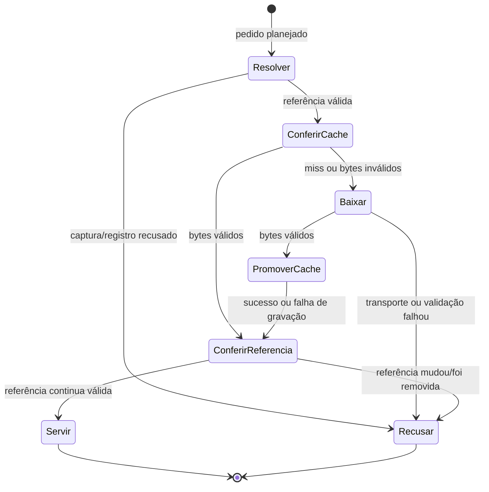

# Modelo de dados — 005, prévias de imagens

Como fichas ligadas a fotografias, cada prévia conserva o registro que autoriza sua leitura. Modelo **planejado**, subordinado à [spec](spec.md), ao [plano](plan.md) e ao [contrato](contracts/midia.md); não acrescenta coluna, migra captura ou cria estado editorial.

## Entidades e relações

| Entidade | Campos / identidade | Validação e fronteira |
| --- | --- | --- |
| Arquivo registrado | `arquivo_id`, `producao_id`/`semana_id`, `tipo`, `versao`, `id_drive`, `sha256`; relações de página/cena existentes | Localizar ID interno exato único no recorte NTV da captura vigente válida; versão inteira positiva segura e id_drive canônico preenchido. SHA vazio é opcional; preenchido exige 64 hex. Tipo declarado não autoriza/recusa a rota: assinatura dos bytes decide. Não derivar referência da URL |
| Posição de galeria | arquivo interno, contexto de peça/unidade, índice, posição do ponteiro e versão da imagem | Derivada das unidades já resolvidas e vigentes; páginas por índice/ID; cenas por índice/ID e inicial/final. Vídeo fora. Repetição mantém cada posição |
| Fallback de peça de imagem | arquivos de imagem da própria produção na versão válida da produção | Somente peça de imagem sem unidades; preservar empates e ordenação determinística por ID. Não selecionar maior versão nem comparar com pacote |
| Fingerprint de referência | tupla ordenada `arquivo_id`, versão, `id_drive`, `sha256` normalizado | Comparar referência resolvida antes e depois de cache/download; captura inválida, remoção ou alteração impede servir bytes anteriores como atuais |
| Entrada de cache | `data/midias/<sha256-da-tupla>.bin`; bytes originais validados | Nome hexadecimal calculado pelo servidor; caminho confinado à raiz fixa, nunca ID/path recebido. MIME e hash são reconferidos na leitura; entrada descartável |
| Resultado do serviço | `{bytes, contentType}` ou falha pública com status | Tipos permitidos: image/png, image/jpeg, image/webp; até 15.000.000 bytes; sem dados de autenticação/provedor na resposta |
| Estado visual | não solicitada, carregando, disponível, indisponível; foco de origem da ampliação | Somente navegador; não grava captura/recibo. Falha mantém texto e link permitido pela allowlist HTTPS Drive/Docs atual; Baixar pacote continua exclusivo de Drive |

O ID remoto é restrito a caracteres canônicos `A–Z`, `a–z`, `0–9`, `_`, `-`. A tupla usa serialização inequívoca, com ordem fixa e SHA declarado convertido para minúsculas; ausência de SHA recebe forma vazia consistente. O hash calculado da tupla identifica cache, sem substituir a validação do hash do conteúdo.

## Regras de bytes e cache

PNG exige assinatura completa de oito bytes; JPEG exige `FF D8 FF`; WEBP exige `RIFF`, marcador `WEBP` e tamanho mínimo para identificação. Não aceitar assinatura truncada, SVG, GIF, vídeo, ZIP, HTML ou JSON. MIME/extensão declarados não decidem o tipo. A validação de assinatura é mínima, não decodificação completa.

Contar bytes efetivos do stream, interrompendo acima de 15.000.000; Content-Length permite recusa antecipada, mas não dispensa contagem. Cache deve ser lido com limite+1 para detectar excesso sem carregar arquivo arbitrariamente grande. SHA preenchido inválido recusa antes de rede; divergência de bytes recusa antes de resposta/promoção. Cache inválido é ignorado/descartado e pode causar novo download.

Promover cache somente após validação, por staging exclusivo e rename; falha remove apenas seu staging. Erro de cache não invalida bytes novos já validados e pode permitir resposta sem persistência. Promessas concorrentes da mesma chave podem ser coalescidas; a entrada em RAM termina com o pedido, sem manter Buffer global. Cache nunca altera capturas, recibos ou estado de coleta.

## Estados de apresentação e limites

Abrir uma peça inicia somente suas posições não solicitadas; sucesso permite ampliação, erro HTTP ou `img.onerror` marca apenas a posição indisponível. Fechar ampliação devolve foco à miniatura e mantém a gaveta; Escape seguinte pode fechar a gaveta. Em Pronta, galeria fica fora da dobra de páginas/cenas e não muda os avisos existentes.

Vigência/retirada/revisões seguem a tarefa 1: nenhum índice é retirado por inferência e a versão da produção continua regendo revisão. Sem SHA declarado, referência igual não comprova imutabilidade remota. Cache não tem limpeza/expiração automática; não há transcodificação, manifesto ZIP ou verificação editorial nova.
